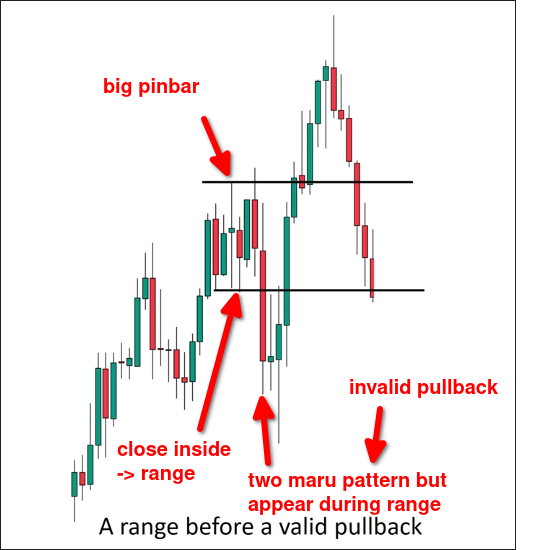
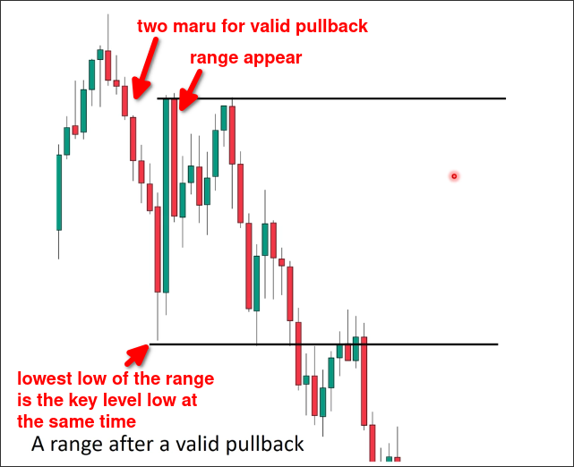

# Range after and before the pullback

## Rules

**after**
- If a valid pullback formed **after** a RANGE, PULLBACK is **invalid**, so it cannot define a valid key level (make key level be **invalid**).

**before**
- If a valid pullback formed **before** a RANGE, PULLBACK is **valid**, it can still define a valid key level but this key level is **weaker**.

## Examples

**after**

If the pullback standard pattern also breaks out of the range at the same time, this pullback is valid. However, the above pullback standard pattern only meets the conditions for a valid pullback and does not break out of the range, so this pullback is invalid.

**before**

In the above chart, a valid pullback appeared first, followed by a range. At this point, the pullback is still valid, but because of the appearance of the range, the key level it defined will become weaker.

The reason is that the key level should absorb all the pullback forces and then allow the trend to further extend, however, the range represents uncertainty, the big boys at the key level, although they prevent the extension of the pullback, do not clearly show the intention to extend the trend, so this key level will become weaker.

