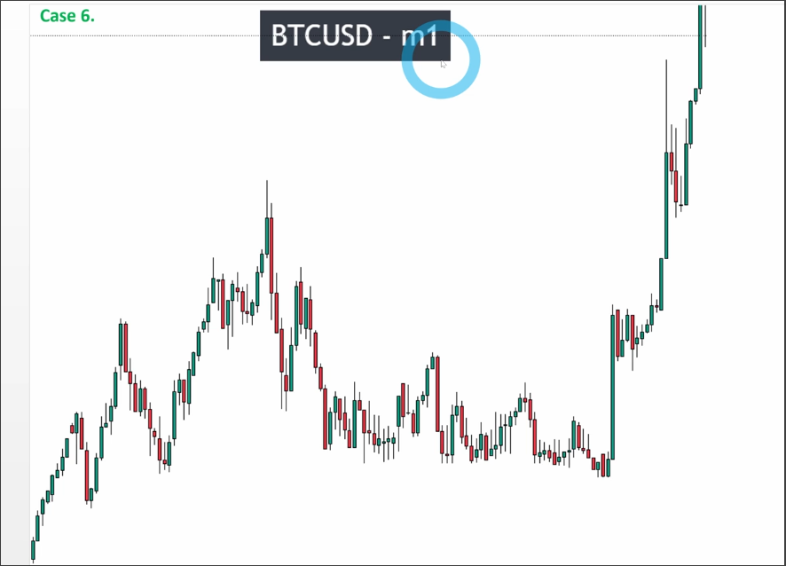
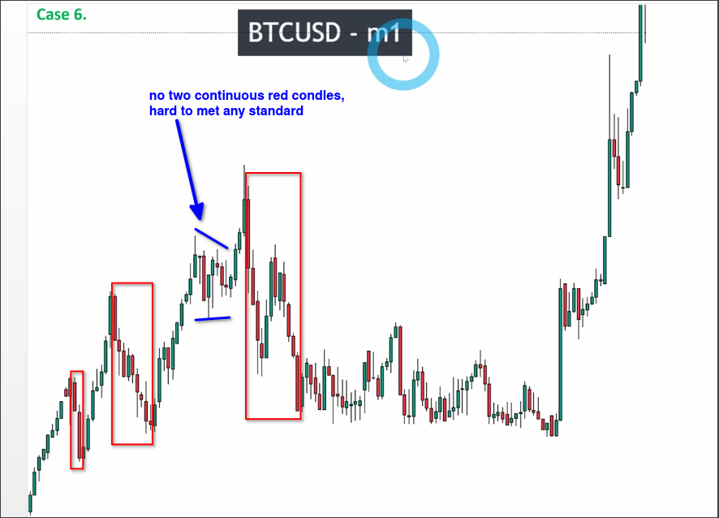
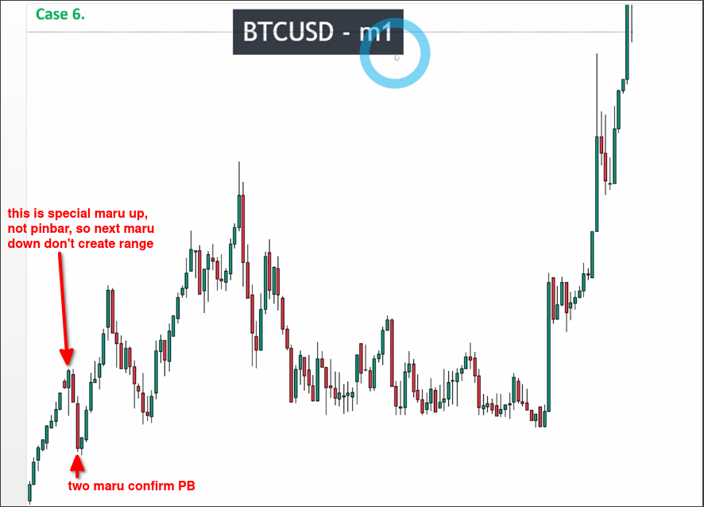
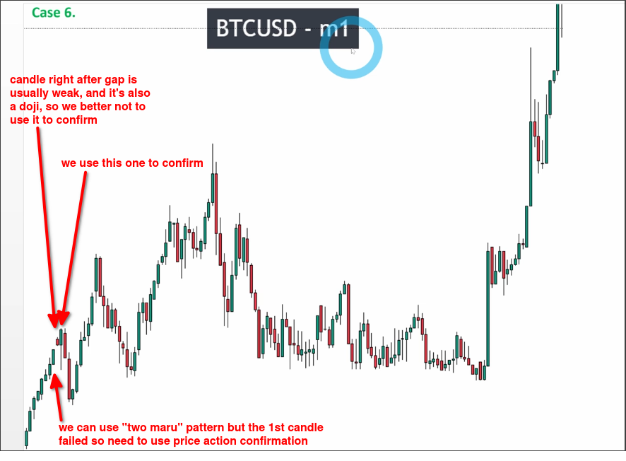
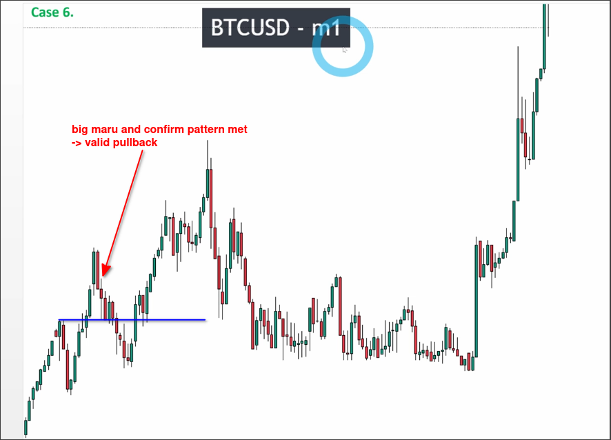
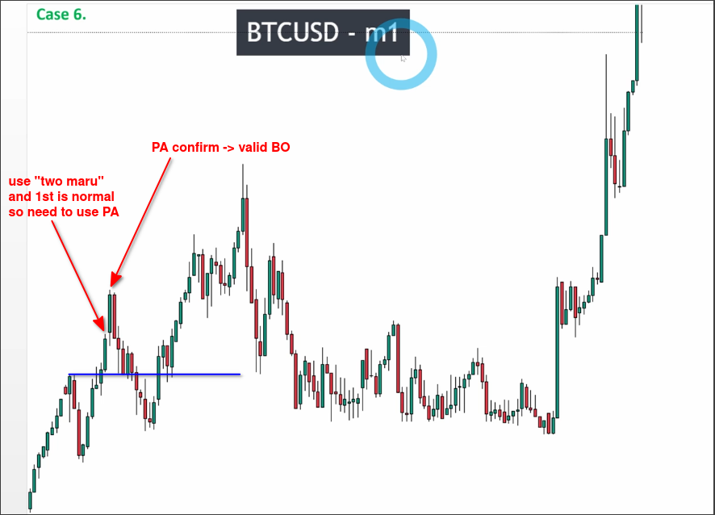
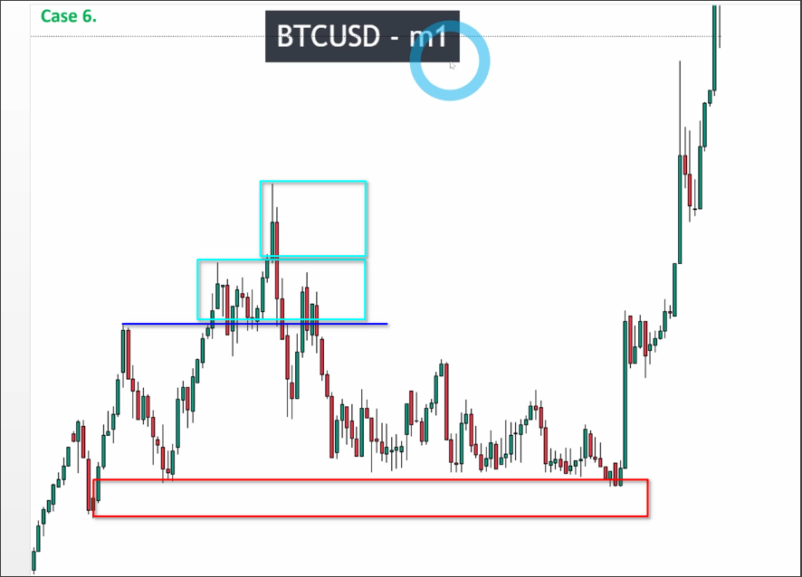

# Assigment 6: Bitcoin_A noise chart with gap

The above chart is the price trend chart of Bitcoin for one minute. We can first make a simple judgment on the possible area where the pullback wave may appear as follows:

First analyze the most left area:

The judgment of the special up maru candle in the above figure is very important, because if it is mistakenly judged as a pinbar candle, the next down maru candle closing within it will be mistakenly judged as a range.

This area has a valid pullback wave, and then we should look back to analyze the pulse wave:

We usually don't use the first candle right after the gap to confirm the pattern because it is usually weak.

"Two maru" pattern with one candle failed can be "normal-maru" or "maru-normal", then we can use price action confirmation to confirm the validity.

This pulse wave is valid, so we can draw the highest high and keep analyzing the next possible pullback area:

This pullback wave is valid, and we can look back to check if the recent high is valid breakout:

The recent high is valid breakout, so we can draw the key level and keep analyzing the next possible pullback area, but lecturer check if the new recent high is valid breakout instead because if it is not valid breakout, even the next pullback wave is valid, it is still counted as previous pullback wave, so we spend time to confirm the pullback standard for the already valid pullback wave is nonsense.

In the above chart, we can see that the recent high is a valid breakout, so we can draw a range from the recent high upwards. Another failed attempt to break out of the range high has caused the range to extend further upwards.

Because there is no valid breakout at this recent high, we can completely skip analyzing the subsequent price drop, as this is still considered part of the confirmed pullback wave from before. Therefore, we do not need to confirm it again.

Afterwards, we can see the price accurately falling back to our key level and then shooting up.
