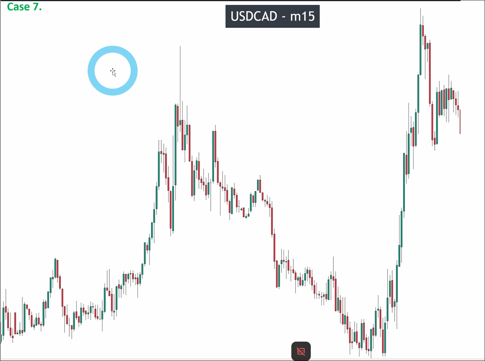
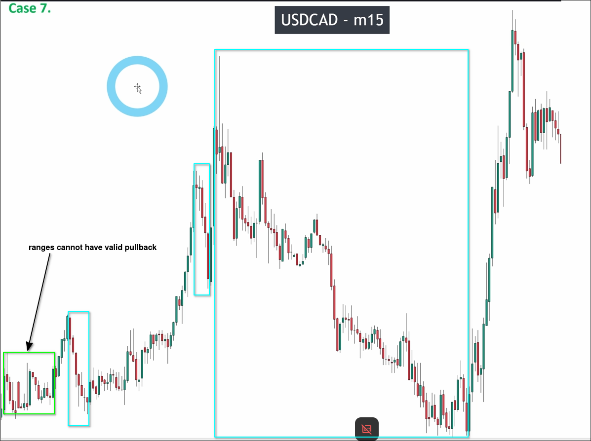
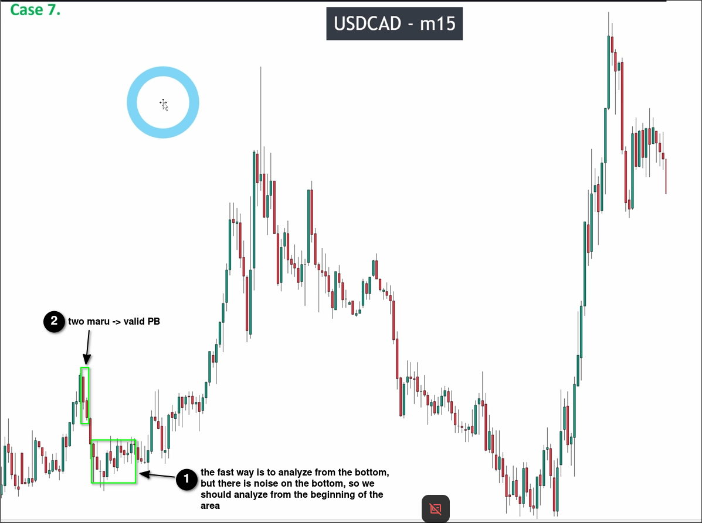
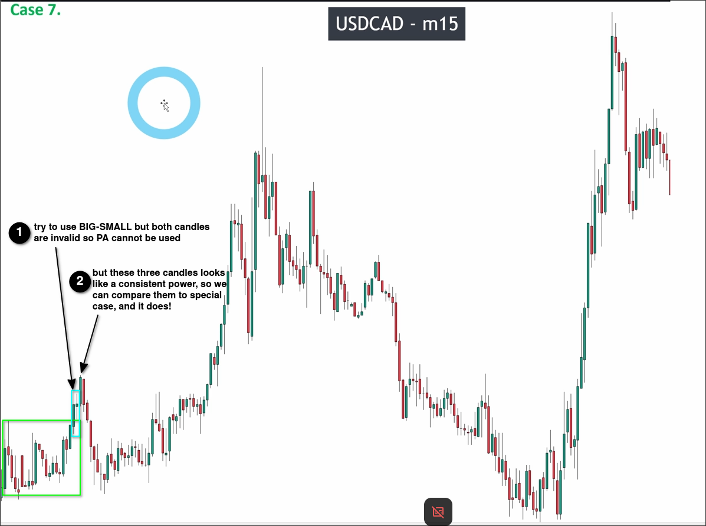
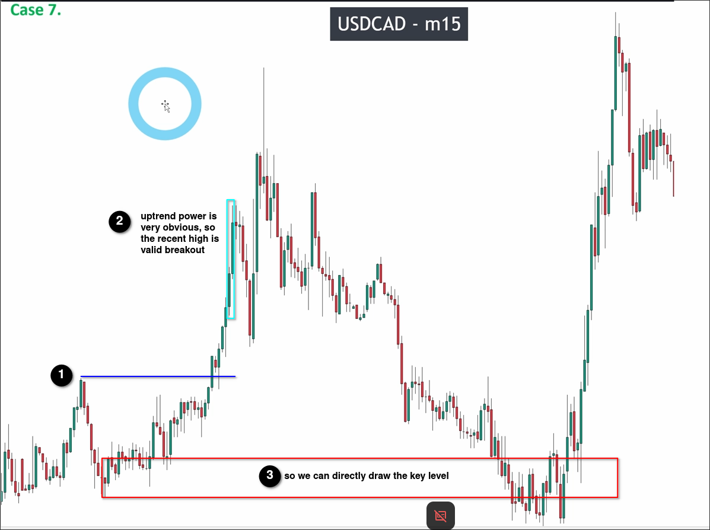
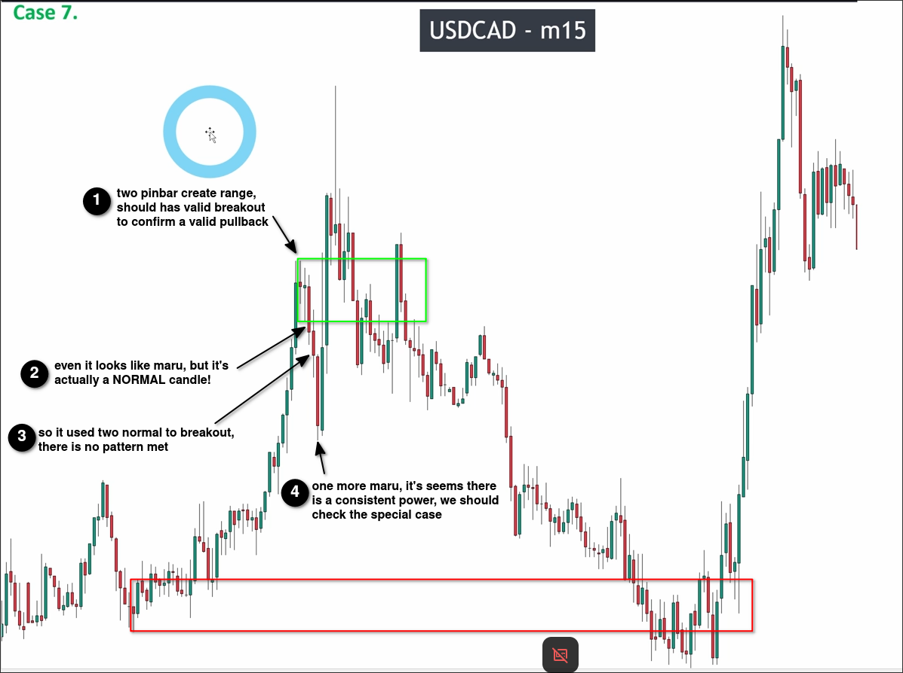
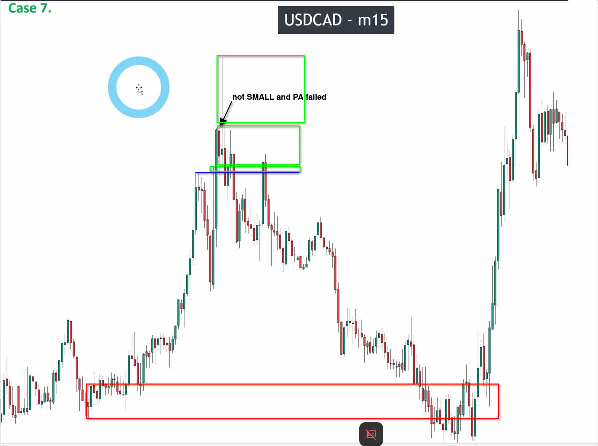

# Assigment 7: USDCAD_A difficult chart of price action confirmation

The above chart is a 15-minute chart of USDCAD. It can be observed that the price on the far left is low and then reaches a high point near the right side. Therefore, it can be determined that it is an uptrend.

Because it is an uptrend, we need to simply identify areas where there may be a pullback wave.

When we are initially drawing out areas that may have a pullback, we should pay attention to the ranges as shown in the above diagram, and avoid drawing possible pullback areas within them, as pullbacks within a range are invalid.

Then, we start to analyze the most left area:

In the above diagram, we can see that the bottom of the area has some noise, so we should analyze the area from the biginning instead of the bottom.

After analyzing, we know the PB is valid, then we should look back to check if the pulse wave exists.

If the pulse wave does not exist, then PB will not exist either and will be completely contained within the range.

Let's check if the pulse wave exists:

Because there is a range at the bottom obviously, we need to focus on whether this range has been valid breakout in order to correctly determine the existence of a pulse wave.

We see on the chart a combination of a maru and a pinbar of the same color attempting to breakout of the range. At this time, we must use the BIG-SMALL (same color) pattern to determine if it is a valid breakout and not a TWO-MARU.

Because the first maru cannot meet the requirements of forming a BIG compared to the previous five candles, and the lowest low of the second pinbar is lower than the middle of the first candle, it is also invalid, leading to an invalid breakout.

However, after the two candles, there is also an upward maru candle. The three candles seem to have consistent power. At this point, we need to consider the possibility that they may fit a special case. After comparing, they indeed fit the special case of MARU-PINBAR/DOJI-MARU. Therefore, this is a valid breakout, which also proves the existence of a pulse wave.

So we can draw the recent high:

Above, we have marked the position of the recent high, and because it is clear that the recent high has been broken out, we can directly obtain the key level.

Now, we can start to analyze the second area:

At the beginning of the area, there are two pinbars and the close of the second bar is within the first one, so it is obvious that there is a range. Therefore, the key point we need to analyze is whether this range is a valid breakout.

The first breakout candle may look very similar to a maru, but in fact it is normal because the body size is less than 70. The following candle is also normal, resulting in no breakout pattern that fits.

But then a downtrend maru candle appeared later, making these three candles clearly have consistent power. At this point, we need to consider whether they meet the special case. After comparison, they indeed meet the special case of NORMAL-NORMAL-MARU, so this pulse wave is valid.

Because both the pulse wave and pullback wave have been confirmed, we can draw a new recent high.

In the above image, we draw the recent high and determine if it is a valid breakout. We can see that although there is a large maru breakout, the subsequent red candle does not meet the condition of being SMALL after measurement, and the price action confirmation also fails. This results in no valid breakout and causes the recent high to move up. Therefore, there is no need to analyze the subsequent price drop, as the recent high cannot be broken through, making the price drop part count as part of the previous pullback wave.

After price drop, the price rose to a new high again, but did not create a new high after falling back, so there is no need to analyze this section because it is unlikely to produce a key level. Our focus is on finding the position of key levels, so there is no need to waste time on pointless analysis.
