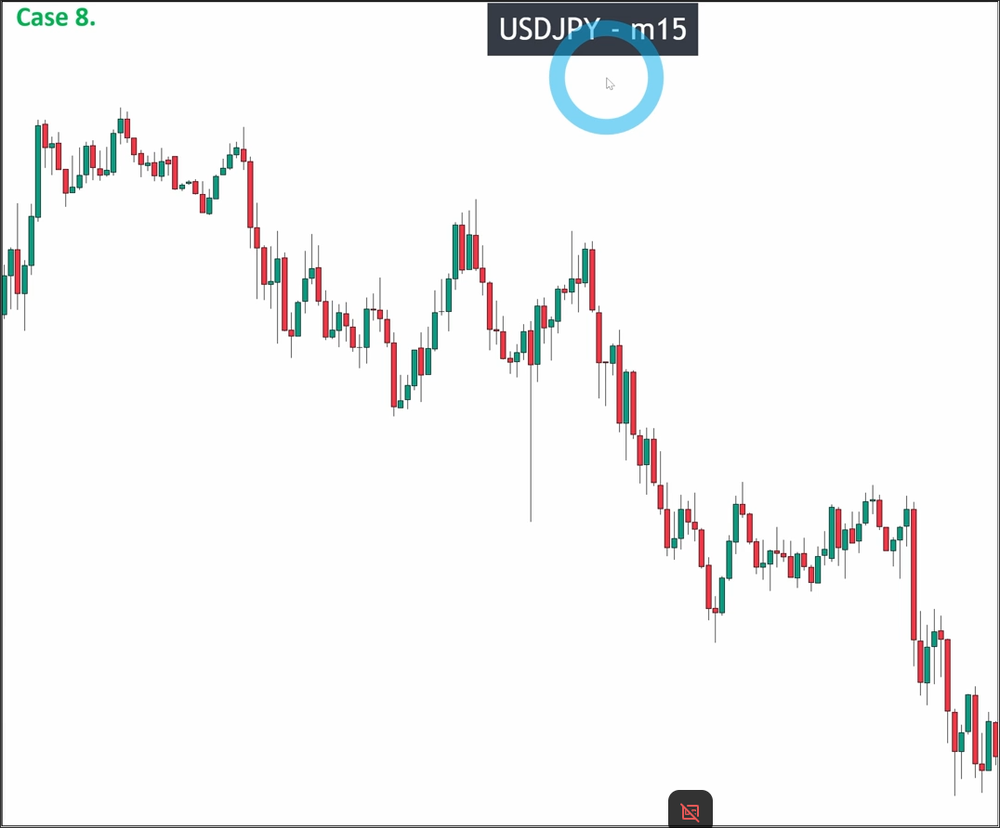
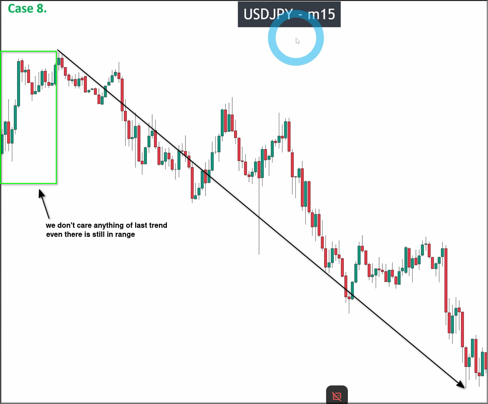
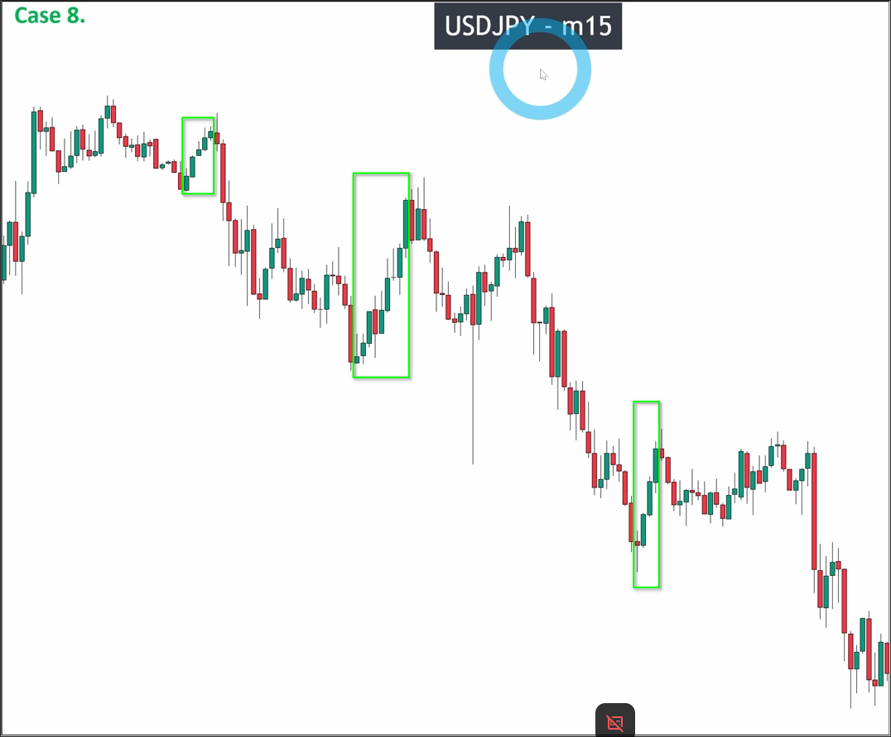
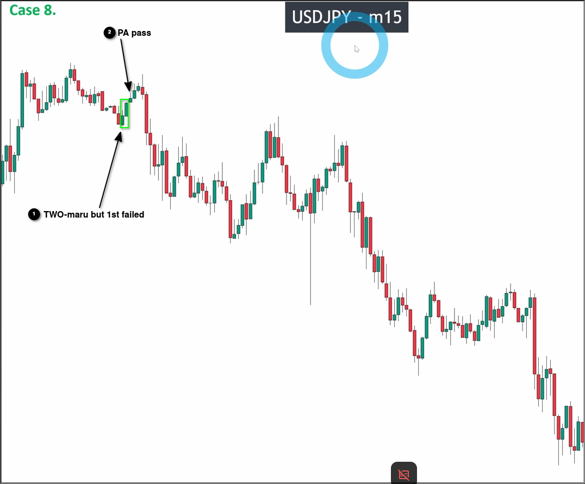
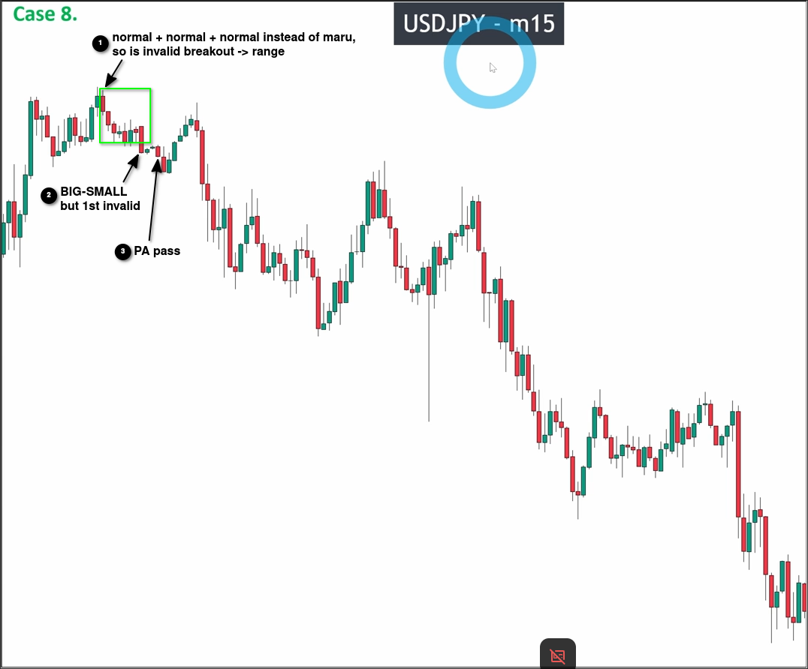
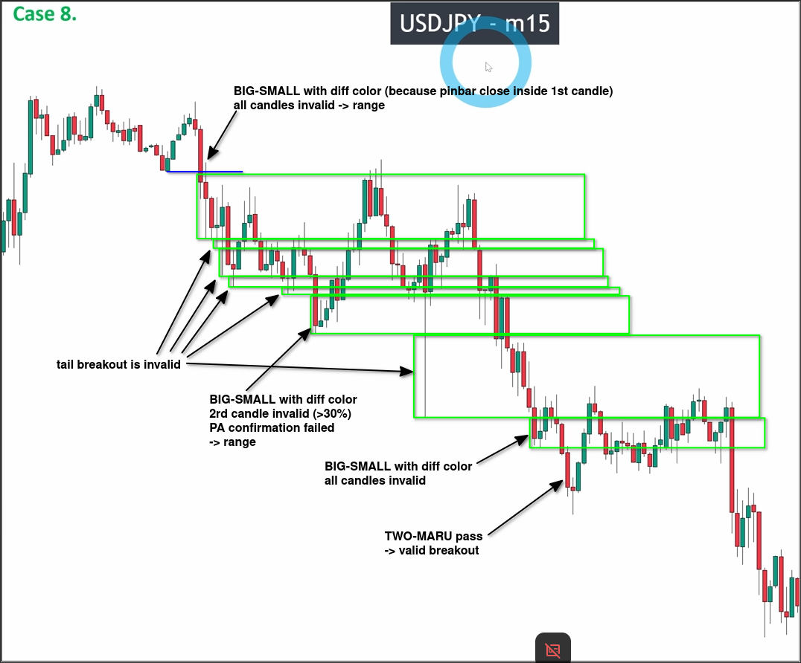
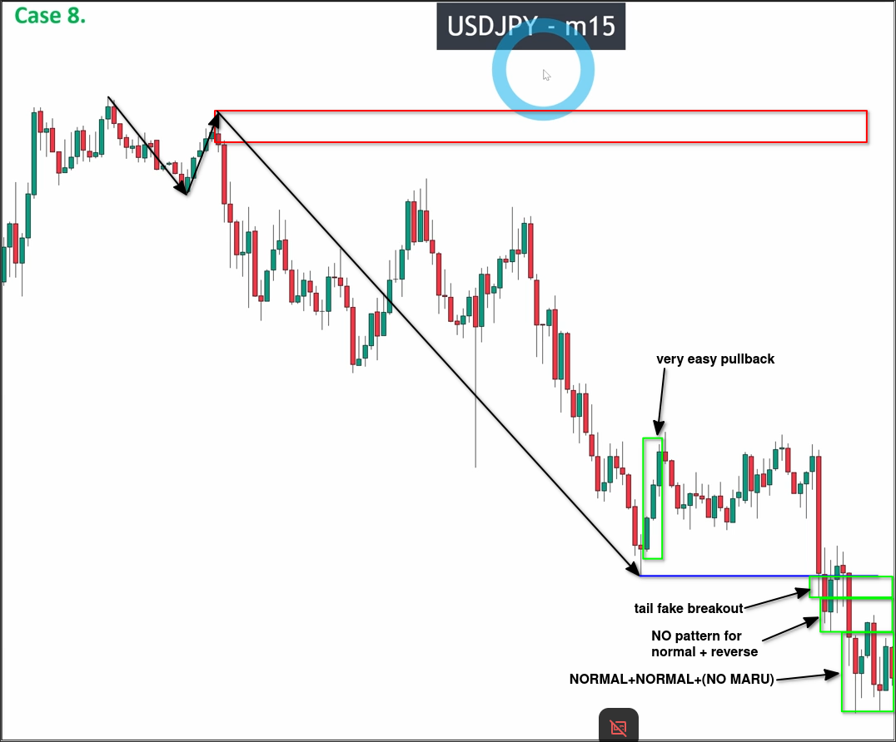

# Assigment 8: USDJPY_Noise and hard market with price action

The high point in the above chart appears near the 15th candle after the beginning. Assuming the previous trend was an uptrend, we will analyze from a downtrend perspective starting from this high point. At this point, we do not consider anything related to the uptrend portion in the chart. uptrend portion in the chart has a range, which we will not consider when analyzing the downtrend.

Because we are analyzing a downtrend, we need to pay attention to the green candle and then draw out the area where there may be a pullback wave.

The first area in the above figure would not exist if we were considering the range of an uptrend, but because we do not need to consider anything related to an uptrend, this area exists.

Let's analyze the first area.

We see a combination of normal + maru, which can use the "TWO MARU" pattern, but the first candle is invalid so a PA confirmation is needed. The result is that the PA confirmation passes, so it is a valid pullback.

Let's look back to check if pulse wave exists.

At first, there were three consecutive red candles that appeared to have a consistent pulse wave. Upon inspection, it was found that the three candles were normal and could be considered a special case - the "NORMAL-NORMAL-MARU" pattern failed because the breakout failed, which will always result in a range. Therefore, we can use the highs and lows of these three candles to draw out the range.

There is a maru+doji combination breakout range behind, we use "BIG+SMALL" check, found that the 1st candle is invalid, but the following PA pass so this pulse wave is valid.

Then, we can draw the recent low and check where the recent low is breakout valid.

From the analysis in the above chart, we can see that the recent low has been continuously subjected to multiple fake breakouts, and the noise has been increasing. It is only when the price is far away from the original level that it is truly broken through. In this way, we can confirm the position of the key level.

If only the tail breakout range and then close back within the range, a fake breakout has already formed and the range will expand.

Now, we can analyze the next area.

This area has a very clearly three continuous maru candles, so there is a valid pullback obviously. Then we can draw the recent low and check if the recent low is breakout valid.

As the chart shows, there is much noise below the recent low, so there isn't any valid breakout. The key level is still the same as before.

