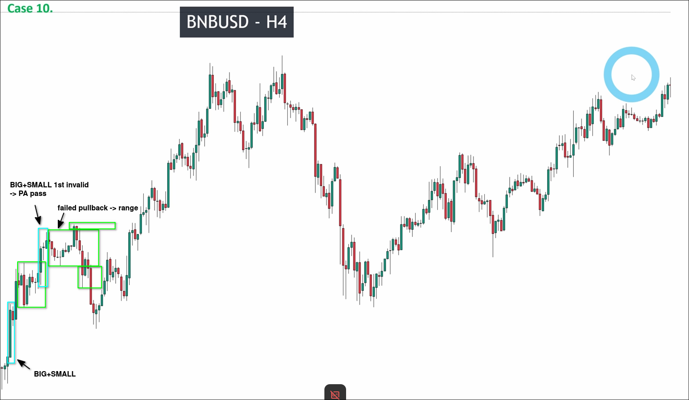

# Assigment 10: BNBUSD_Analyze pullback to find Risky zone

First, we need to identify areas that have chances to be pullback wave.

In the analysis in the above figure, it can be seen that I skipped many parts using the following techniques:
- No continuous pullback candles and big pullback candles
- If only few candles, quick check the candle types and get the results
- Use failed pullback to draw range, there is no valid pullback in the range, so you can skip it if there is range.

And, if there is no chance to breakout the recent high, we don't need to analyze the pullback because there is no chance to draw the key level.

So, there is only one area we need to analyze.

In this area, we analyze from the bottom because there is no noise and we can see a obvious "BIG SMALL" pattern there, so even above the area has ranges, theywould be also breakout by it.

Next, we need to look back to check if the pulse wave is valid or not.

At the bottom, we can see a very obvious "BIG SMALL" pattern so the pulse wave is valid. But we still need to analyze the upper portion because if there is a range, it has change the pullback wave we confirmed is actually invalid.

After analyzing, the upper portion has a range but the pullback wave is still valid.

Next, we need to check if the recent high has been breakout or not.

We directly use the most obvious up maru candle, it met the "BIG SMALL" pattern, so the recent high has been breakout validly. We can draw the key level now.

Although the 2nd area has no need to analyze because there is no chance to create new key level, we still need to analyze the pullback wave to find the risky zone.

We use failed pullback to draw the range to remove the chance of the only possible pullback area, so there is no risky zone in this main pullback wave.

