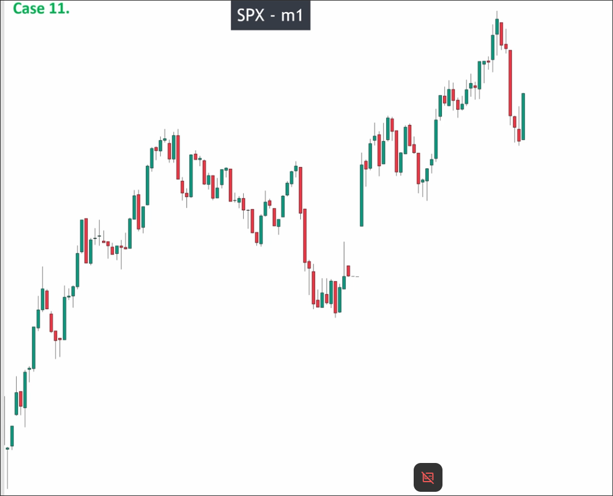
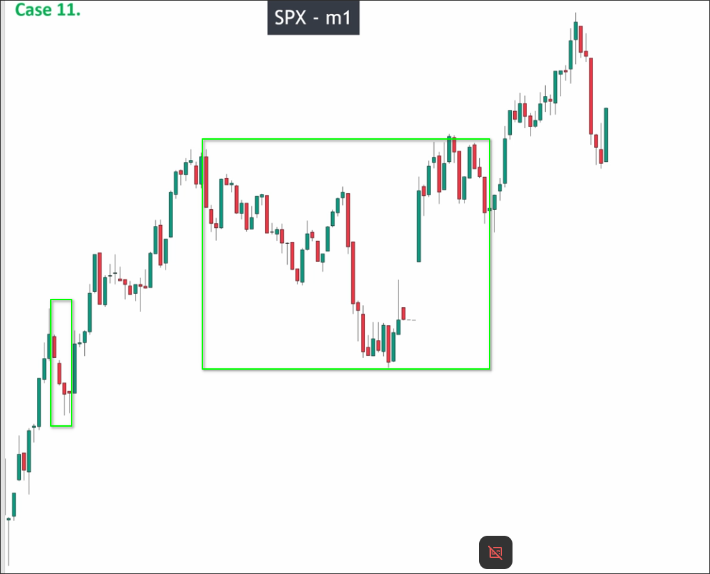
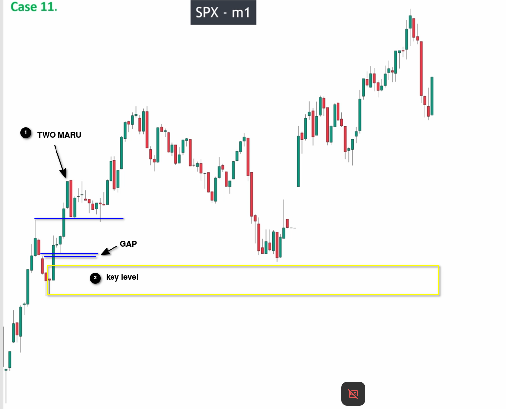
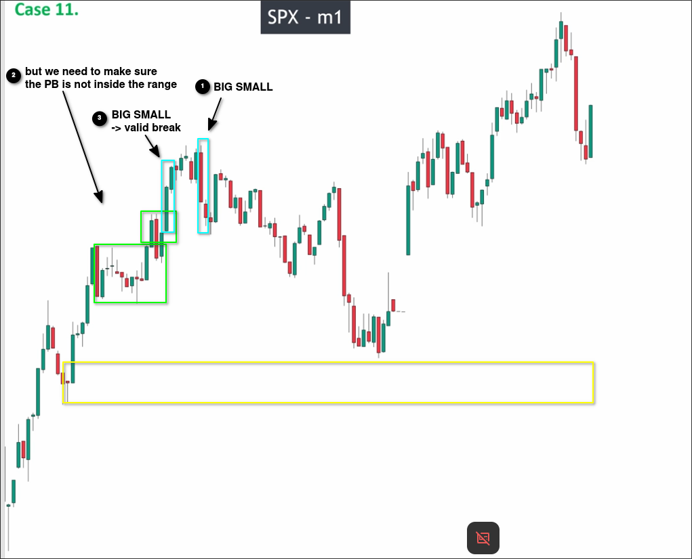
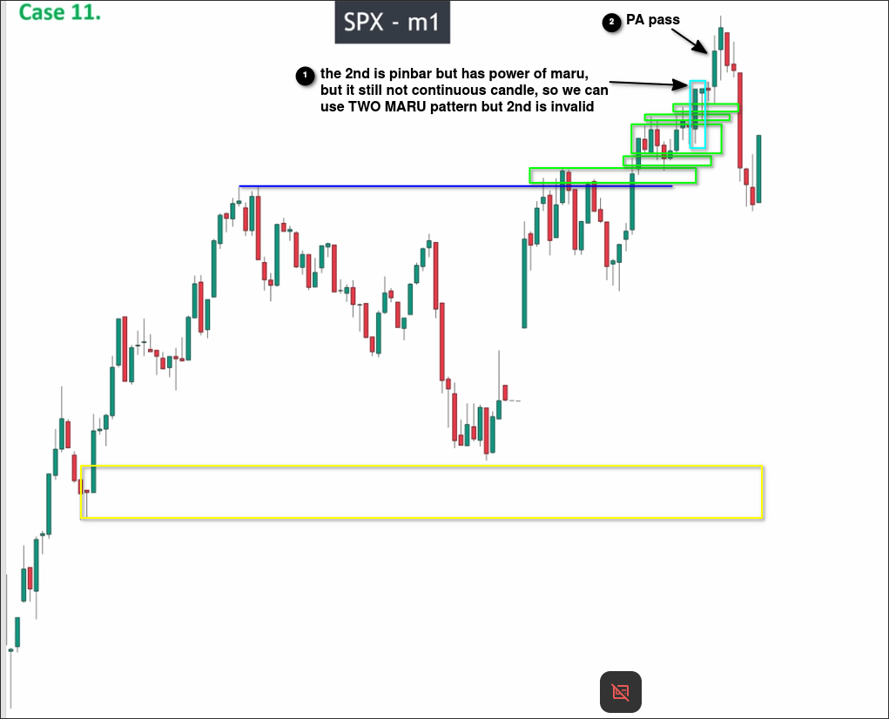
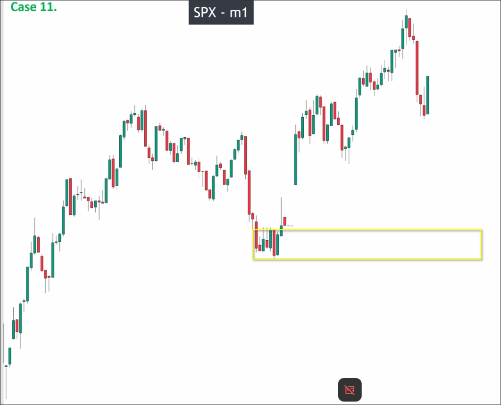

# Assigment 11: S&P 500 Index_Analyze with GAP on M1 chart

We can analyze step by step from left to right or use a quick method (first draw possible pullback areas). If the chart looks noisy, the former method may be faster than the latter. The lecturer in the video chose to analyze step by step from left to right, I chose to analyze quickly to see if the results are the same.

First, draw the areas of possible pullbacks.

Then, we can it's very obvious that the first area is a valid pullback by TWO-MARU pattern, and left is a valid pulse wave by 4 continous candles, so we can draw the recent high and check if there is a valid breakout.

The recent high has a obvious breakout by TWO MARU, so we can easily draw the KEY LEVEL out.

You can see there is a GAP between two down maru, only two situations can happen:
1. liquidation is too big
2. liquidation is too small

Because the price is go down quickly after the gap, so we can say the liquidation is too big, in this case, we can treat the gap as a maru candle.

Let's analyze the next area:

The second area has a BIG SMALL pattern, so the pullback is valid, but we need to look back to make sure the pullback is not inside the range, or the pullback is not valid. After checking, we can see the pullback is valid, so we can draw the recent high and check if there is a valid breakout.

As above chart, even the maru-pinbar group can use TWO MARU pattern, but only if the pinbar has **power of the maru**, this pinbar has long tail only on the downside, so we can say this pinbar has power of the maru, but it is not close above the 1st maru, so it still not met the CONTINUOUS condition, so we can say the 2nd candle is invalid but we can use price action confirmation to check if it is valid breakout.

After checking, we can see the candle after the maru-pinbar group close above the highest high of the group, so we can say the breakout is valid, then we can draw a new KEY LEVEL out and remove the old one.

