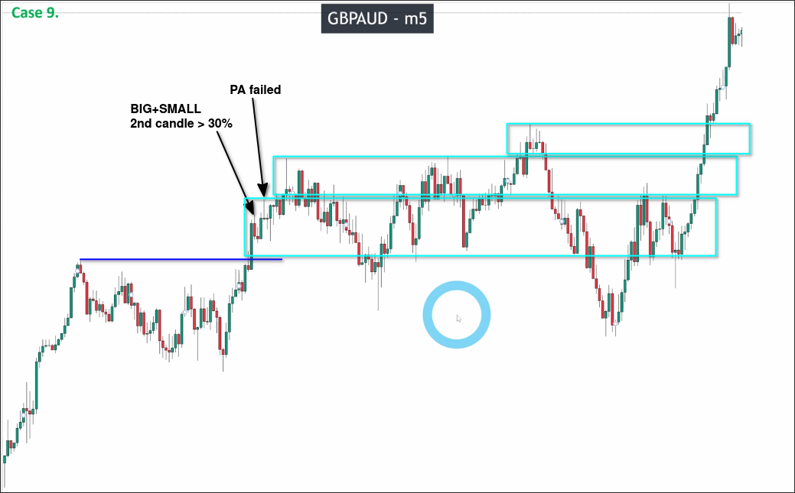

# Assigment 9: GBPAUD_A special point of big maru and one small candle

GBPAUD is called "cross pairs" because neither of the two currencies in the currency pair is the US dollar. Conversely, currency pairs with the US dollar are called "main trading assets".

If only trading "main trading assets", it will be found that all assets are in one of two situations at the same time, either trending or sideways. In order to increase trading opportunities, we need to look for trading opportunities in "cross pairs" when "main trading assets" are sideways.

First, let's draw areas that have possibilities of pullback waves.

As shown in the above figure, although the second area's price has exceeded the upper edge in the second half, it is clearly a fake breakout, so there is no possibility of a new pullback wave appearing. Therefore, it should be merged into the same area.

Let's analyze the first area in detail.

At the beginning, there were two small down maru candles, but we had to compare them with the largest one out of the previous five maru candles to see if they were doji candles. The conclusion was that both were doji candles, so we couldn't use the "TWO MARU" pattern.

However, right after that, a very large down maru candle appeared. After confirming it as a "BIG MARU" by comparing it with the previous five maru candles, we could use a variation of the "BIG+SMALL" pattern called "SMALL+BIG" pattern to confirm this pullback wave.

Then, we can draw the recent high and check if it has been breakout validly.

We found that the recent high consecutive fade breakouts have occurred multiple times and there has been no valid breakout, which has led to the key level not being confirmed.

Although the initial breakout seems to fit the "BIG+SMALL" pattern, careful measurement revealed that the size of the second candle slightly exceeded the first candle's size by 30, leading to failure. We cannot rely on our eyes or feelings to determine if a pattern is valid, we must measure accurately. This is very important, otherwise drawing incorrect key levels will result in losses.
