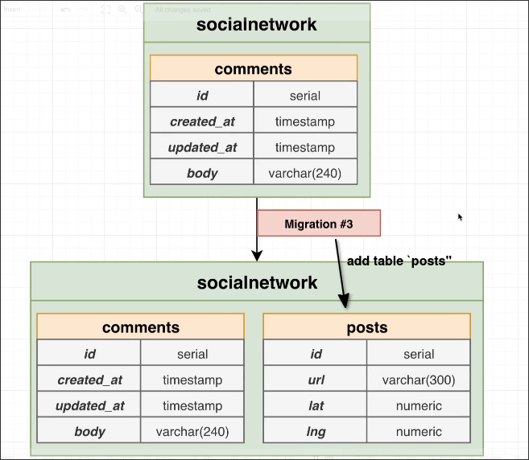
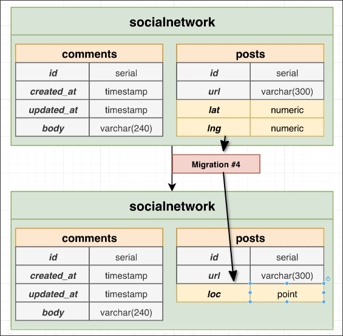

# Schema vs Data Migrations

We want to create the third migration to add the posts table, which has the following columns:
- id: serial
- url: varchar(300)
- lat: numeric
- lng: numeric

And the fourth migration to combine the columns lat and lng into a single column called `loc` with **point** type.

> data type `point` is a built-in PostgreSQL type that stores a pair of floating-point numbers representing a point in 2D space.

However, there may be a long time gap between migration#3 and migration#4, during which a lot of data has been written. Therefore, the steps for migration#4 should be as follows:

1. Create a new column `loc` of type point. *(schema migration)*
2. Get the loc value from lat and lng. *(data migration)*
3. Drop the lat and lng columns. *(schema migration)*

You can find that the second step is completely unrelated to the schema, it is just converting the values of the data, so we call it *data migration*.

*Data migration* is actually a controversial operation, and we will explain this issue in the upcoming topic.

