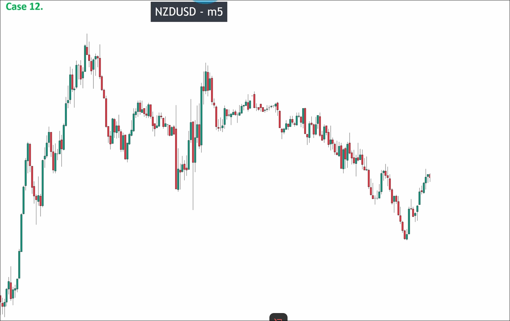
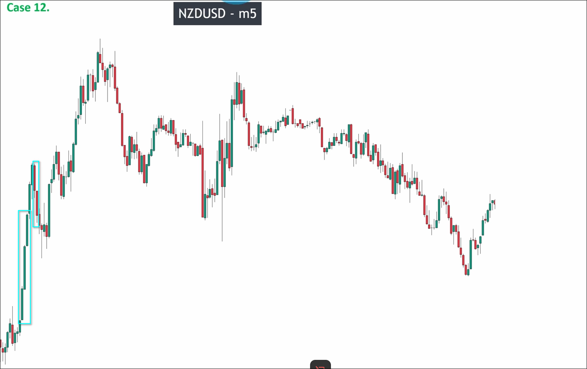
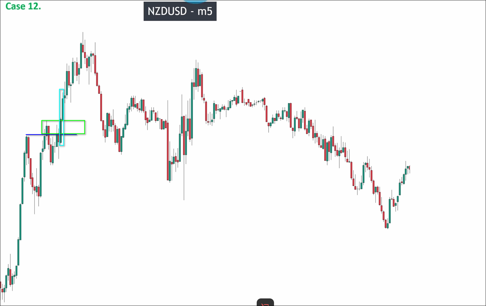
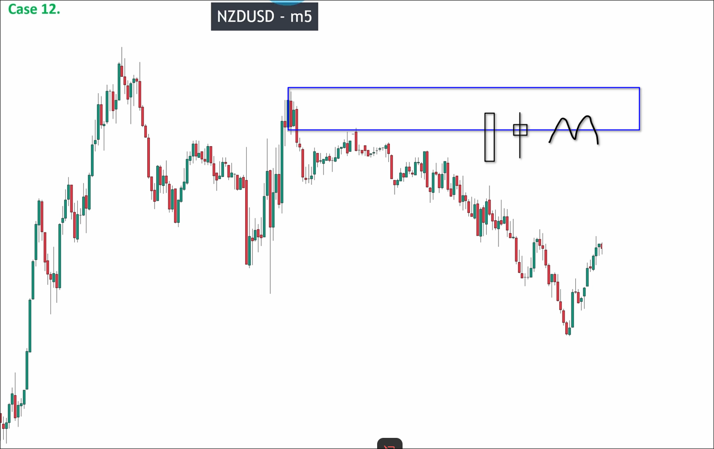
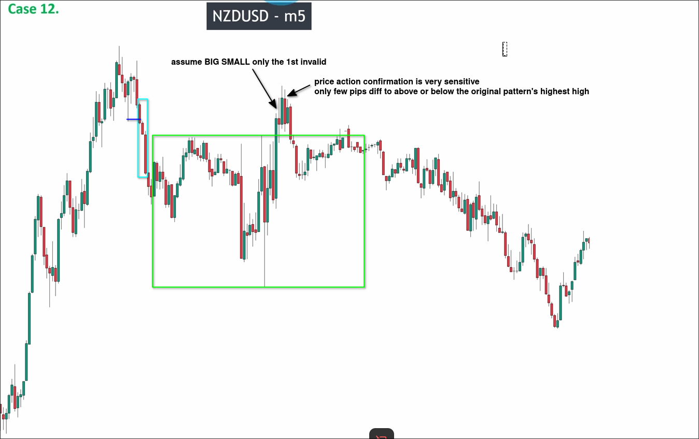
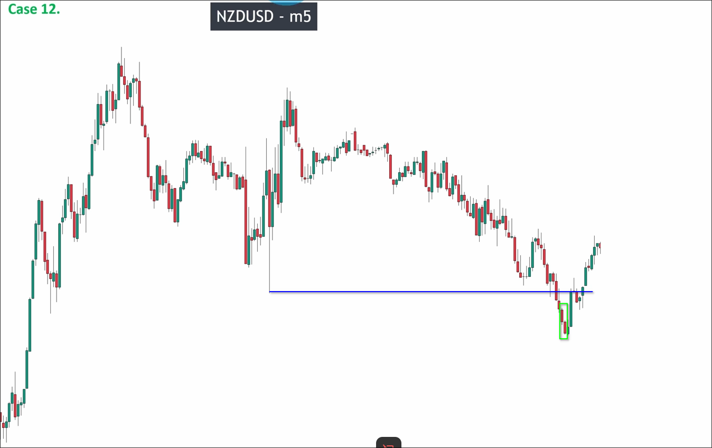

# Assigment 12: NZDUSD_Price action confirmation at sensitive place

Above chart starts with a uptrend then downtrend, we call it V-shape. When we analyze the V-shape, we cannot only analyze the downtrend, we also need to analyze the uptrend because if uptrend's key level is not broken, the downtrend actually is the pullback of the uptrend. It may let you entry in the very danger place and lose your money.

So, we start to analyze the uptrend first.

You can see the first pulse wave and pullback wave of the uptrend are very clear, so we can draw the recent high very quickly and see if it is broken.

We can see the recent high is broken, so we can draw the key level of the uptrend, and the point is to see if it is broken. If it is broken, we can say the uptrend is over and the downtrend starts, then we can analyze the downtrend. If not, we can say the uptrend is still in progress and the downtrend is just a pullback of the uptrend.

We can see the key level is broken, so we can start to analyze the downtrend and all the things happened in the uptrend are useless now, especially the range.

We can see the first pulse wave is clear and then the big range appears, at the upper edge of the range, we can see a BIG SMALL pattern try to break the range, but the first candle of it is invalid (I guess the 2nd candle is invalid too, but video said only 1st candle is invalid, maybe it is a mistake or just for the learning purpose). So we can use the price action confirmation, but the price action confirmation price is very sensitive, the close price is very close to the pattern's highest high, in this case, we can assume this breakout is valid.

Then, we can draw the recent low and see if it is broken.

We can see the recent low is broken, so we can draw the key level of the downtrend.

> Because the key level comes from a sensitive place (PA), when the price reaches the key level, we need to reconfirm the price action. We need to wait a big down maru or big down pinbar or two tops shape, then we can enter the market.

