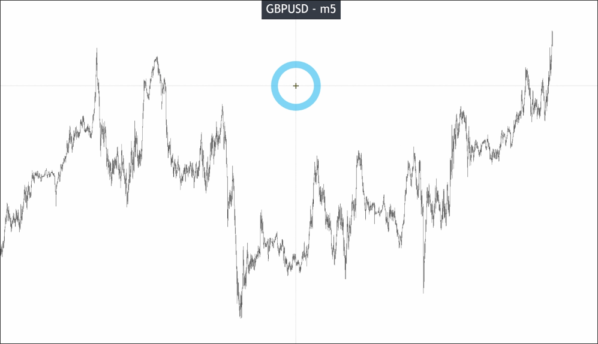
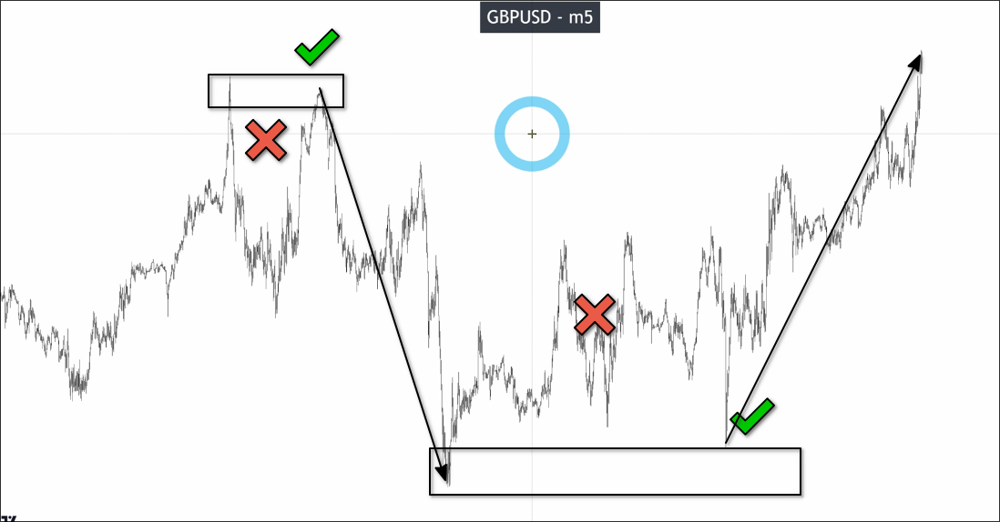
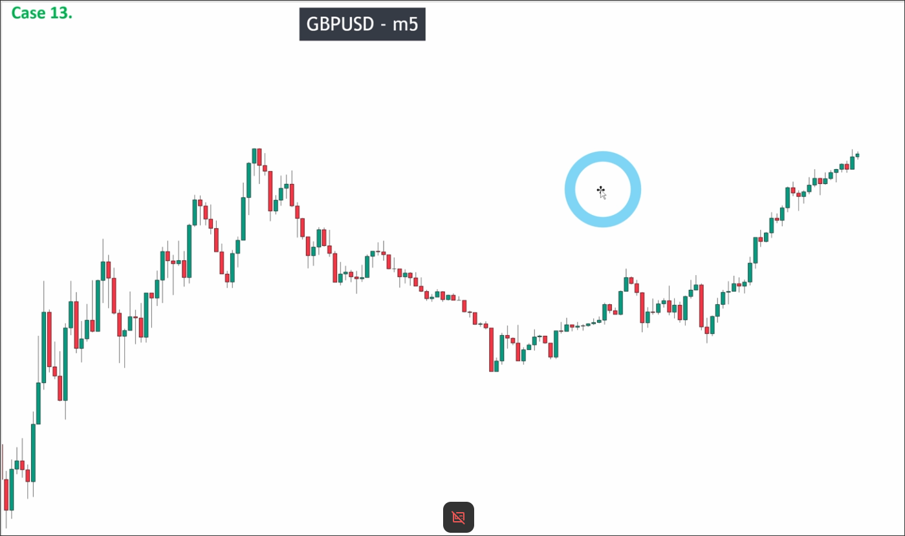
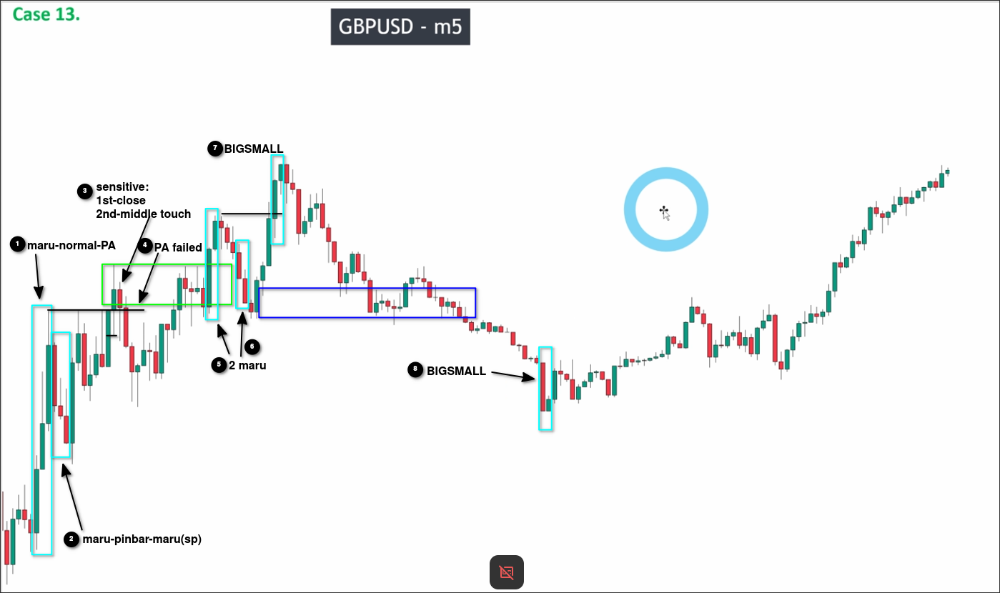
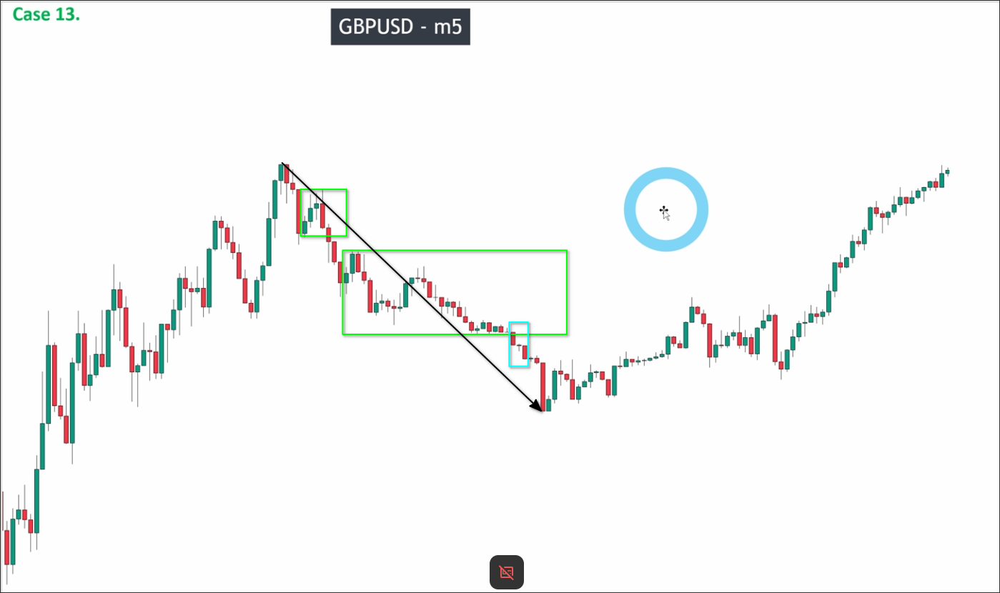
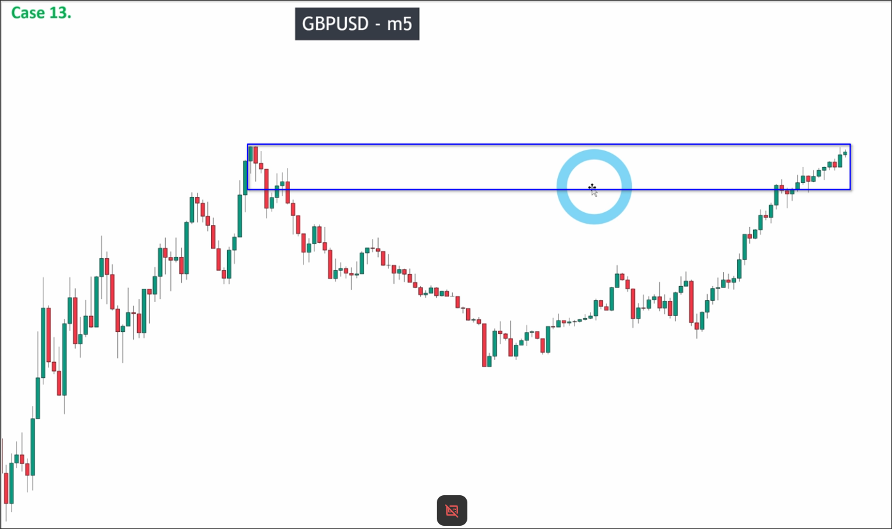

# Assigment 13: GBPUSD_When and where we start analyze a chart

When we are looking at a live chart, there are countless candles below. How do we know where to start analyzing?

One technique is that we can zone some areas where the price has been multiple times. Then start analyzing the chart only from the most recent place where the price has been the zones. This skill can help us to avoid analyzing some useless candles.

Below chart is the main area we want to analyze this topic.

You can see left side of the chart is a V-shape, so we should analyze from the left to the right instead of quick method to avoid risks.

We can see the key levels of uptrend has been broken, so we should analyze the chart from 7. as downtrend.

In mark 3 and 4, you can see the confirmation of BIGSMALL pattern is very sensitive. So we should use price action to confirm the pattern.

From the analysis above, it can be seen that there is no chance of a successful pullback wave from the highest to lowest point of the downtrend. Therefore, the key level is the high point position where the downtrend started.

We can see the price returning to the initial price of the downtrend, which is also our key level. We can wait for a big down maru candle or a two top pattern to appear, and enter short when the key level has not been broken out.

## Portfolio skill

| xxxUSD   | USDxxx   | Cross     | Other assets |
|----------|----------|-----------|--------------|
| EURUSD   | USDJPY   | EURAUD    | XAUUSD       |
| GBPUSD   | USDCHF   | GBPAUD    | XAGUSD       |
| AUDUSD   | USDCAD   | AUDJPY    | OIL          |
| NZDUSD   | ...      | GBPJPY    | US30         |
| .......  |          | CADCHF    | US100        |
|          |          | .......   | ....         |

xxxUSD and USDxxx always have a strong correlation even if their direction is opposite. So we should only trade one of them.

If we are already trading xxxUSD or USDxxx, we should go to the cross pairs to find the trade instead of trading xxxUSD or USDxxx again.

Group `Other assets` is not correlated with xxxUSD and USDxxx or even the cross pairs. So we can trade them at the same time as xxxUSD or USDxxx or the cross pairs. But this group has most fluctuation and momentum, so it's hard for the new traders to trade them.

