# Assigment 14: SOLANA_Always follow Market flow during analyze

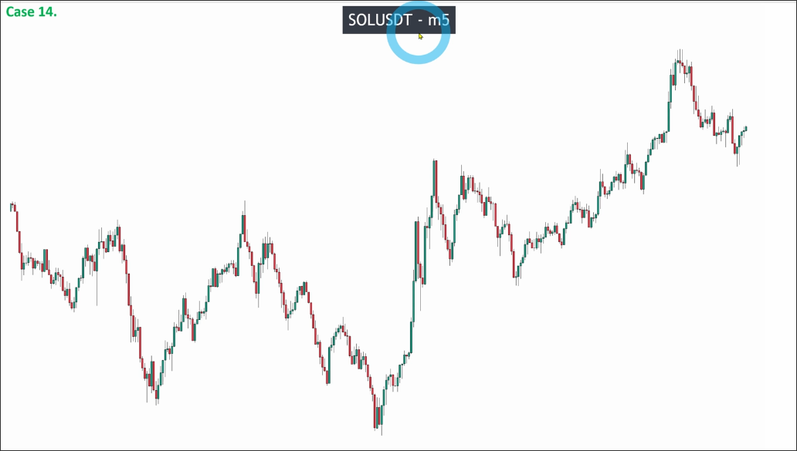

The image above is a commodity of a cryptocurrency. We can select one or two commodities from the top ten cryptocurrencies on Coinmarketcap.com for analysis, but the trends of these cryptocurrencies are usually similar, so there is no need to trade too many cryptocurrencies. This will only increase your risk.

Usually, the noise in forex is minimal because of the high market volume. In contrast, the noise in local stock markets tends to be larger because only local participants are involved. For example, stocks in the US attract traders from around the world, leading to less noise. The same applies to cryptocurrencies.

In short, it is still recommended for beginners to trade forex, as it takes a long time to build confidence and accumulate profits before moving on to the next stage.

Let's start analyzing the chart. This is a V-shape pattern, so we need to analyze from the left to the right in order not to miss any important information.
First, we draw the areas of possible pullback waves on the left downtrend.

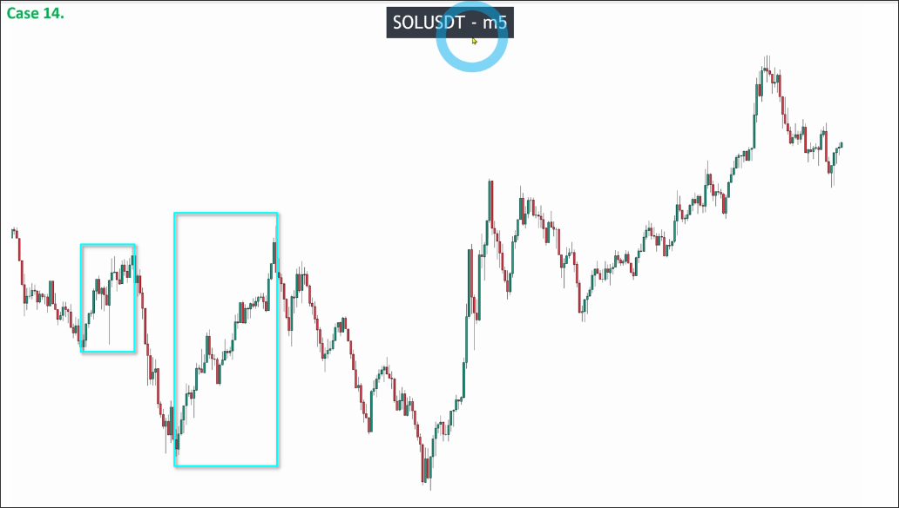
Then, analyze the 1st area.

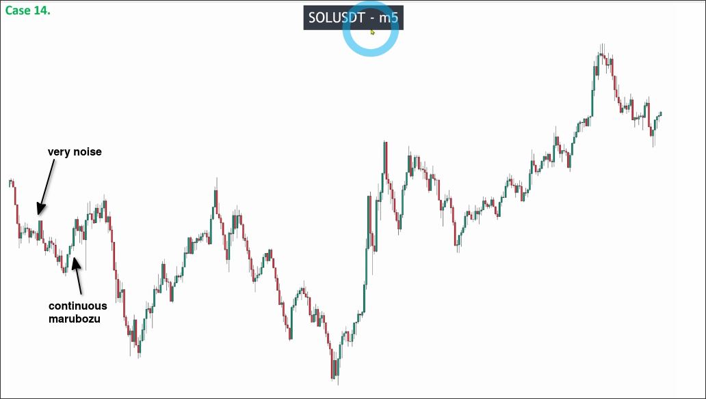

We can see continuous up maru candles in the area, but left side is very noise, so we need to make sure these up maru candles are not inside the range of the left side.

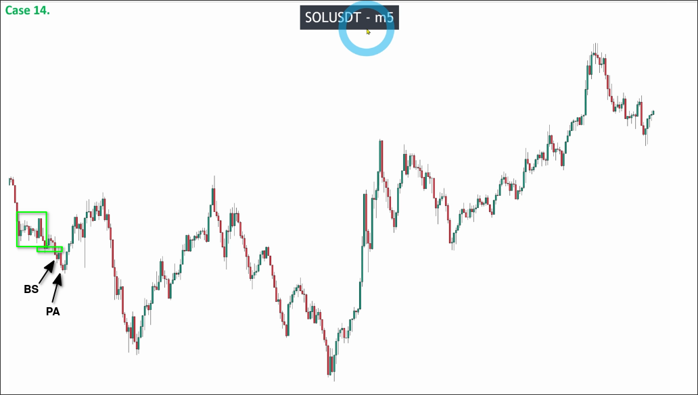

We can see that the range has been broken before the up maru candles, so we can confirm that the pullback is valid, also the pulse wave left is valid. Then we can draw a recent low and check if it was broken.

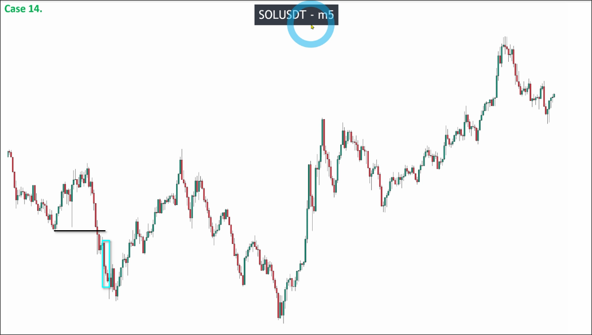
You can see that the recent low was broken, so we can draw our first key level.

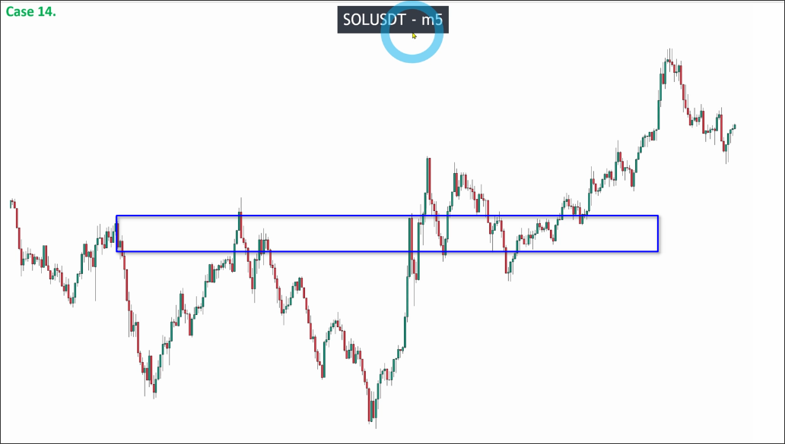

Then, we keep analyzing the 2nd area.

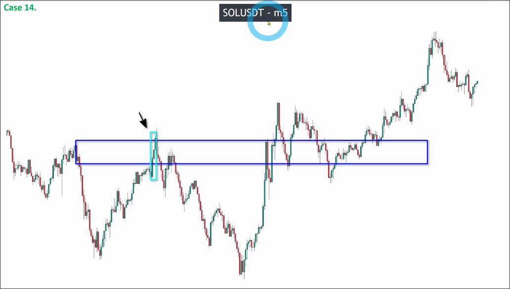

We can see that area has a group of continuous up maru candles, so the pullback is valid. And we already confirm the recent low was broken, so the pulse wave left is valid too. Then we can draw our second recent low and check if it was broken.

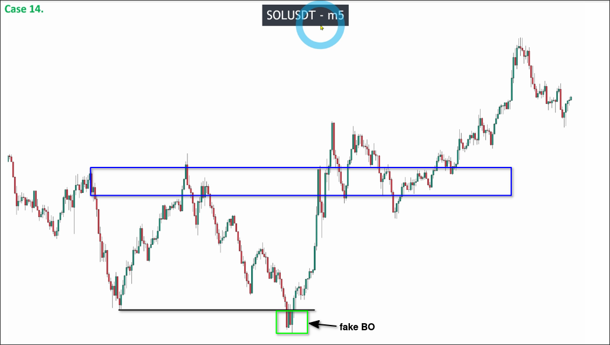

We can see that the recent low was fake broken, so this area is still counted as previous pullback wave, so we can update our pattern of the trend.

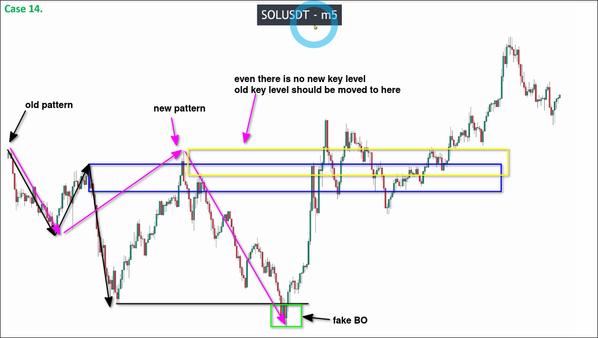

By the new place of the key level, we can see it has been broken as below:

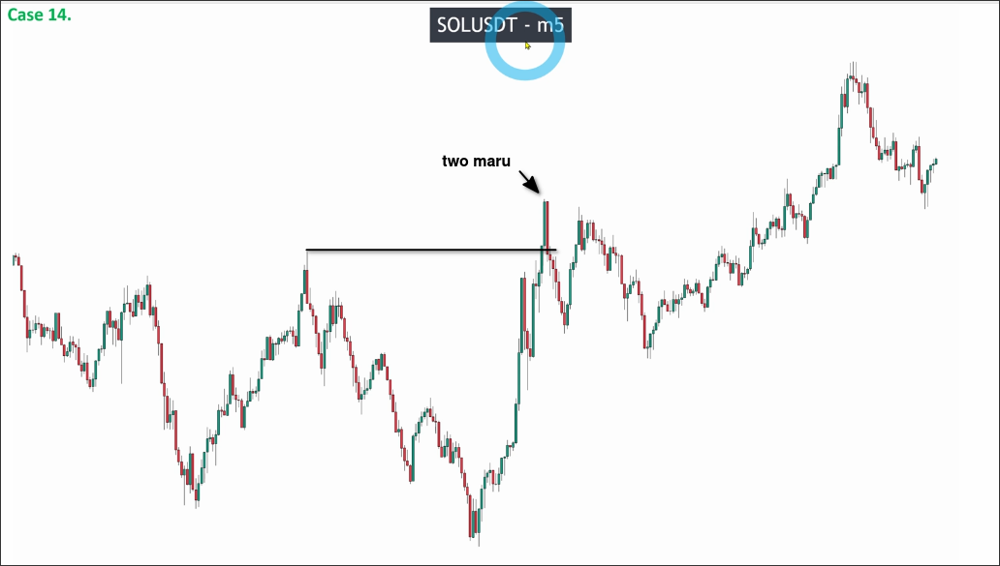

So, we should start analyzing the uptrend from the bottom. Let's draw the areas of possible pullback waves on the right uptrend.

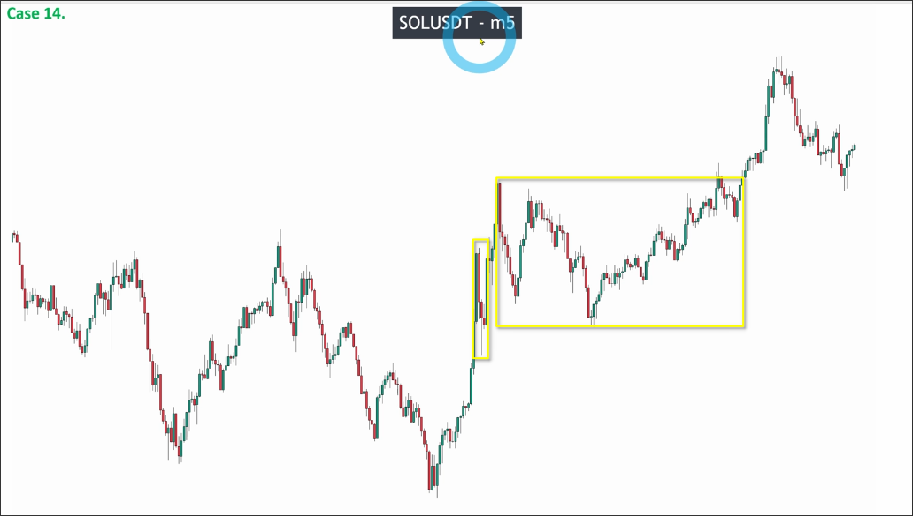

Then, we analyze the 1st area of the uptrend.

The 1st area met the BIG SMALL pattern, so we can confirm the pullback is valid. Left side has strong up continuous maru candles, so we can confirm the pulse wave left is valid too. So we can draw the recent high and check if it was broken.

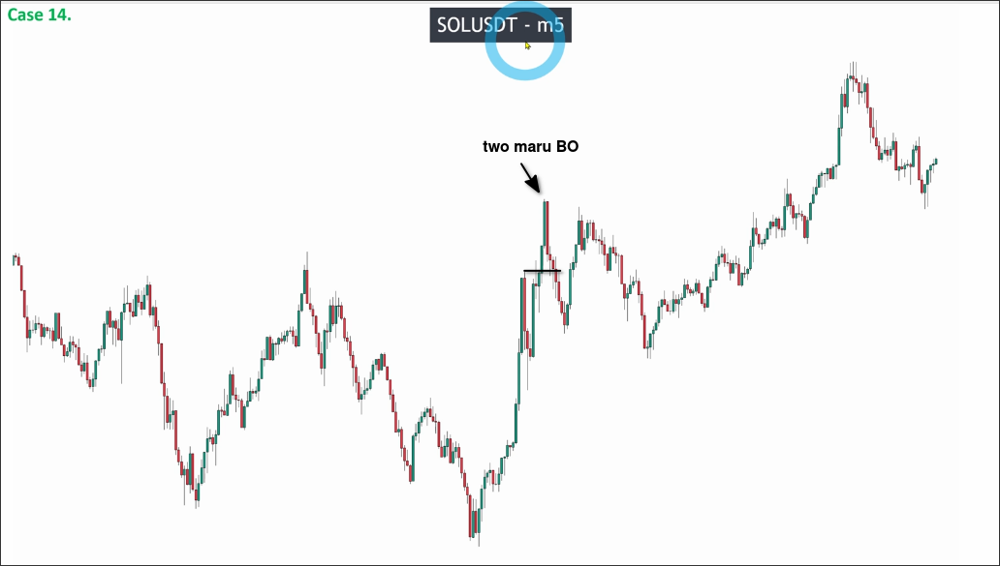

We can see that the recent high was broken, so we can draw our first key level on the uptrend.

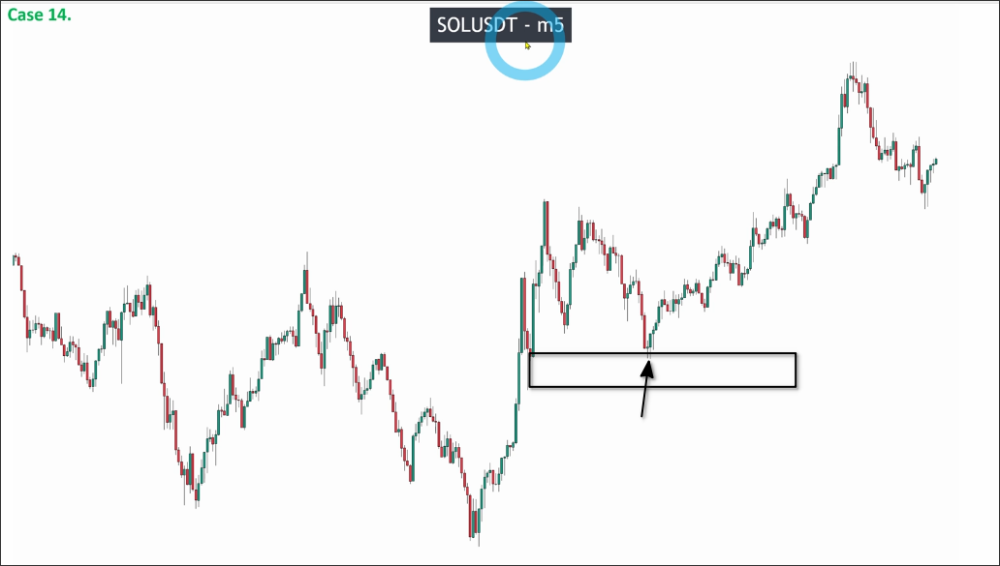

You can see that the price touched the key level and then went up, so we already prove that even the cryptocurrency also respects the key level.

