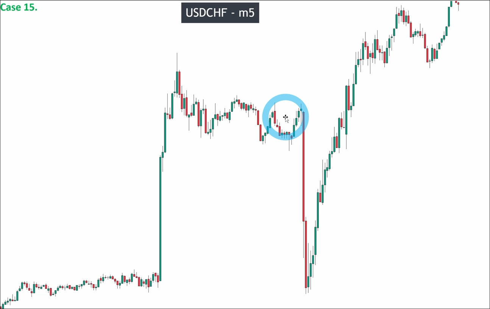
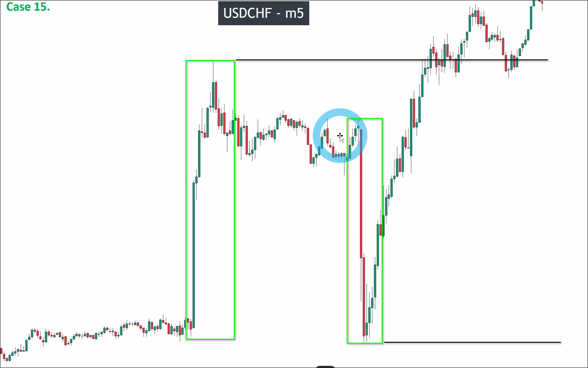
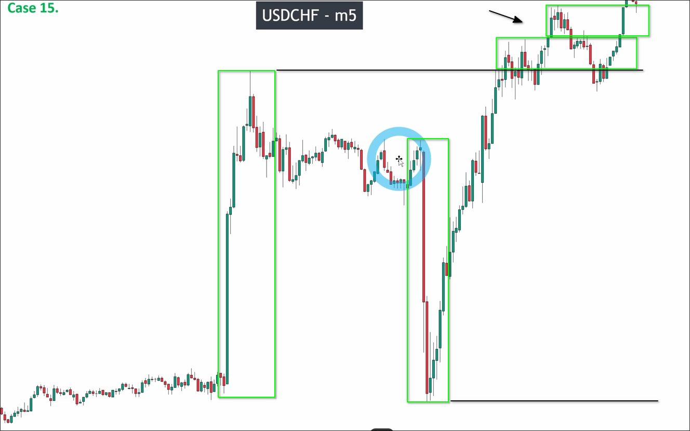

# Assigment 15: USDCHF_Boom and Crash case_Market structure with big NEWS

As shown in the picture above, sometimes we may see very unusual situations like this. This is because big news generates momentum in longer time frames like 4H or 1H, causing these abnormal charts to appear in shorter time frames.

You can see the latest economic news on the website [NCI-New concept Integration](https://www.nci-marketstructure.com/economic-news)

Before the release of this type of news, liquidity will become very poor because many people don't want to risk. If you enter the market at this time, you may encounter slippage issues. After the news is released, there will be a significant momentum causing abnormal structures like the one in the chart above.

## How to trade during this time?

The best method is to stop trading before the news is released, wait for this abnormal structure to appear, and then draw out the highest high and lowest low of this abnormal structure as follows.

After that, you can wait for the price to break the highest high or lowest low completely, then keep analyzing the market structure and enter the market as usual.

In the analysis above, it can be seen that the price is trying to break through the high points of the abnormal range, but they are all fake breakouts, so no trades should be made at the moment.

## Wait, enjoy life, set a profit target range

As a trader, what you need to learn is to wait and enjoy life. You can set a profit target of 8-15 every month, so you only need to make a profit of 2 every week. Even if this situation occurs, you don't need to worry because you still have plenty of time to make money. Even if you don't trade for 5 days, making 2 profits can be easily achieved in one day. That's why you need to learn to wait. You need to learn to wait for the market to give you opportunities instead of seeking them yourself, because the market will never lack opportunities. Just learn to wait.
