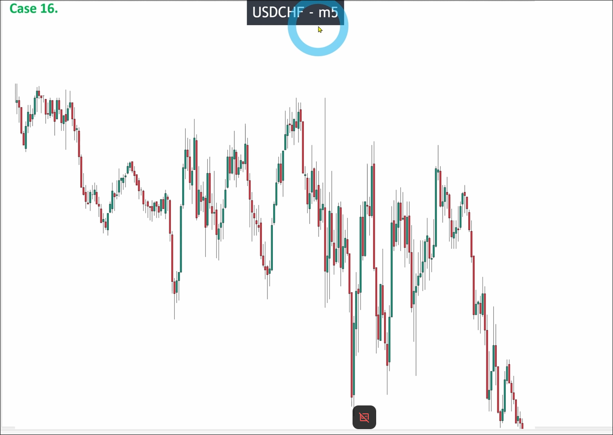
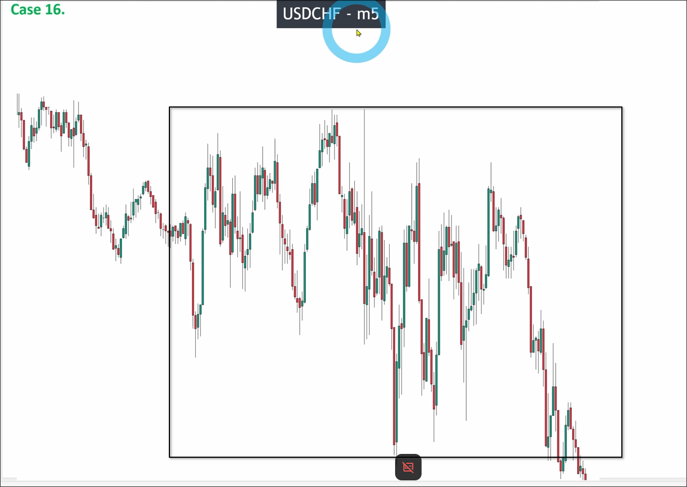
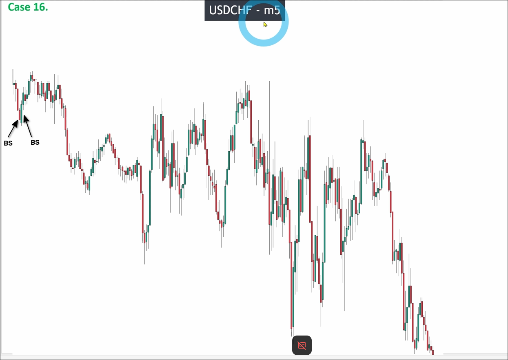
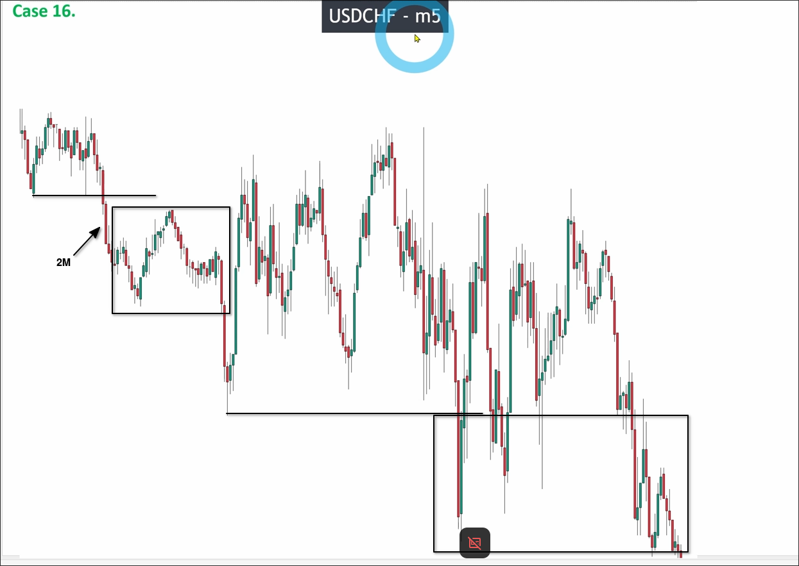
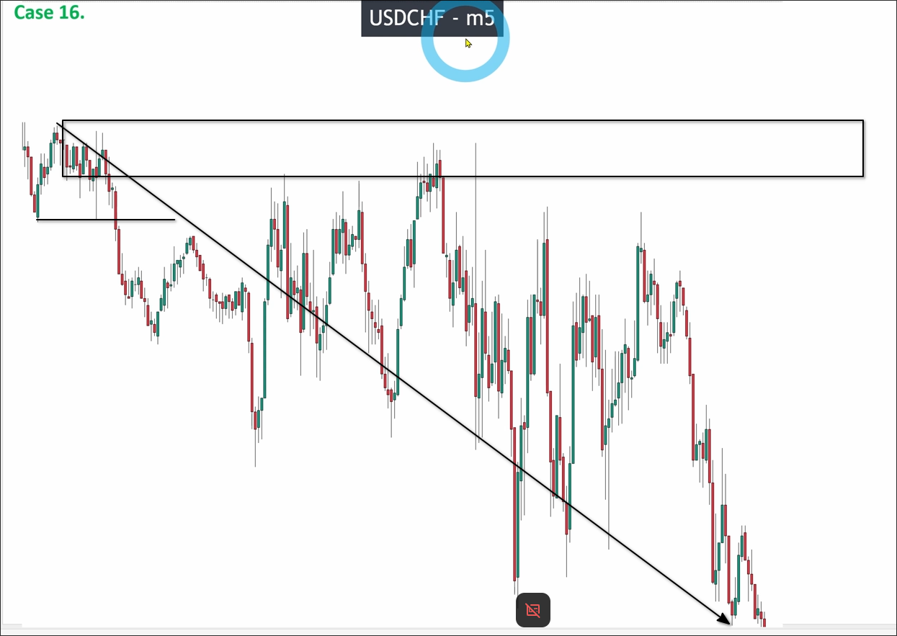
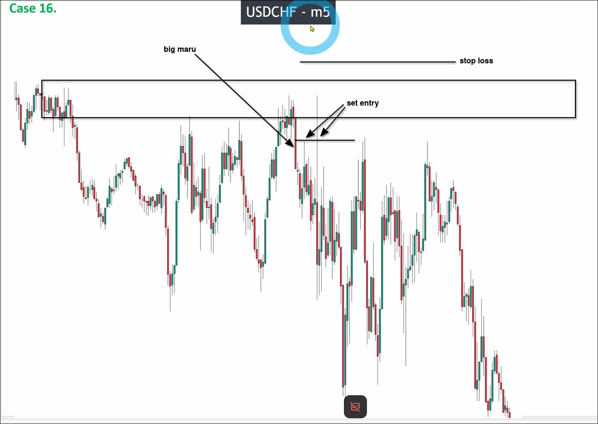

# Assigment 16: USDCHF_How to understand a NOISE maket structure

The image above shows a BIG noise, but it is not considered abnormal. If you are a beginner with less than two years of trading experience, it is recommended to draw out the range of big noise and then analyze it after the price completely breaks through.

But as an experienced trader, you can still conduct analysis, because there is big noise, so analyze from left to right without using any quick method to avoid errors in analysis at any point.

The first wave has 2 BIG SMALL to confirm the valid pulse wave and also pullback wave, then we can draw the recent low and check if it was broken.

You can see that the price broke the recent low and then the range happened, so there is no more pullback wave, only the pulse wave extension.

You can see the price still respects the key level, even though it is a big noise. When the price reaches the key level, we can wait a big down marubozu candle to confirm it and set the entry on the middle of the candle and stop loss above the key level.

## Don't analyze all chart, only analyze the key point

The most common mistake for beginners is trying to analyze everything in the market, which is wrong. You only need to analyze key points and then trade on those key points. This can help avoid over-analysis and incorrect trading decisions, as well as prevent being influenced by emotions.

