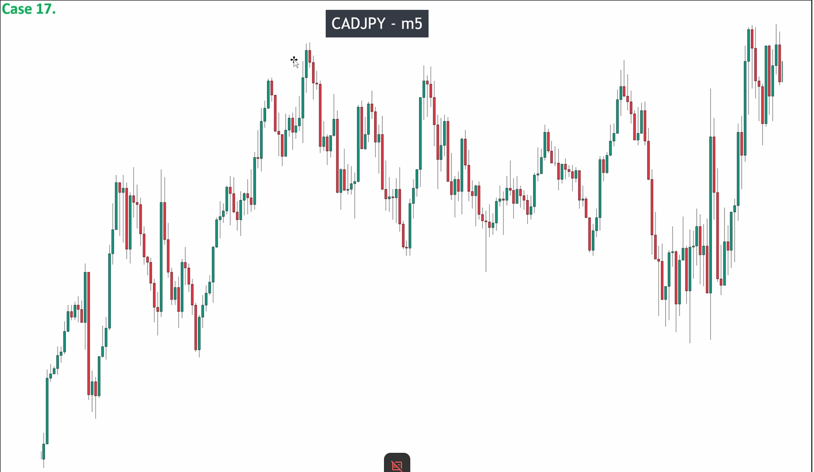
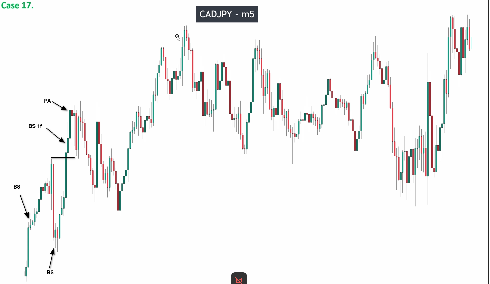
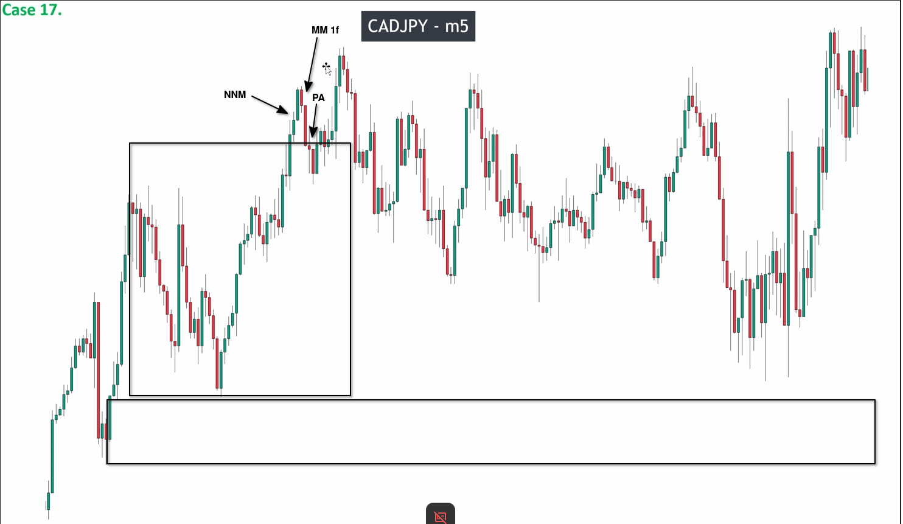
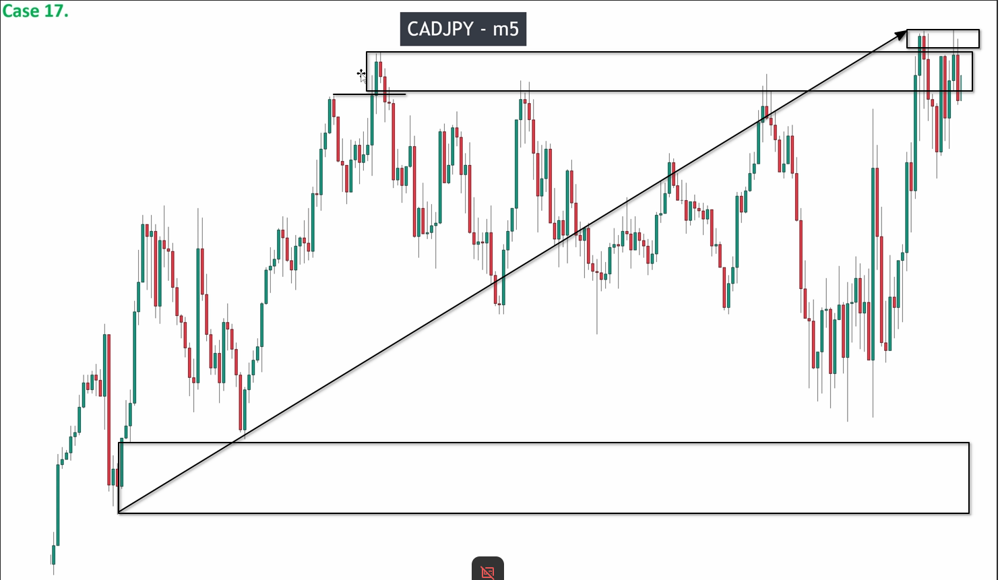
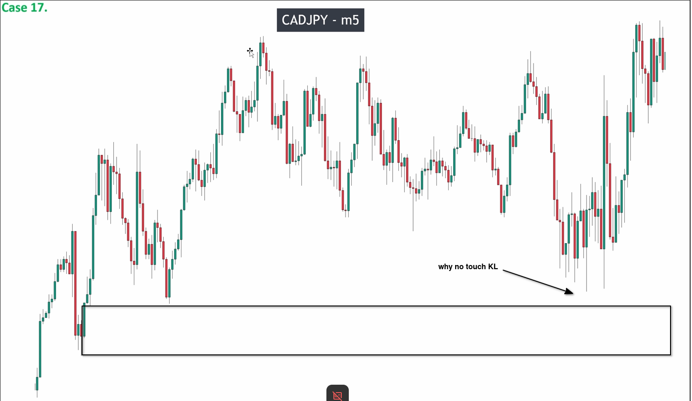
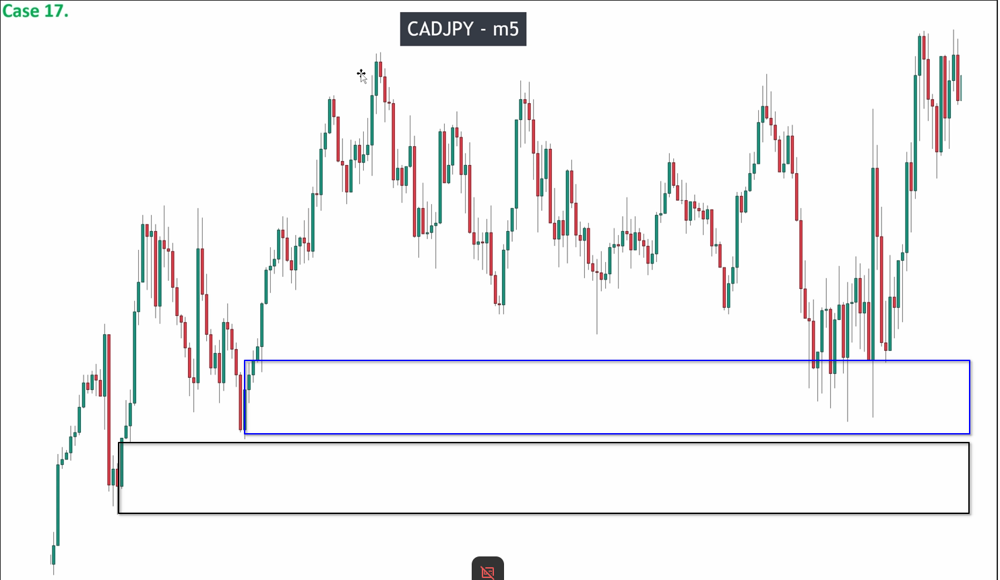

# Assigment 17: CADJPY_How smart money work with market

The above chart is a 5-minute chart of CADJPY. It can be observed that there is a lot of noise, so we analyze from left to right sequentially to avoid errors in analysis.

You can see that the first wave has a valid pulse and pullback and successfully breaks through the high point. We can draw the first key level and continue with the analysis.

It can be seen that there is a big range but it valid breaks upwards near the high point, followed by an valid pullback. We can draw a new high point.

You can see that this high point has not been effectively broken through, but instead has made the high point higher and higher.

## Why the price didn't touch the Key Level?

Some people may ask why the price rebounded without touching the key level and went up instead. (as shown in the picture)

This is because there is a POI area in the middle, as follows

POI is determined using the Fibonacci line. When a POI area appears, we will focus on trading in this area instead of key levels (we will learn about it in more detail in higher-level courses).

## How to entry the market?

When the price reaches the POI area, you can observe a big candle with a long tail appearing, indicating that the selling pressure has been completely absorbed by the POI zone. At this point, we can enter the market.
