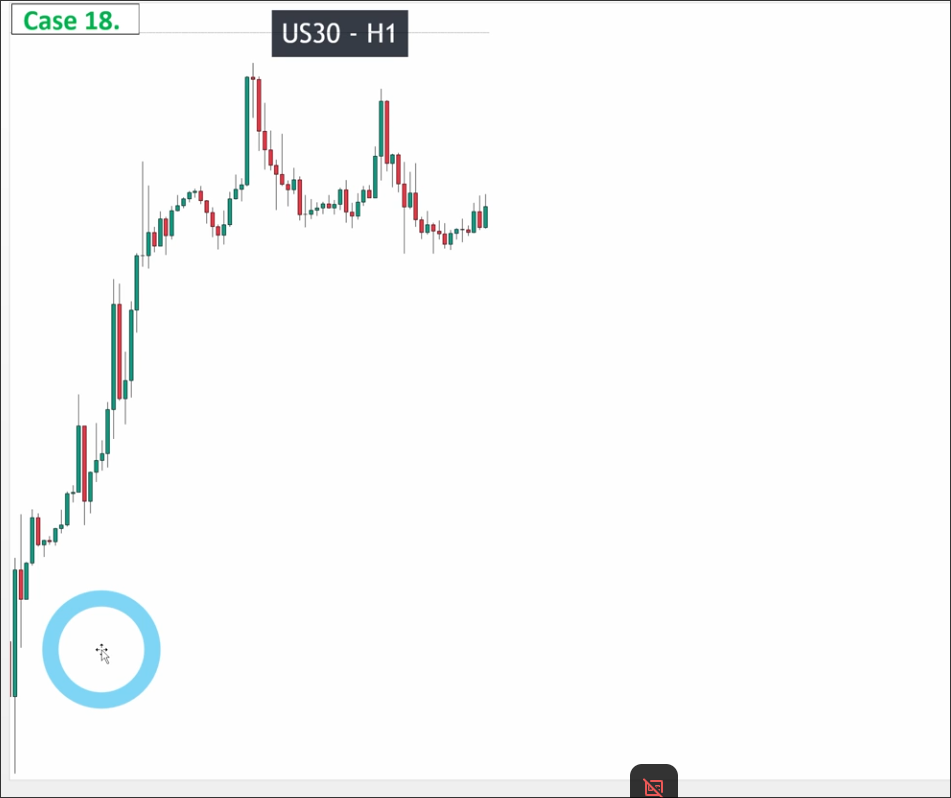
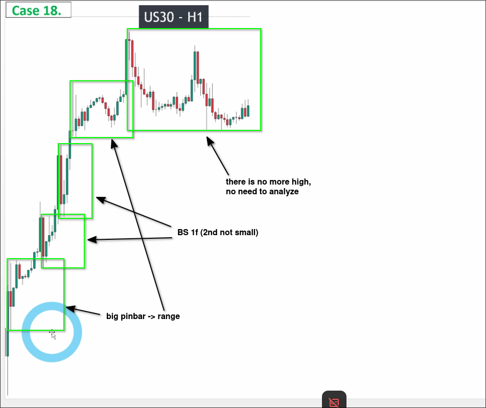
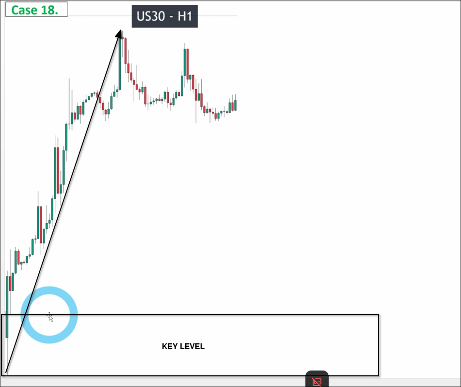
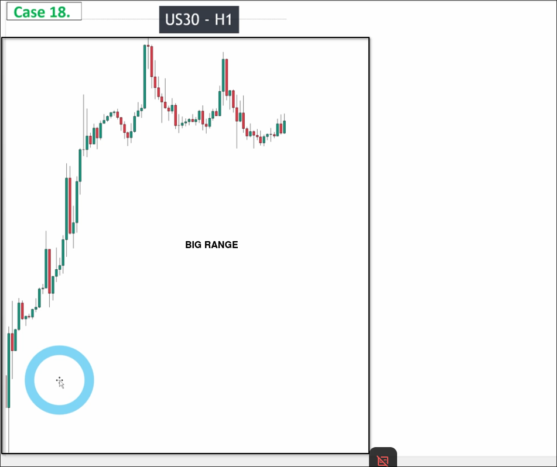
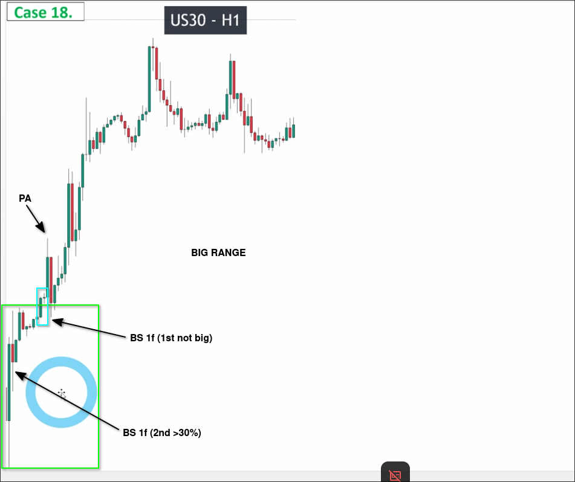

# Assigment 18: US30_How to analyze a STRAIGHT WAVE_No pullback

The chart above shows a clear upward trend. We can start by analyzing the pullback wave.

It can be seen that there is no pullback wave established. In this situation, we still need to confirm if there is any valid breakout upwards to establish a pulse wave, even if it seems like a clear upward burst.

Assuming there is a valid breakout upwards, there will be a key level at the bottom.

Assuming there is no valid breakout upwards, this entire chart itself is a large range.

Let's analyze carefully to see if there is a valid breakout upwards.

The conclusion is that it happened in a very small detail, so we have a key level at the bottom.

