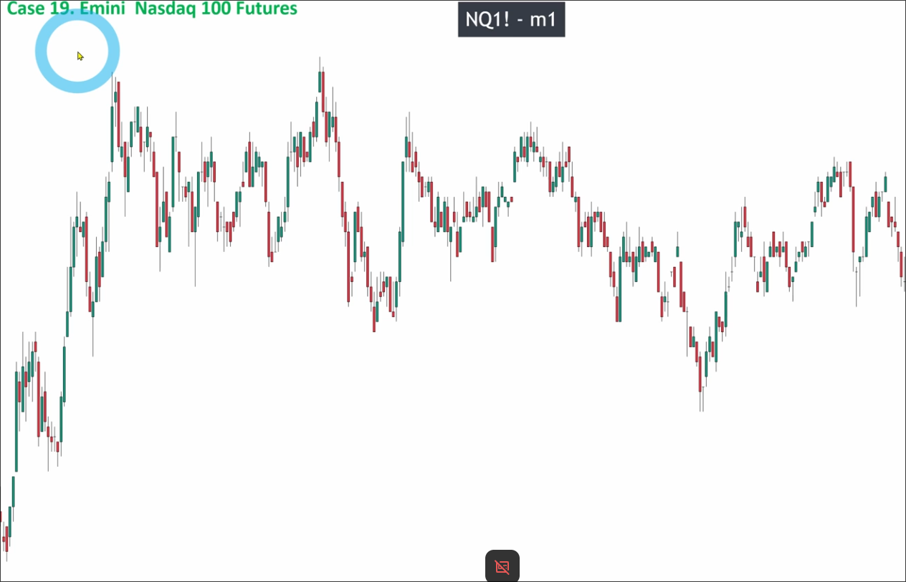
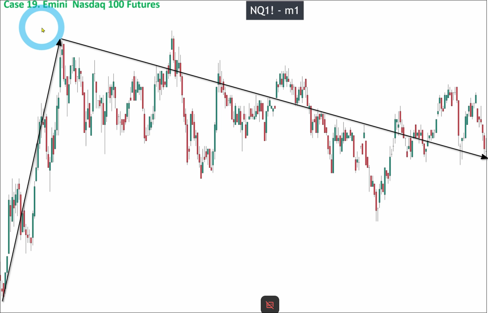
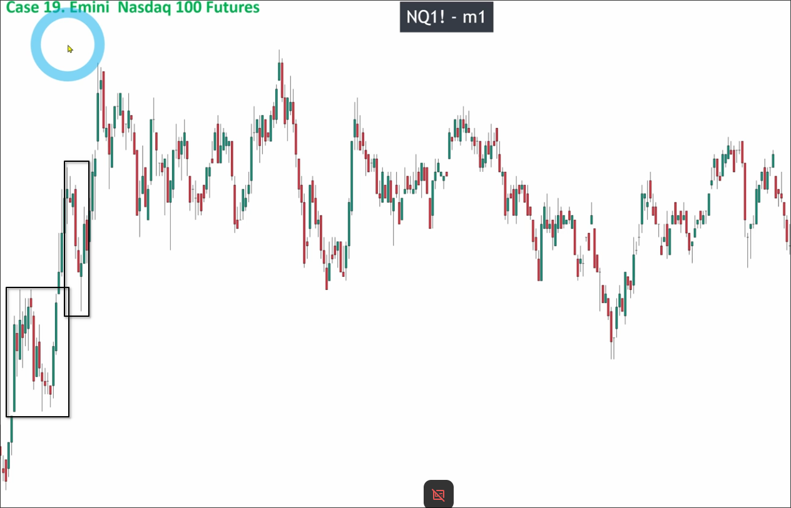
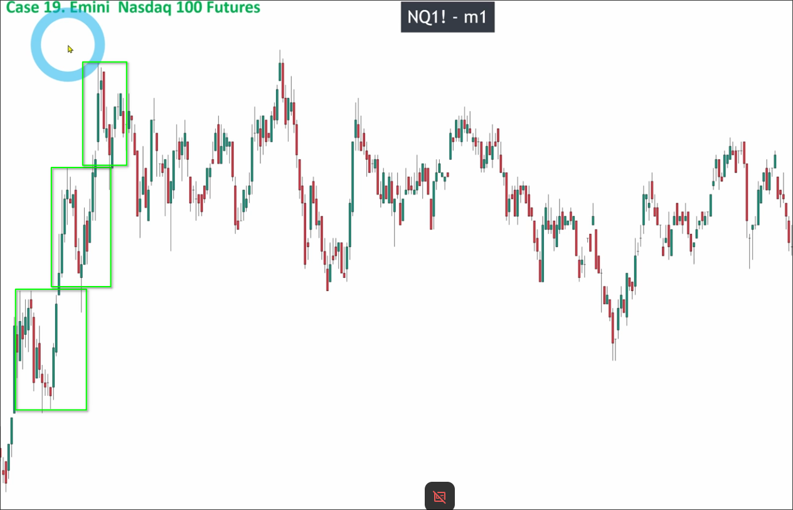
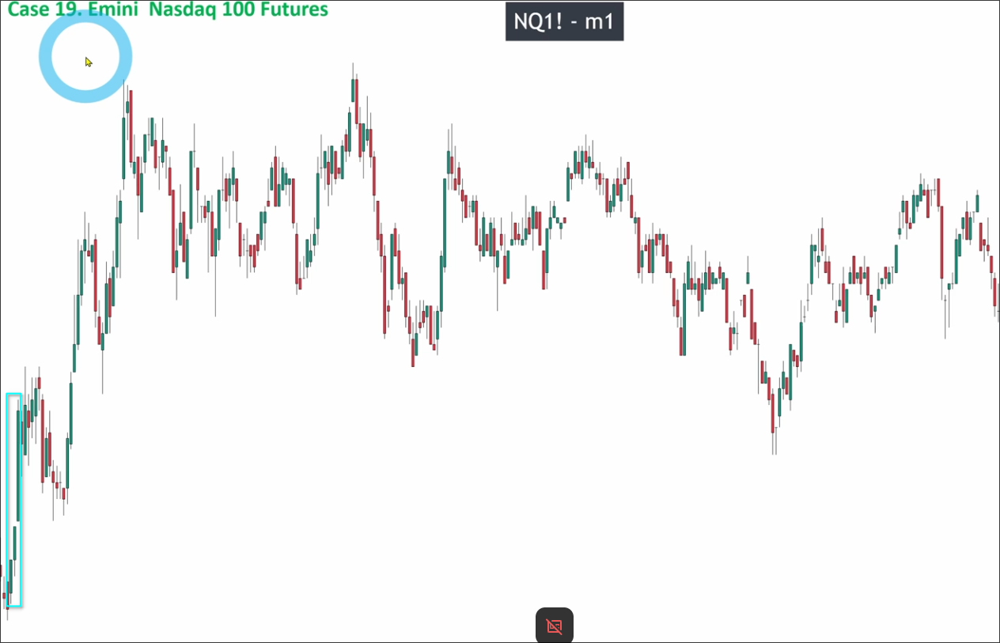
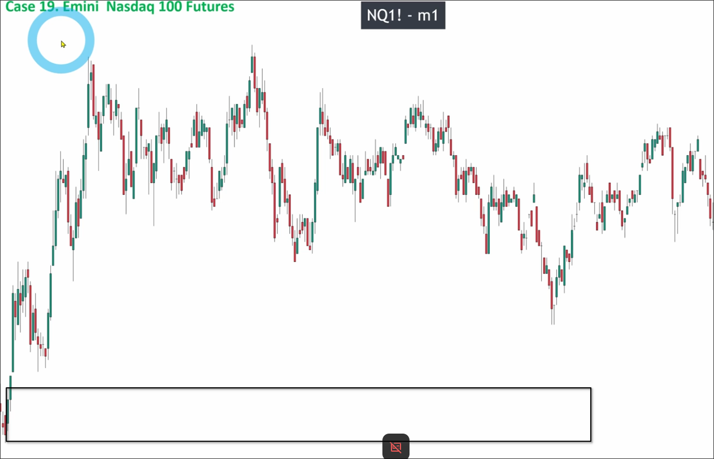

# Assigment 19: Emini Nasdaq 100 Futures_Scaling on M1 timeframe?

First, let's analyze the overall trend of the prices above.

It can be seen that it is a V-shape, so we must start the analysis from the uptrend on the left to avoid the situation where the downtrend is actually a pullback wave.

Then, we can pick the areas where it is possible to be pullback waves to analyze.

There are two areas that can be considered pullback waves, then we can analyze them in detail.

It can be seen that a range was formed from the first area, and it continuously extended to the highest point through fake breakouts, so it can be confirmed that there is no pullback wave.

However, we still need to confirm whether there is a pulse wave in order to determine if there is a key level at the bottom.

It is obvious that there is an upward breakout, so we confirm there is a pulse wave, so we can draw out key levels.

You can see that the price did not fall back to the key level and instead rose directly. This is because of the appearance of the POI zone in the middle. The POI zone is something that will be taught in level 2 courses, so I won't go into detail here.

## For day trader or scalper

You can see that the timeframe in the above chart is M1, which is usually used by day traders or scalpers. When trading on this timeframe, when the price falls back to a key level (or POI), we do not wait for price confirmation (big candle) before entering the market. Instead, we directly use pending orders to set the entry point and stop loss, then close the window and do other things. The result is just win or loss.

## Day traders need strong mental resilience

Day traders are easily prone to consecutive losses in a short period of time, which can create immense pressure. This pressure may lead you to constantly watch the market, causing you to take profits prematurely and re-enter at the wrong time. This behavior can result in losing all your funds in a short period of time, which is not worth it.

Therefore, it is recommended that friends with long-term swing trading experience try day trading again, as you need to have a strong psychological quality to face these situations.
