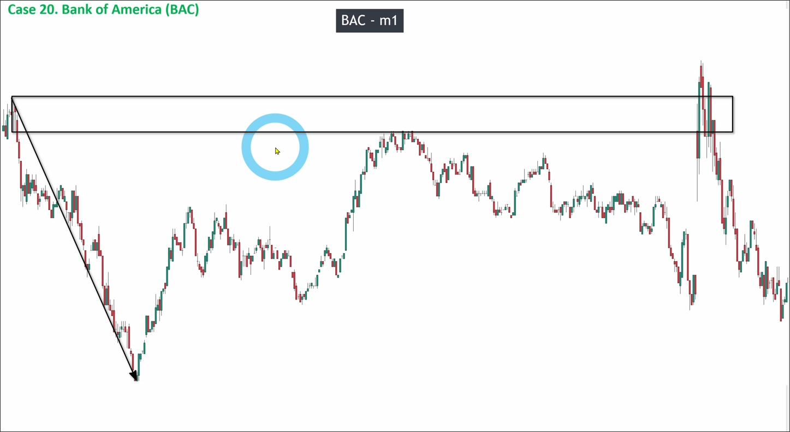

# Assigment 20: Bank of America_Scalping mindset

The above is a 1-minute chart of Bank of America (BAC). We need to trade different types of assets to optimize our investment portfolio in order to reduce risk, so I am introducing this product here. BAC is a favorite of many scalpers.

First, we need to identify the highest high and lowest low of this chart and draw the overall structure as follows.

This picture can be seen divided into two main parts, we must start analyzing from the first part to avoid misinterpreting the current trend.

Above, we analyze whether there is a pullback wave in the downtrend of the first part. It is obvious that the first part where a pullback wave may occur is actually covered by a range.

The second part where a pullback wave may occur has a gap. We can consider the gap as a marubozu candle, but because the size of the drawn marubozu candle is too small, it can only be considered as a doji. This pullback also fails and results in a range, so there is no any valid pullback wave in the downtrend of the first part.

Then, we need to check if any valid breakout in the first part to confirm the pulse wave, so we can know if there is a key level on the top or just a big range.

As shown in the picture, there are two very obvious valid breakouts in the first part, so we can draw the key level on the top.

But we can see that there are two imbalances occurring in the first part, so we can use Fibonacci to draw the POI zone. After having the POI zone, we will no longer enter using key levels, but instead enter using the POI zone.

In the uptrend of the pullback wave, we also found an imbalance situation occurring, so there will also be a reverse POI zone. We also need to draw it out.

We can plan the entry, stop loss, and take profit prices in the two POI zones as above, but it is essential to ensure that the return ratio (RR) is greater than 2 before entering the trade. RR > 2 is a very important criterion. Sometimes our analysis may be wrong or we may lose direction, but as long as we follow the principle of entering only when RR > 2, we can guarantee that your account can profit in the long term. Because if RR > 2, it means that you only need an average win rate of 33% to maintain a profitable account in the long run. Even if we have no idea how to analyze, we will still have a 50% win rate. Therefore, the principle of RR > 2 is very, very important.

In the above chart, the RR seems to not have reached two, but we can adjust the entry and stoploss prices to achieve an RR of two. In day trading, we do not need to wait for price action confirmation. We just need to plan the prices, place the orders, and then close the chart. Therefore, we can adjust these prices accurately.

Afterwards, as a scalper, we can also enter using reverse POI, as planned below.

When the price returns to the key level, we can plan again as follows:

As a scalper, it is all about planning, setting the entry, stop loss, take profit, closing the chart, and then waiting for the price to reach a key position to continue the next cycle. Beginners may want to constantly monitor the chart, but in reality, this can lead to stress and emotional influence, resulting in wrong decisions. Therefore, the mindset of a scalper is very important, ideally with at least three years of swing trading experience to have enough psychological resilience to do scalping.
