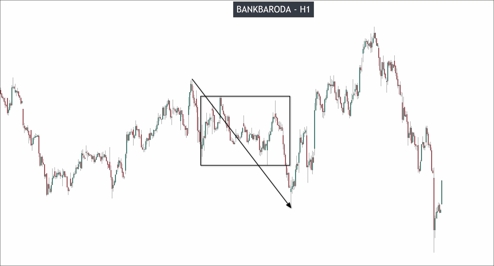

# Example with India Stock: Bank of Baroda (BoB)

I see some gaps in the chart above, so we need to observe the following two things:
1. Observe if the size of the candles is large enough, indicating strong momentum
2. Observe if a wave only has one gap instead of multiple gaps

When the market has enough momentum and the number of gaps is within a reasonable range, we can assume that these gaps are marubuzu candles and conduct analysis.

Then, identify the highest high, lowest low, and recent price in the chart and draw out the main structure.

You can see that it is divided into two parts, uptrend and downtrend, so we need to start analyzing from the first part.

The first part begins with three identical low points appearing, and we can choose the most recent one to start analyzing.

Then, analyze the parts that may have a pullback wave.

In the first pullback wave, a special marubozu candle appeared followed by a normal candle. You can use the two marubozu candle pattern, but it requires price action confirmation. Although I did not find successful price action confirmation, the video mentioned that there was confirmation.

Looking back at the pulse wave, it is clear that it is a valid pulse wave, so we can draw out the recent high. We can observe that the recent high has also been effectively broken by two marubozu candles.

Then we can draw out the key level.

When we draw out this key level, we can immediately see that it has been effectively broken through. We don't need to analyze the structures above it, because even if new key levels appear above, they will still be broken through.

Therefore, we must start analyzing from the high point in this pullback in a downtrend perspective.

We can see that this downtrend is pretty noise, so there is no any pullback. In addition, we can use the breakout of key levels to confirm that this is a valid pulse wave, without the need to search for a valid breakout again. Therefore, we can directly draw out the key levels of the downtrend.

When the key level is drawn, it can be seen that it has been broken again, so the trend continues to reverse. In this situation, we need to stop analyzing on this timeframe and switch to a higher timeframe for analysis. We switch to the 4-hour chart to see why this situation is happening on the 1-hour chart.

In the 4-hour chart, we zoomed in to observe the stable and unstable states of the trend. We can see that there was indeed a long period of stable uptrend movement before. However, after the recent key level was reached, a big range appeared above, preventing the emergence of a new wave and causing the key level to be retested many times.

When a single key level is tested each time, it represents buyers absorbing the pressure from sellers. When this absorption occurs too many times and no new key levels are generated, the ability of buyers to absorb and push up prices in this key level will gradually be depleted. This ultimately leads to the trend being ready to reverse at any time. This is why we see continuous trend reversals on the 1-hour chart.

We must avoid trading until a stable trend appears after 4 hours before continuing to trade this asset.

