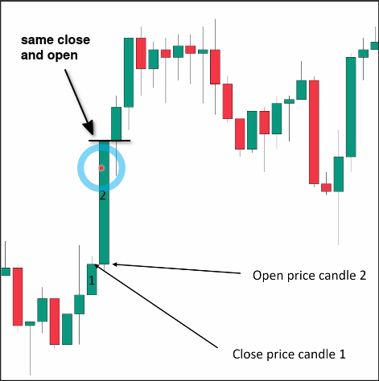
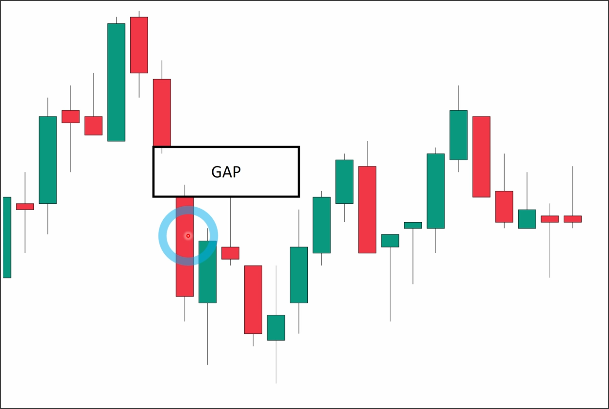
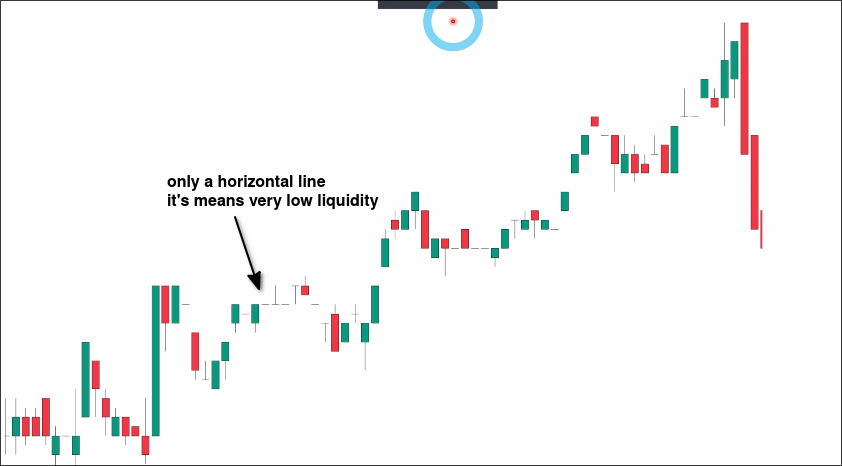
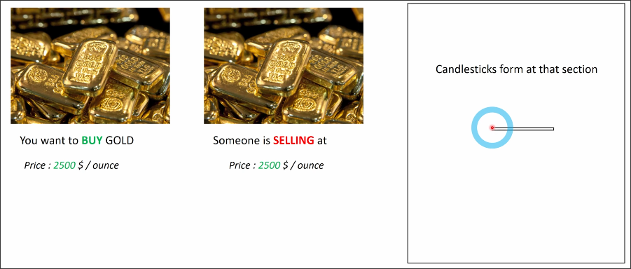
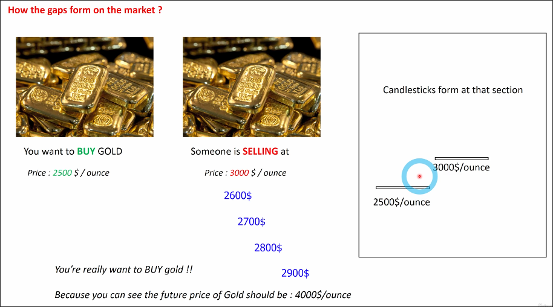

# How GAP appears on chart

## What is a gap?

Usually, if the price moves very smoothly, the close and open prices of each adjacent candle will be very close as follows.

However, if the price moves very violently, the close and open prices of each adjacent candle will be very far apart as follows.

As shown in the picture, when the close and open prices of adjacent candles differ significantly, we can draw a gap.

## Why does the gap appear?

There are two situations in which a gap appears:
1. Market is on too strong momentum
2. Market is on too low momentum

We can determine whether the gap is caused by too strong or too weak momentum by observing the size of the candles before and after the gap.

In the above picture, you can see that there are many large candles before and after the gap, so the gap in this example is caused by strong momentum.

In the case of momentum being too weak, it will be obvious on the graph, as shown below.

In this case, the gap is caused by weak momentum because the candles before and after the gap are small and even some candles are only one horizontal line, which means very low momentum and liquidity.

## Human mentality to impact the price and the formation of gaps

When we want to buy gold at $2500 per ounce, and someone is selling at $2500 per ounce, a candle will form as above.

However, if we want to buy gold at $2500 per ounce, but no one is selling at that price, only someone is selling at $3000 per ounce, but you still want to buy because you think the price will go up and you can still make a profit in the future, then the price will form a gap as shown above.

The above shows the impact of human mentality on prices and the formation of gaps.
