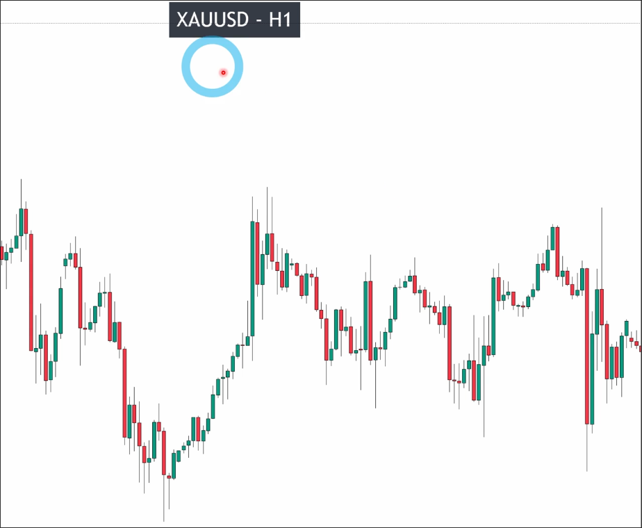
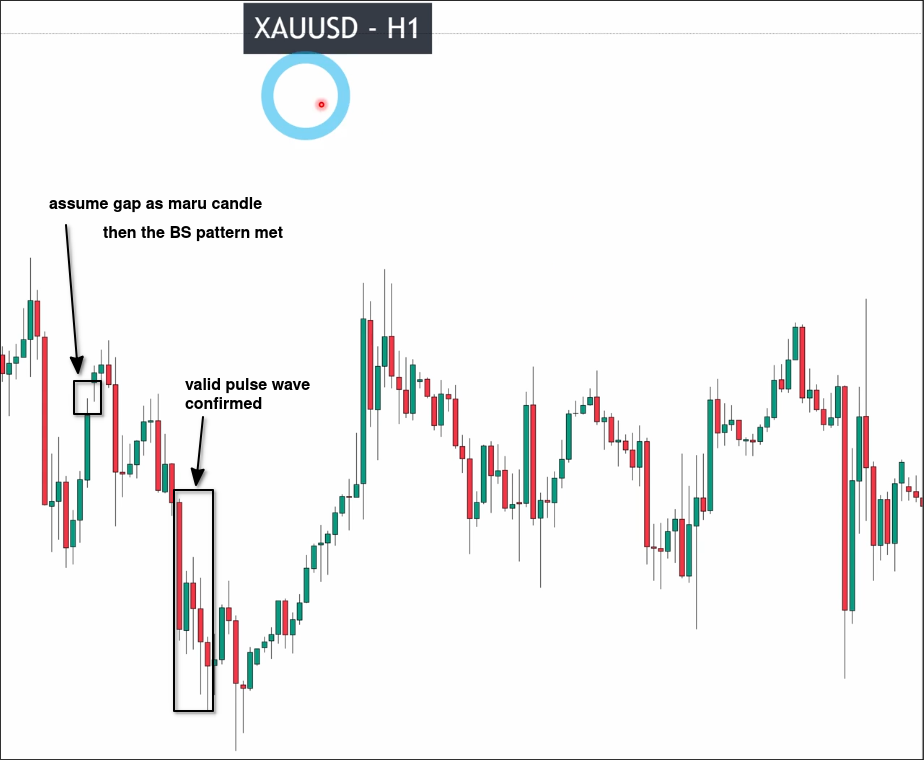
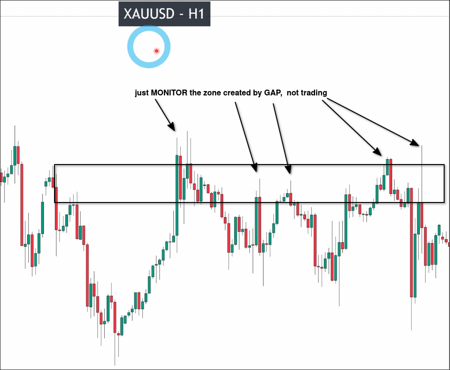

# How to TRADE with GAP market

## Two situations when a gap occurs

There are two situations when a gap occurs:

### 1. If chart just has several gaps

Just analyze market structure to monitor trend and skip trading.

### 2. If chart has many gaps

Do not trade or even analyze the chart with many gaps. If you really want to see what is going on, you can open higer timeframe which has less gaps or no gaps to analyze the chart.

## Situation 1: How to trade with gap

We use the following example to illustrate:

We quickly analyze and determine the position of the key level as follows.

We assume that the gap is a maru candle, which generates an valid pullback wave. There is also a clear breakout below, so there is also an effective pulse wave, allowing us to draw key levels.

This key level zone can be seen to be continuously retested, followed by a price decline. Although the key level zone has experienced multiple fake breakouts, there has been no valid breakout. Therefore, it can be determined that this key level is valid but relatively weak.

The key point is that in this process, we are only monitoring the behavior of prices at key levels, because these key levels are generated based on our assumption that the gap is a maru candle. If we do not make this assumption, the key levels would not exist, so we should not trade based solely on these key levels.
