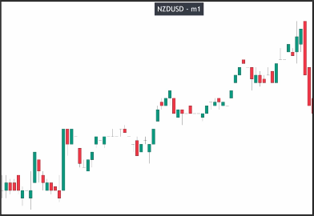
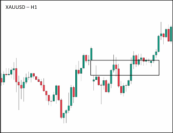
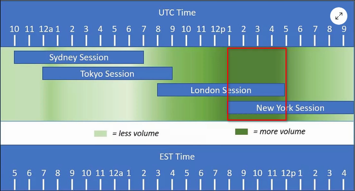
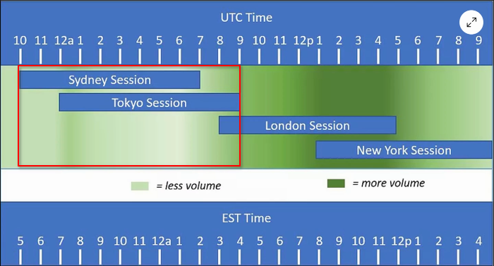
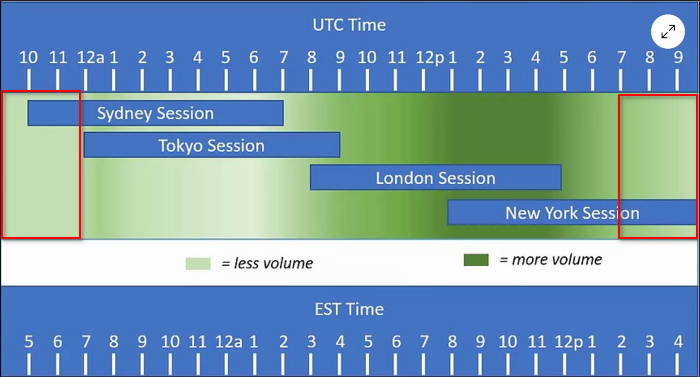

# When GAP appears on chart

## Low trading asset and timeframes

Gaps normally appear on low trading assets and timeframes.

The above chart is a 1-minute chart of the New Zealand Dollar (NZD). Because NZD itself is a low trading volume asset, and it is a 1-minute chart, there are many gaps that appear due to low momentum.

We should try to avoid trading based on this type of chart as much as possible, even if you can still analyze the market structure. Usually, this type of chart is prone to fake breakouts, which can result in losses for you.

Although NZD itself is a low trading volume asset, we can increase the trading time frame, usually using a 15-minute time frame or higher. The chart structure of NZD will become good enough for us to conduct normal analysis and trading.

## Trading session change

Sometimes a gap may appear due to changes in the trading session.

The gap in the chart is caused by the change in trading sessions, transitioning from the New York session to the Asia session.

There are four trading sessions.
1. New York 8am to 5pm EST (1pm to 10pm UTC)
2. Tokyo 7pm to 4am EST (12am to 9am UTC)
3. Sydney 5pm to 2am EST (10pm to 7am UTC)
4. London 3am to 12pm EST (8am to 5pm UTC)

In the above picture, the varying shades of green in the background represent the size of the trading volume.

The London session and New York session are the largest, especially when they overlap, which is the period of the day with the highest trading volume.

We refer to them as the Asian sessions, the trading volume during this period is significantly smaller than the London and New York sessions, because the traders during this period are mainly Asian traders, and their trading volume is relatively smaller.

The period with the lowest trading volume occurs after the overlap of London and New York, and the trading volume gradually decreases to the lowest point. This is because the high trading volume at the overlap leads to a significant decrease in trading volume afterwards. The trading volume will remain low until the opening of Tokyo.

As traders, we should avoid trading during low volume periods. These times are only suitable for observing market structure and not for entering trades.

We should wait for the opening of the Tokyo session, and then truly enter the market for trading only after it stabilizes.

