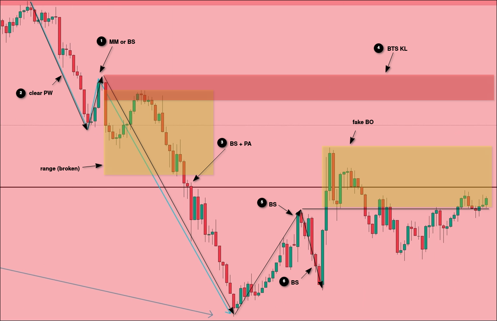
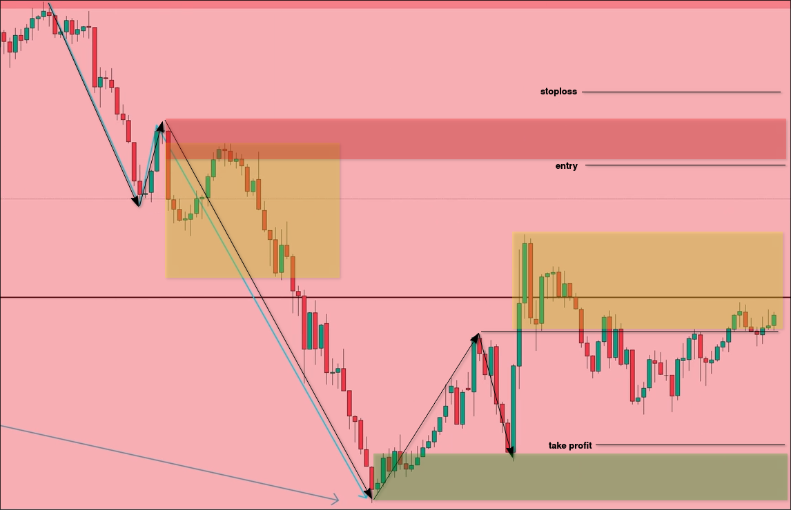

# Detail EXAMPLE about Trading with Multiple timeframe

When using the Multiple Timeframe strategy, the analysis order is HTF -> BTF -> LTF.

First, we search for major trends on HTF.

Then, we analyze the BTF for current market conditions.

As analyzed above, we have identified the KL of HTF, but currently it is in a range. The course video starts using BTF analysis directly from HTF KL, but personally I think that because we are currently in a range state of HTF, we can choose not to continue the analysis directly, but instead switch to other assets to find opportunities.

Let's follow the video and analyze the BTF from HTF KL.

Before starting to analyze BTF, some people may think that HTF KL has been backtested many times, so the selling pressure has been exhausted. However, this is wrong. Before the recent low breakout, KL has not been confirmed yet. The price hovering at high levels is actually accumulating selling pressure rather than consuming it.

Let's analyze the BTF now.

In the analysis of the chart above, we have found the KL of BTS. We can use BTS KL and recent low to set entry, stop loss, and take profit as follows:

We can further analyze LTF to identify the intervals that require risk management.

In the above figure, we found the KL of LTF, which is used to control risk. When entering the market, if the price approaches this zone, we must adjust the stop loss to the entry price.

Next is to wait for the price to break through the entry price and then wait for confirmation to appear. There are three types of confirmation:
1. Big red maru
2. Big pinbar with long tail upper
3. doule or tripple tops

We can also use the KL of HTF to set TP to increase RR.

As shown in the figure above, we can use HTF's KL to set TP to increase RR, and even use old HTF KL, but this will significantly decrease your win rate because there is a lot of buying pressure in these KL, especially the current one.

Above, if we use HTF KL (current) to set TP, this trade will break even. Although you haven't lost anything, because there was once a very lucrative profit, the result is still a break-even outcome. In your heart, you will actually feel that you have lost those profits (even if there is no change on paper), which can cause you stress. You will want to quickly make back the lost profits and engage in revenge trading behavior.

Therefore, it is recommended for beginners to simply use BTF recent high/low to set TP. Even if the RR is not high, it will not have a negative impact on the mind, and can cultivate confidence steadily, which is the most important.

> Note (personal opinion), I think that setting up a TP for HTF must be accompanied by an LTF's KL to set up a mobile TP.
