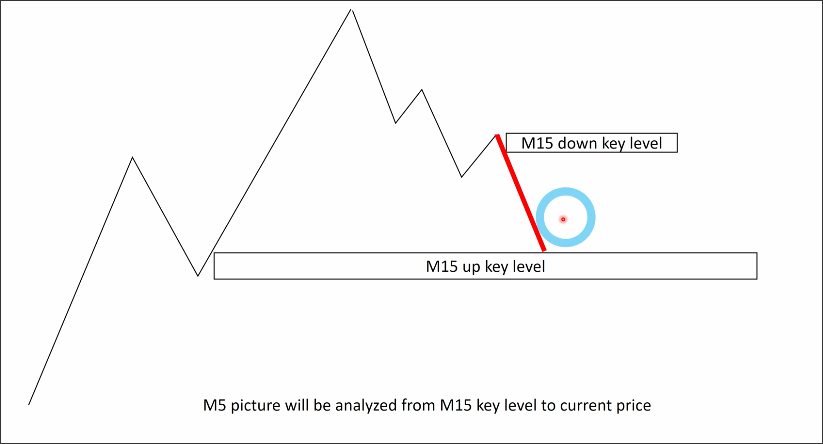

# How to Combine Multiple timeframe with market example_having example

When the price retraces to the key level of BTF, we should start switching to analyzing LTF from the key level in the pullback trend.

When we enter from BTF KL and the price indeed spikes, we should start switching from the KL to analyzing LTF.

Here is an example, assuming that BTF analysis has been completed as follows

We can see that the price is currently retesting the key level of the main trend, and the KL of the pullback wave trend is at the bottom. At this point, we need to start analyzing the LTF from the KL of the pullback wave.

We use LTF to analyze the market structure of BTF pullback and found that during the process, LTF's KL was generated as above. We must use this KL for risk management.

As mentioned above, when we enter the market with the BTF KL, if the price approaches the LTF KL, we must do risk management, which means we must move the stop loss originally set at the BTF KL to the entry price.

> Note, it is when "close to" LTF KL that risk management is conducted, rather than "entering"

As shown in the above diagram, if the entry does not reach the TP price for a long time and there is a lot of noise, do not continue to try to enter using the same KL. You must wait for a new KL to appear before entering again.

This is because buyers and sellers in this area have started to hesitate about future trends, so the best thing we can do is close the chart. Beginners may want to interpret all the information on the chart, but in reality, much of it is situations we cannot control and do not need to interpret.

