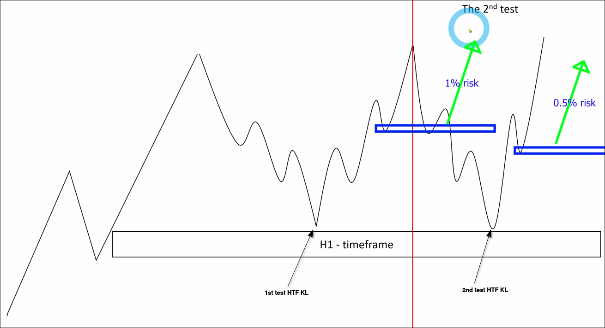

# JUDGE market condition on HIGH timeframe to reduce RISK

Before analyzing with BTF, we should use HTF to determine the market conditions.

Market conditions are divided into *nice* and *noise*. There is only one nice situation but countless noise situations. We only need to use BTF for analysis and to find entry opportunities in nice situations.

## Nice situation

When the trend of HTF is consistent with the trend of BTF, this is a NICE situation as shown in the following diagram.

## NOISE situation

### retest KL multiple times

When KL is being retested (assuming it is in an uptrend), buying pressure must be used to absorb selling pressure and the remaining buying pressure to push up the price. If KL is retested multiple times, buying pressure will be depleted, the buying pressure that pushes up the price will become less and less, which also means that the risk of entering the market will increase.

The above rules apply in any timeframe.

If you are a beginner, it is recommended to enter the market only when testing KL for the first time in both HTF and BTF, and avoid entering in other situations. Because building a trading mindset is very important, beginners must use low-risk, high-win-rate methods, even if it means missing out on some opportunities.

After you have some experience, you can enter the market with the usual risk on the first test of KL (1%), but only enter with half the risk on the second test of the same KL (0.5%). If there is a chance for further testing of KL in the future, avoid entering the market altogether.

### HTF in noise, DO NOT analyze BTF

When HTF is in noise, we do not need to analyze BTF. We can only wait for HTF to be in a nice situation before analyzing BTF.

