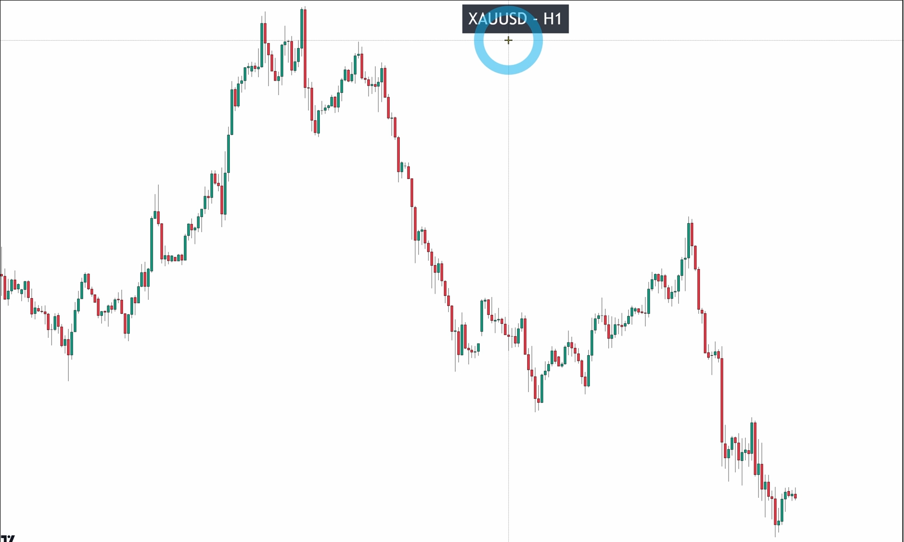
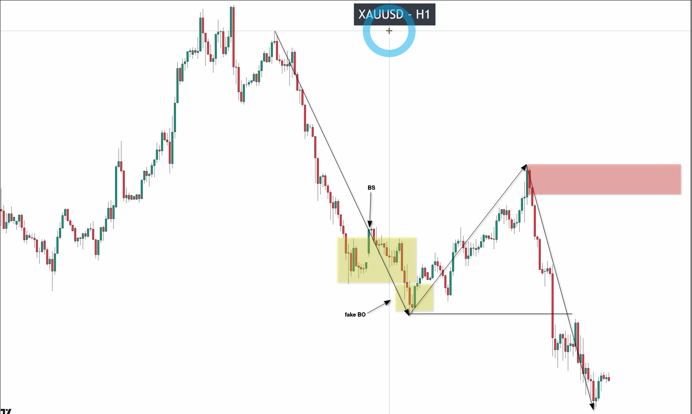
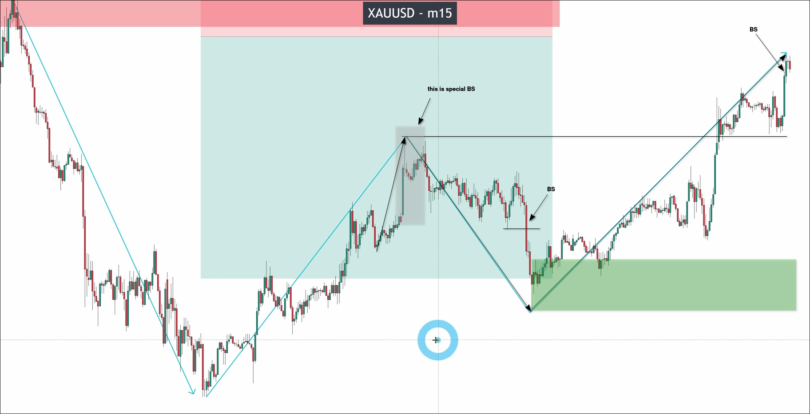
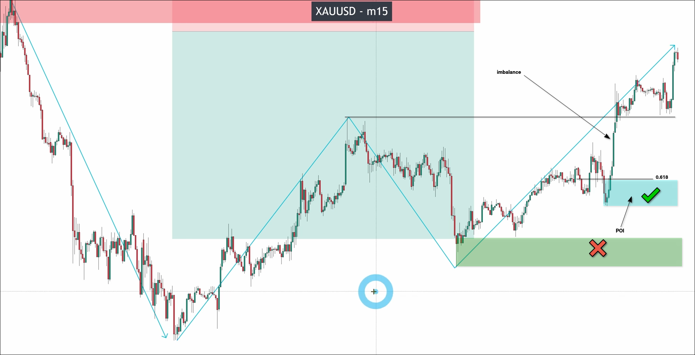
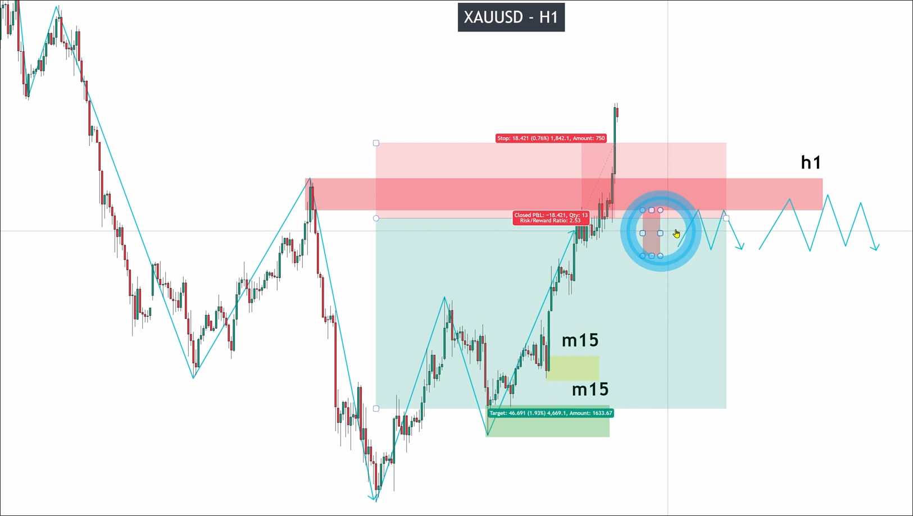
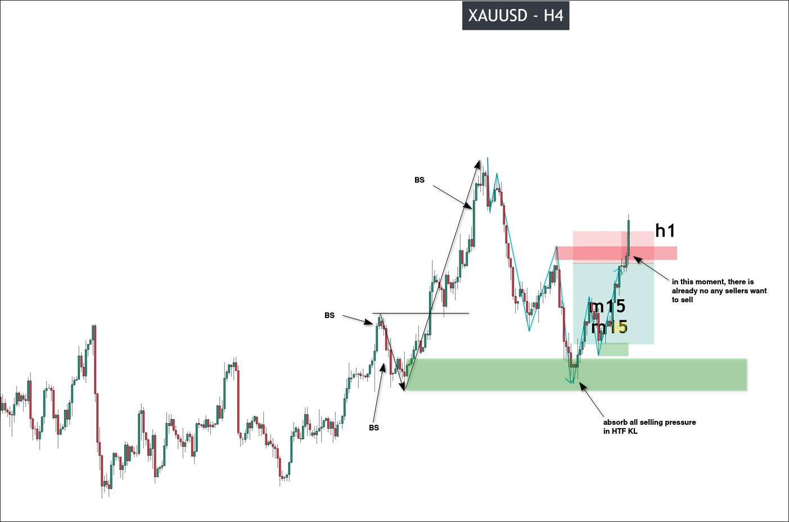

# Avoid losing trade with Market CYCLE

Assuming we use H1 as the BTF to operate gold, we can directly use the situation on the right to analyze where the current trend and KL are.

By analyzing only the right side, we can see that the current BTF is in a downtrend and the position of KL. The prices higher up actually do not need to be analyzed.

After that, the price starts to approach BTF KL, at this time we can use LTF to analyze this wave of retracement to more accurately control the risk.

We only analyzed the right half and found the KL position of LTF. Note that there is a special Big-Small pattern, which is a very large marubozu + pinbar. This pinbar has a very long upper tail, indicating significant buying pressure at the beginning and then a similarly large selling pressure pushing back. However, many subsequent candles slowly pushed the price back towards the high of the pinbar, which we also consider a valid breakout.

We can see an imbalance in the pulse wave of LTF, where imbalance occurs when there is a very large marubozu in the middle of three consecutive candles, causing a gap between the high of the first candle and the low of the third candle. We refer to this gap as an imbalance.

When there is an imbalance, Fibonacci retracement can be used to find the point of interest (POI) as follows:

When a POI appears, we will use POI instead of KL, because POI is stronger than KL, and traders will be attracted to this place.

Next, we wait for the price to reach BTF KL and conduct risk control at LTF POI.

It can be seen that BTS KL has been crossed, so this transaction has caused a loss.

There are two reasons for the failure of this transaction:

1. We entered without waiting for confirmation, confirmation could be
- big down maru
- two/three tops

Zone is the place where buying pressure and selling pressure consume each other, we need confirmation to determine which side has the advantage after the consumption.

2. Not using HTF to analyze whether the market cycle has ended.

If we use HTF to analyze market cycles, the results may be different. Let's try to analyze and see.

We can see that HTF is in an uptrend, and the pulse wave of BTF directly enters the KL of HTF. This is a clear indication of the end of the market cycle.

So if we truly use HTF to determine the current market cycle, we will not incur this loss.

