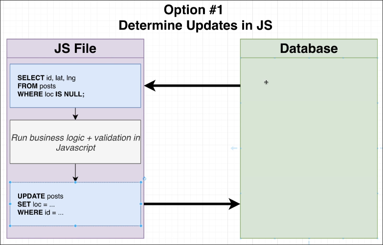
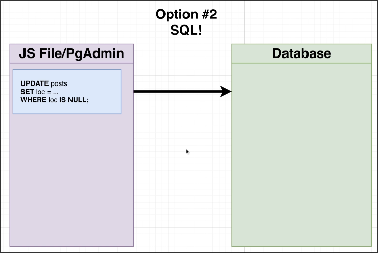
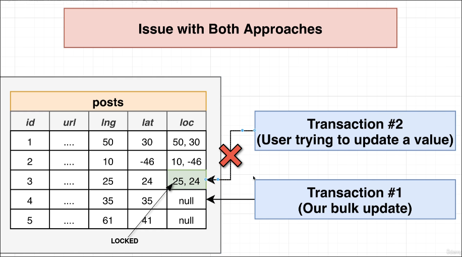

# Concept of step 3: Transaction Locks

We have two main methods that can be used to achieve the third step in [[2025-04-07_Properly-Running-Data-and-Schema-Migrations|Properly Running Data and Schema Migrations]].

## Option #1: Determine Updates in JS

This method is divided into three steps.
1. query records which loc are null from the database to JS
2. calculate the point of the loc (and do some validations or other business logic here also...)
3. update the records with computed loc values to database

This method has some disadvantages.
1. If there are millions of records, the node server may crash.
2. If the database is set up on some cloud service provider, connecting from the node server to the database may be very challenging.

And upside is that we can run very complex business logic and validations in JS.

Regarding the first downside, we can solve this problem by using batch processing. That is, we process a certain number of records at a time with each query, which is called a batch. Therefore, we will have many batches that need to be processed sequentially, one after another.

The problem with batch processing is that if an error occurs in the middle or at the end of a batch, the previous batches have already been processed and cannot be recovered.

We can establish a transaction to process all batches within it until the last batch is finished, then commit the transaction. However, this may also lead to other issues, which we will discuss later.

## Option #2: SQL!

The second method is to directly update in the database without querying any records to JS.

This method will definitely be faster than the first method because it updates directly without a query.

However, the downside is that we cannot perform too complex validations or business logic on the database.

## ISSUE of ONE transaction (Both Options)

No matter whether it is option #1 or option #2, as long as you choose to use a single transaction for processing, the following problems will occur.

This issue only occurs when there is a large amount of data in the table (over a million records).

The record updated in the transaction will be locked until the transaction is committed or rolled back, and will only be unlocked after that. In other words, all records must be updated before they are unlocked.

The effect of records being locked is that other transactions need to wait for the lock to be released before they can update the locked records.

So if this transaction needs to update a large number of records, when the user performs an operation that requires updating locked records, they will need to wait a long time.

This is a very bad user experience, and it may even cause the user to think that the system is down or frozen.

### Solution

We can choose the batch processing method of Option #1, where each batch uses a transaction, so there won't be the mentioned problems. However, errors occurring in a batch may still result in the inability to rollback the previously processed batches.

