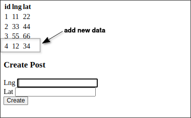

# Demo 2nd step: new version API to write both lat,lang and loc

Following the [[2025-04-14_Demo-first-migration:-add-loc-column|Demo first migration: add loc column]], we are going to proceed with the next step of [[2025-04-07_Properly-Running-Data-and-Schema-Migrations|Properly Running Data and Schema Migrations]]: updating the API to write data into the post with *loc* in addition to the *original lat and lang*.

```js
// index.js

// ...

app.post('/posts', async (req, res) => {
  const { lng, lat } = req.body;
  await pool.query(
    'INSERT INTO posts (lng, lat, loc) VALUES ($1, $2, $3)',
    //                            ^^^                  ^^ add loc to insert
    [
      lng,
      lat,
      `(${lng},${lat})` // <-- group lat and lng into a point data for loc
    ]
  );
  res.redirect('/posts');
})

// ...

```

Let's launch the web to ensure the functionality is still working.

```sh
$ node index.js
```



Check the database to ensure the data is inserted correctly.

```sh
$ psql -U postgres -d socialnetwork

socialnetwork=# SELECT * FROM posts;
 id | url | lat | lng |   loc
----+-----+-----+-----+---------
  1 |     |  22 |  11 |
  2 |     |  44 |  33 |
  3 |     |  66 |  55 |
  4 |     |  34 |  12 | (12,34)  # <--- new data inserted
  #                     ^^^^^^^ because of new version API, new data is inserted with loc
(4 rows)
```

Above, we tested that both the web and database can still function normally, so even if the next step comes a long time later, there will be no problems.

We can see that some loc values are present in the current table while others are not, but this does not affect the operation of the web. This will be resolved in the next step.


