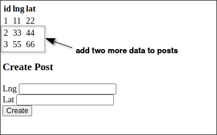

# Demo first migration: add loc column

We will actually execute the first migration in [[2025-04-07_Properly-Running-Data-and-Schema-Migrations|Properly Running Data and Schema Migrations]]: adding the loc field.

First, we need to create a new migration file.

```sh
$ npm run migrate create add loc to posts
```

Then, edit the migration file to add the loc column to the posts table, and also the logic to remove it in the down migration.

```js
//...

exports.up = (pgm) => {
  // logic to add the loc column
  pgm.sql(`
    ALTER TABLE posts
    ADD COLUMN loc POINT;
  `);
};

exports.down = (pgm) => {
  // logic to remove the loc column
  pgm.sql(`
    ALTER TABLE posts
    DROP COLUMN loc;
  `);
};
```

Execute the migration to actually add the loc column to the posts table.

```sh
$ DATABASE_URL=postgres://postgres@localhost:5432/socialnetwork npm run migrate up
```

Check if the migration was successful.

```sh
```sh
$ psql -U postgres -d socialnetwork

socialnetwork=# \d posts
                                    Table "public.posts"
 Column |          Type          | Collation | Nullable |              Default

--------+------------------------+-----------+----------+-----------------------------------
 id     | integer                |           | not null | nextval('posts_id_seq'::regclass)
 url    | character varying(300) |           |          |
 lat    | numeric                |           |          |
 lng    | numeric                |           |          |
 loc    | point                  |           |          |   # <-- new column
 #                                             ^^^^^^^^ in this step, the added column should never set to NOT NULL
Indexes:
    "posts_pkey" PRIMARY KEY, btree (id)

socialnetwork=# SELECT * FROM posts;
 id | url | lat | lng | loc
----+-----+-----+-----+-----
  1 |     |  22 |  11 |     # <-- old data still work, but no loc value (NULL)
(1 row)
```

Let's launch the web to test the API.

```sh
$ node index.js
```



Above, we added two more data through the form, and it seems to work well.

Check if the data is inserted correctly.

```sh
$ psql -U postgres -d socialnetwork

socialnetwork=# SELECT * FROM posts;
 id | url | lat | lng | loc
----+-----+-----+-----+-----
  1 |     |  22 |  11 |
  2 |     |  44 |  33 |      # <-- new data, and filled the loc with NULL
  3 |     |  66 |  55 |      # <-- new data, and filled the loc with NULL
(3 rows)
```

Above, we have completed the first migration and proven that all functions are working properly. This means that no problems will occur regardless of how long the next step takes.


