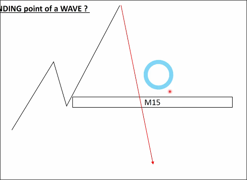
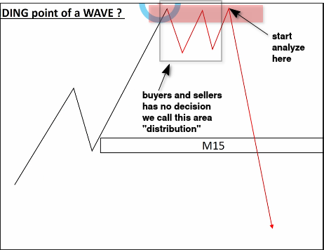
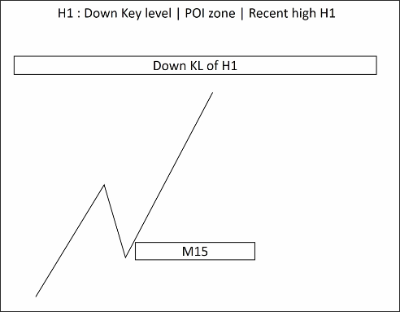
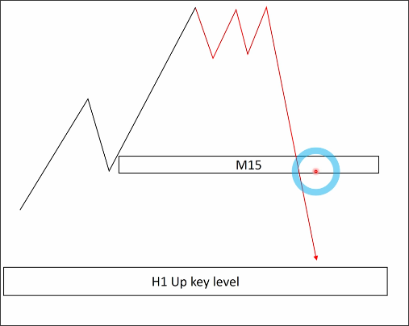

# Market cycle

## What is a market cycle?

The meaning of market cycle is the beginning and end of a trend.

## When does a market cycle start?

When the BTF trend breaks through KL, the trend changes, and the market cycle begins.

However, it usually does not break through the KL and start a new cycle smoothly or directly as shown in the above figure. Instead, there will be a period of fluctuation representing a balance of buying/selling pressure. When the buying pressure is exhausted and the selling pressure remains strong, the price will then break through the KL downwards.

In this situation, we must analyze from the perspective of a downtrend starting from the latest high point, rather than the initial high point, because at this time both buyers and sellers are uncertain about future trends. It is only at the latest high point that sellers are certain that the trend will change and push prices down. Therefore, we should analyze from the latest high point.

## When does a market cycle end?

When approaching the reverse zone of HTF (KL, POI, recent high/low), it means that the cycle of BTF is about to end.

At this time, even if the BTF structure is complete and has KL, there are no buyers willing to continue pushing up the price, so we should avoid entering the market.

During this period, it is easy to experience significant fluctuations because the trends on both the high timeframe (HTF) and the low timeframe (BTF) are pulling against each other, causing price fluctuations. Entering the market at this time can easily lead to losses.

Need to wait for the KL of BTF to be broken, a new market cycle to begin, or BTF to be stronger than HTF, leading to the breaking of HTF's zone, before entering the market.

## Even if the market cycle has just begun, it may end immediately.

In this case, the market cycle has just begun (broken BTF KL), but there is a HTF up zone just underneath, and the price is approaching this zone. This means that the market cycle may end immediately.

This situation is not uncommon, we still need to wait for BTF to generate a new market cycle or for the HTF zone to be broken before considering entering the market.

