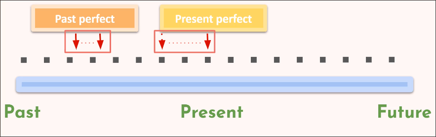

# Past perfect + present perfect (continuous!)

These tenses are both used to discuss *durations of time* in the past and events happening up to now.

## Past perfect

The past perfect is used to talk about an event/action that began and ended in the past.

## Present perfect

Similar to the past perfect, but slightly different. The present perfect is used to talk about an event/action that was started in the past and is happening up until now.

