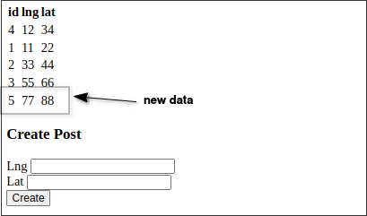

# Updating the App Server to only work on loc (exclude lat and lng)

Now we are going to execute the fourth step of [[2025-04-07_Properly-Running-Data-and-Schema-Migrations|Properly Running Data and Schema Migrations]]: update code to only write to the loc column (and also only read loc from the database)

The purpose of this step is to completely remove the app's dependence on lat and lng values from database, so that when lat and lng are deleted from the database table in the final step, the app will not encounter any problems.

```js
// index.js
const express = require('express');
const pg = require('pg');

const pool = new pg.Pool({ ... });

const app = express();
app.use(express.urlencoded({ extended: true }));

app.get('/posts', async (req, res) => {
  const { rows } = await pool.query(`
    SELECT * FROM posts;
  `);

  res.send(`
    <table>
      <thead>
        <tr>
          <th>id</th>
          <th>lng</th> // we can still render lng and lat here, but remember our records only have loc now
          <th>lat</th>
        </tr>
      </thead>
      <tbody>
        ${rows.map(row => {
          return `
            <tr>
              <td>${row.id}</td>

              // because we are only using loc now, the values of lng and lat come from loc

              <td>${row.loc.x}</td>
                        ^^^^^ replace lng with loc.x
              <td>${row.loc.y}</td>
                        ^^^^^ replace lat with loc.y
            </tr>
          `;
        }).join('')}
      </tbody>
    </table>

    <form method="POST">     // about the form, we can still let user input lng and lat, but there is only loc column in the database table
      <h3>Create Post</h3>   // so we need to convert lng and lat to loc before inserting into the database
      <div>
        <label>Lng</label>
        <input name="lng" />
      </div>
      <div>
        <label>Lat</label>
        <input name="lat" />
      </div>
      <button type="submit">Create</button>
    </form>
  `)
})

app.post('/posts', async (req, res) => {
  const { lng, lat } = req.body;
  await pool.query(
    'INSERT INTO posts (loc) VALUES ($1)',
    //                  ^^^          ^^ remove lat and lng, only left loc
    [`(${lng},${lat})`] // because user input lng and lat, we need to convert them to loc before inserting into the database
  );
  res.redirect('/posts');
})

//...

```

After the modification, the app will only read and write to the loc column in the database. Let's launch the app and test it.

```sh
$ node index.js
```




It seems that everything works well. Let's check the database to see if the data is correct.

```sh
$ psql -U postgres -d socialnetwork

socialnetwork=# SELECT * FROM posts;
 id | url | lat | lng |   loc   
----+-----+-----+-----+---------
  4 |     |  34 |  12 | (12,34)
  1 |     |  22 |  11 | (11,22)
  2 |     |  44 |  33 | (33,44)
  3 |     |  66 |  55 | (55,66)
  5 |     |     |     | (77,88)  # new inserted
  #          ^^^^^^^^ lat and lng are null
```

We can see that the newly inserted data lat and lng are both null. This is because when we inserted the data, we only wrote the loc field, which ensures that no errors will occur when inserting data after lat and lng are deleted.


