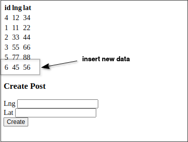

# Very last step: Dropping the lat and lng columns

We are going to perform the final step of [[2025-04-07_Properly-Running-Data-and-Schema-Migrations|Properly Running Data and Schema Migrations]]: Dropping the lat and lng columns from the database table schema.


This is only database schema migration, so we can create a new migration file for it.

```sh
$ npm migrate create drop lat and lng
```

```js
// ...

exports.up = (pgm) => {
  pgm.sql(`
    ALTER TABLE posts
    DROP COLUMN lat,
    DROP COLUMN lng;
  `);
};

exports.down = (pgm) => {
  pgm.sql(`
    ALTER TABLE posts
    ADD COLUMN lat numeric,
    ADD COLUMN lng numeric;
  `);
};
```

Then, we can run the migration:

```sh
$ DATABASE_URL=postgres://postgres@localhost:5432/socialnetwork npm run migrate up
```

Let's launch the app and check that everything is working as expected.



And let's check the database to see that the lat and lng columns have been dropped.

```sh
$ psql -U postgres -d socialnetwork

socialnetwork=# SELECT * FROM posts;
 id | url |   loc   
----+-----+---------
  4 |     | (12,34)
  1 |     | (11,22)
  2 |     | (33,44)
  3 |     | (55,66)
  5 |     | (77,88)
  6 |     | (45,56)
```

We can see that the lat and lng columns have been dropped from all the posts in the database, no matter that the post is new or old.

Here, our migration work is complete. By following this process, we can ensure that there can be any length of time interval between each step without affecting any user's usage even there is a data migration in the middle of the process.


