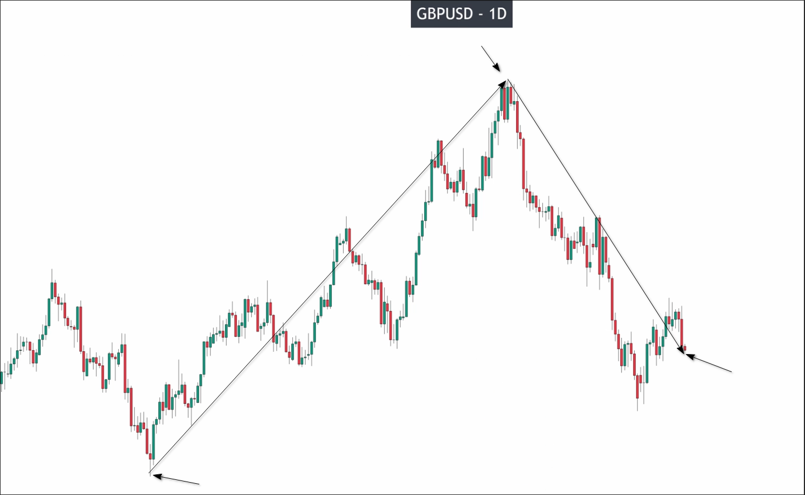
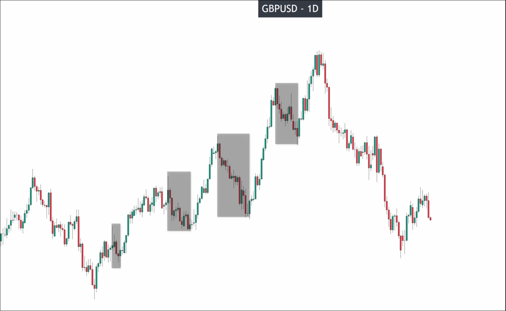
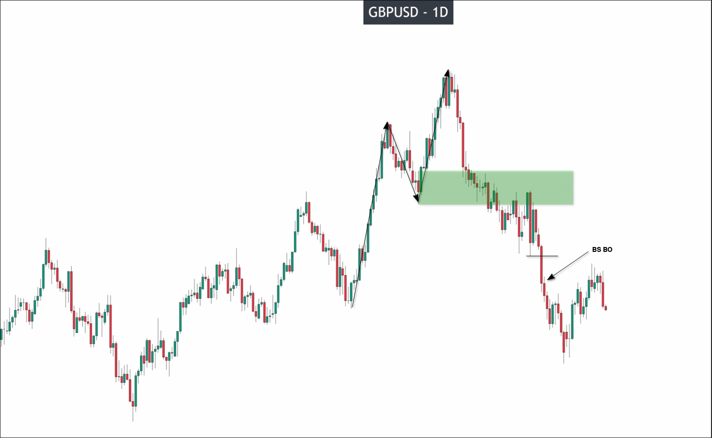
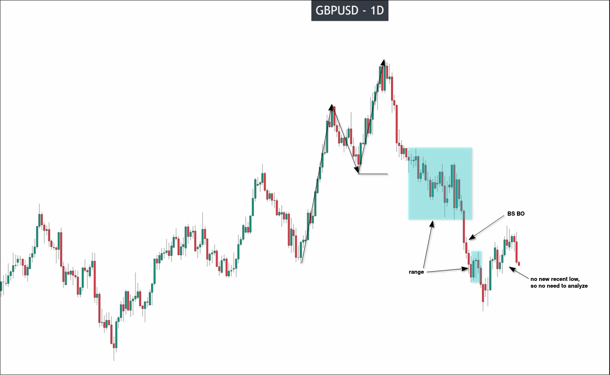
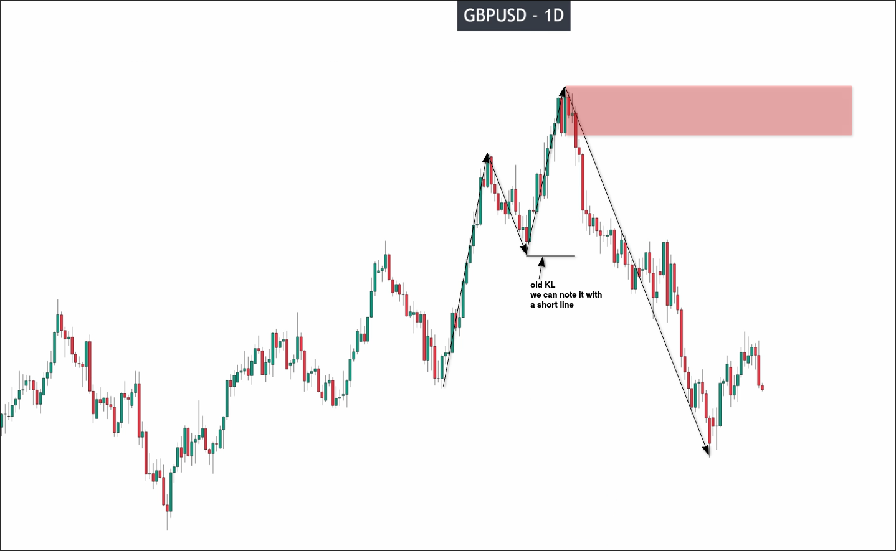
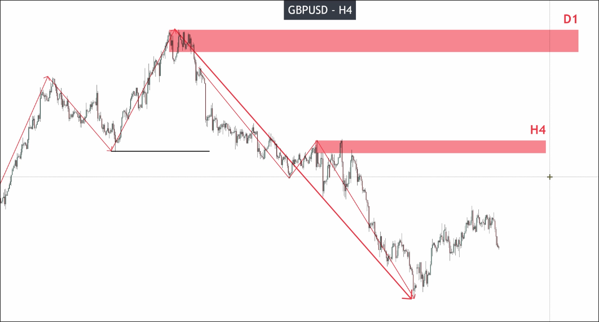
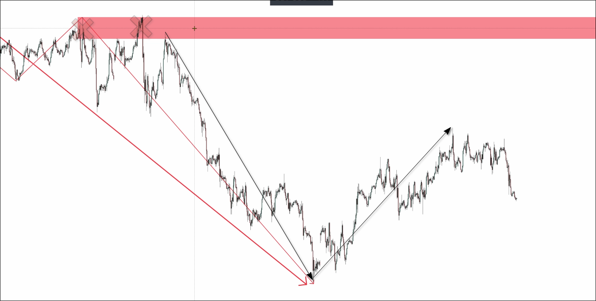
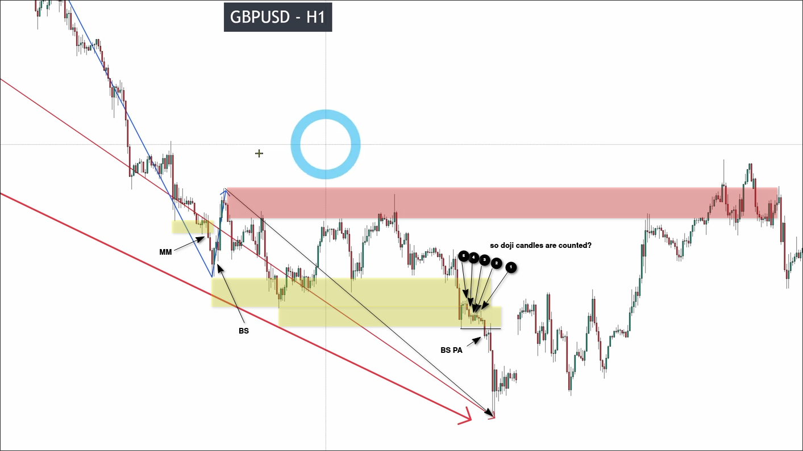
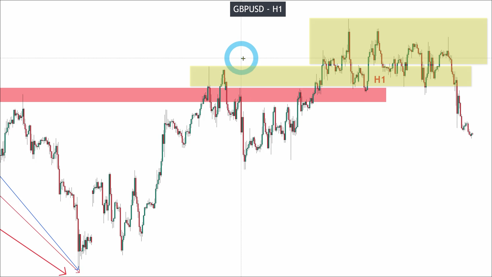
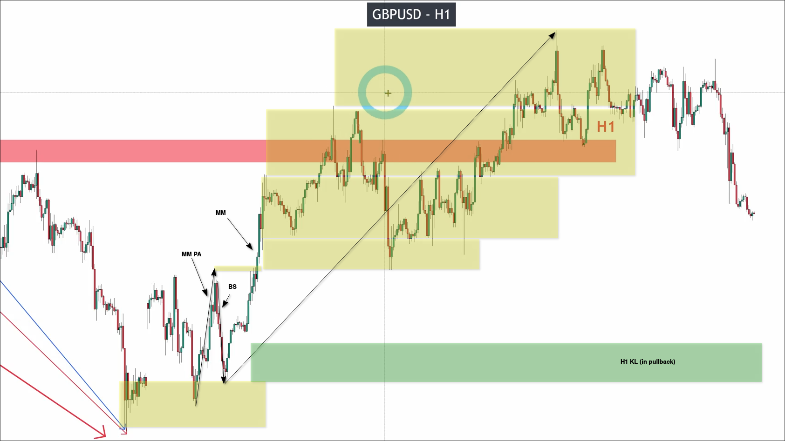

# How to analyze the Market structure from D1 to M1 on GBPUSD_part 1

We will analyze the market structure (MS) and market cycle (MC) of GBPUSD in multiple timeframes (D1, H4, H1, M15, M5, M1) to understand what is happening in each timeframe.
(We generally only use two or three timeframes to analyze market structure.)

## D1

We start from the largest time frame. Below is our D1 chart. First, we need to identify the highest high, lowest low, and recent price to draw out the general structure.

It can be seen that it is a V-shaped structure, so we need to start analyzing from the left half.

First, identify the zone that may have PB.

We start analyzing from the zone on the far right to save time.

We can see that the first zone has a valid PB, and there was a valid PW before that, and the recent high has also been successfully broken through, so we can already draw the KL for this part.

After drawing the first part of the KL, it is obvious that the KL has already been broken in the second part, so we need to analyze the downtrend of the second part starting from the high point.

First, mark out the areas that may have potential PB.

We can find that areas with possible PB all have obvious noise, and direct analysis easily reveals that they are all range. Therefore, in the second part, the downtrend only has a pulse wave and no pullback wave, so there is only a KL at the highest point.

I have marked the first part that has been broken through with a short horizontal line on the KL. It may be used in analysis on smaller timeframes.

## H4

Next, we will analyze the structure of H4 starting from KL of D1. We will also analyze from the right side, which can save time. The analysis result above is from the course video, and it differ from mine.

Then we can also analyze H1 starting from H4 KL.

You can see that there are three identical high points at the starting position, so the analysis should start from the most recent high point, and it is clearly a V-shape, so the analysis should start from the first part.

## H1

You can see from the H1 analysis results above that we have obtained H1 KL and the price has already returned to H1 KL.

It can be seen that although the price has tried several times to break through the H1 KL, it has not been successful. Therefore, the trend in H1 is still downtrend.

We can see that the pullback wave has already moved out a bit, we can analyze it as uptrend also.

You can see that there is a lot of noise around the KL area above the H1 pullback. This is because the buying pressure and selling pressure around KL are absorbing each other, and neither side has a clear advantage. In addition, a KL is formed depending on the starting position of the pullback (but remember this is inside PB).

