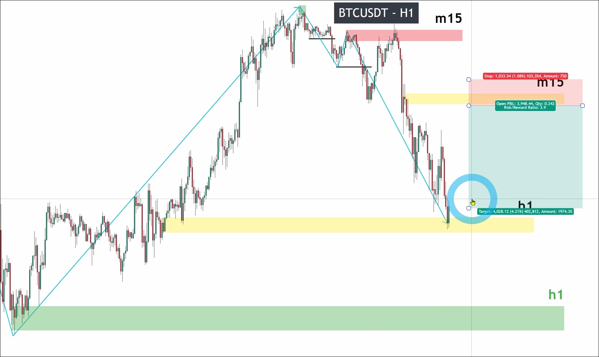
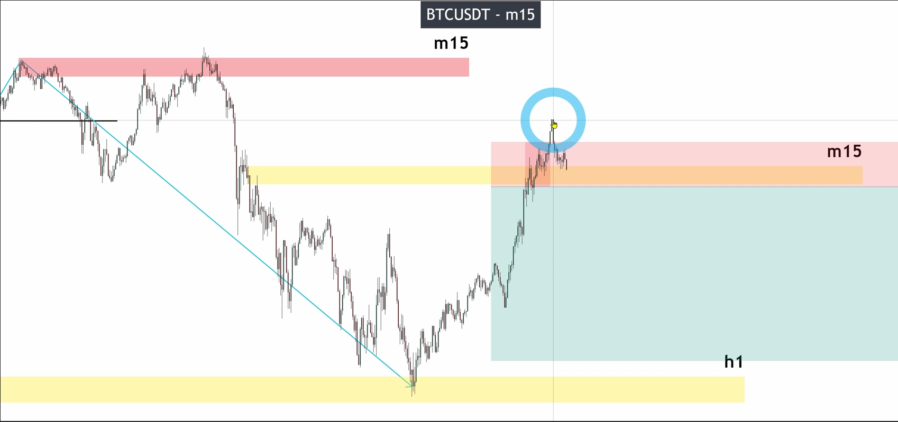

# Market CYCLE works perfectly with smart money concepts on Bitcoin chart

When we see a chart, we need to first decide where to start analyzing, the method is to identify the highest high and lowest low along with the recent price.

In the above chart, the lowest low is approximately the position of the recent price, so it is obvious that we should start analyzing from the highest high to the position of the recent price. Then we need to draw a zone from the highest high to see if the price reaches this zone later. If it does, we should start analyzing from the price that most recently reached this zone, rather than the original highest high.

Next, mark all possible positions where PB may appear.

We analyze each PB position from right to left in order to save our time.

The lower boundary of the first zone has not been valid broken through, so even if this zone has a valid PB, it cannot generate KL. Therefore, we can disregard this zone and not analyze it.

In the second zone, there was originally an invalid breakout, but the previous low point before looking at the zone was not effectively broken through. Therefore, we need to see if there is a range generated above this low point. After checking, there is indeed a range, and the zone is within it, so a valid pullback cannot be generated.

The third zone is a clear range that is skipped directly.

The first two lows in front of the fourth zone were both false breakouts, and then comes the fifth zone. If the fifth zone has a valid pullback, then no new pullback can occur before a valid breakout at the low point. If there is no valid pullback, then the entire range containing the fake breakout is a large range, so the fourth zone will not have a valid pullback in any case.

The low point in front of the fifth zone was fake broken through, but the low point in front of it was valid broken through. The obvious high point between these two low points was broken through by a BS pattern in that zone, so there will be a valid pullback in this zone. At the same time, the previous pulse wave has been confirmed, resulting in the generation of KL.

In the pulse wave after KL, a clear imbalance can be seen, so we can use Fibonacci from high points to low points to draw a zone, and find the POI zone between 0.618 and 0.8.

After having POI, we no longer use KL, but use POI to find opportunities to enter the market.

But before deciding whether to enter, we need to analyze the HTF to understand the market cycle situation, and avoid entering at the end of the market cycle.

The above is the analysis of HTF, which shows that HTF also generates POI zone, and it is opposite to the trend of BTF. In this situation, we need to use HTF POI to determine whether the market cycle of BTF has ended.

In the above chart, it can be seen that the price has reached the Point of Interest (POI) area of HTF. At this point, the selling pressure has been completely absorbed, so even if the price returns to the POI area of BTF, there will not be any sellers entering the market.

It can be seen that BTF's POI has been easily breached, proving that sellers no longer exist.
