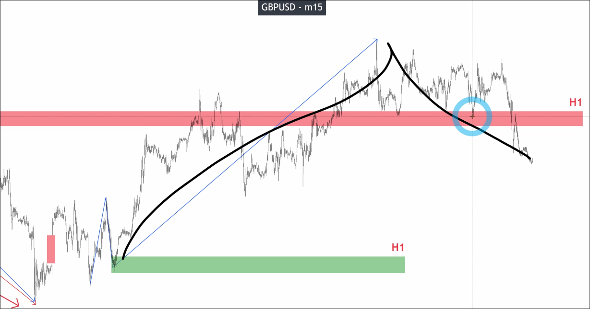
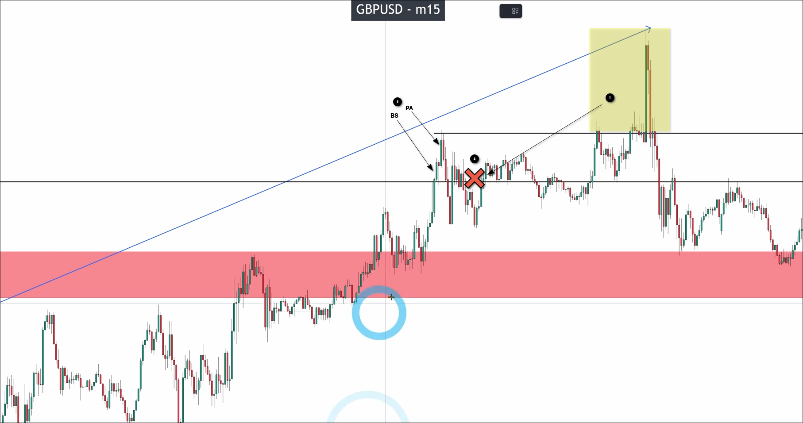
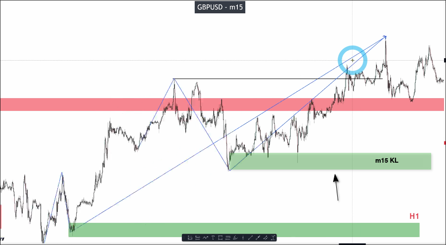
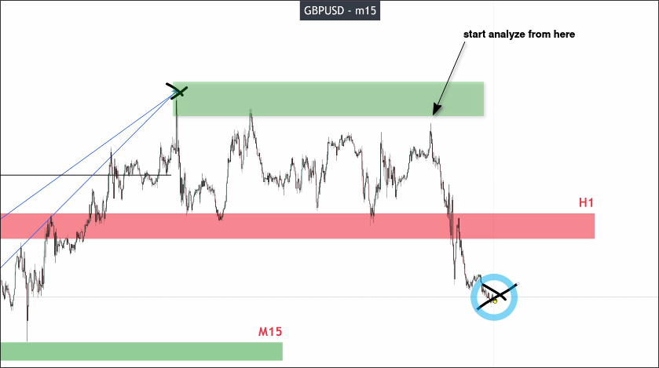
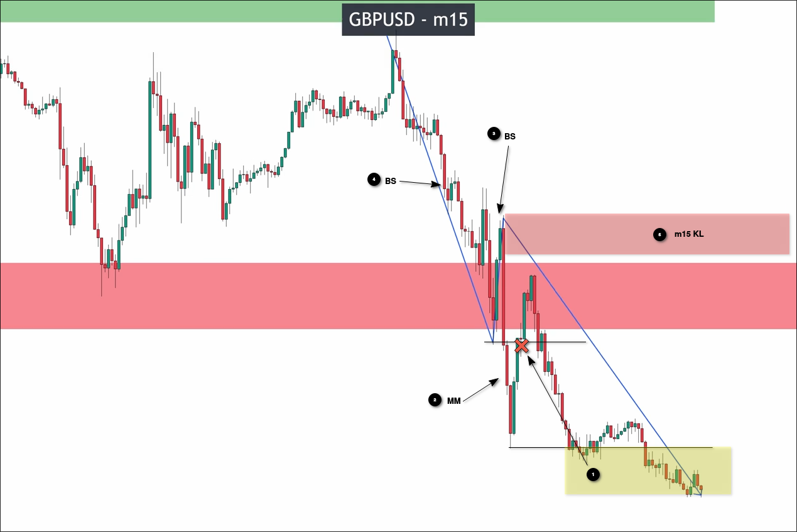
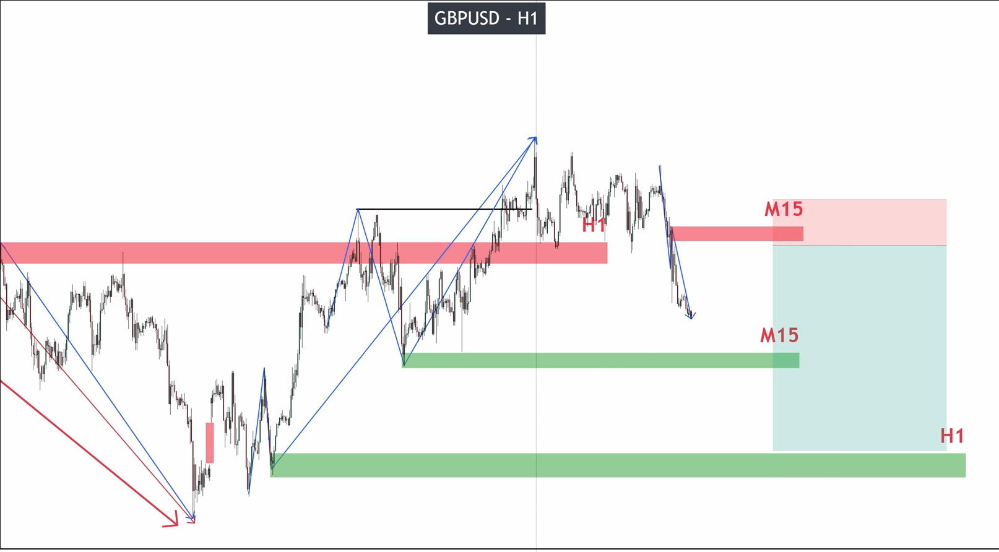

# How to analyze the Market structure from D1 to M1 on GBPUSD_part 2

We continue the content of "How to analyze the Market structure from D1 to M1 on GBPUSD_part 1", starting to analyze the structure of m15 from the KL of H1 pullback.

As shown in the picture, it is a V-shaped structure.

Start analyzing the first part, we can draw out the key high points as follows, directly identifying the places with valid breakouts.

As shown in the diagram, we identify several key high points from the highest point to determine the presence of a valid breakout. The first high point is a fake breakout, so there is no need to analyze possible price wave areas. The second high point has a valid breakout.

So we still need to draw some key high points to find KL.

We found the KL in the uptrend of m15, and then we can analyze the downtrend part.

We can see that in the m15 downtrend, there are multiple price highs that are quite similar. We must start analyzing from the most recent high point, even if the last high point is a few pips away from the area we have drawn, it is still acceptable.

If we analyze at the previous high point, it may lead to incorrect results.

We found the KL of the m15 downtrend as above.

We can see that both H1 and m15 have uptrend and downtrend KL, so we don't need to analyze the KL of m5 again, because in this case m5 must be very noisy.

Assuming m15 is BTS, we can use m15 downtrend KL to plan trades as above. We can set the take profit position slightly above the H1 KL, as this is also the end of the BTS market cycle. However, when the price reaches above the m15 KL, we must do risk management by moving the stop loss to the entry price. This ensures that we do not incur losses.

