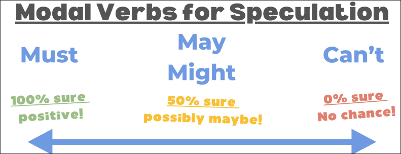

# Model Verbs for Speculation

*Speculation* talking about events that haven't happened yet.

We can use *modal verbs* to show certainty or uncertainty when discussing different topics.

- Must: 100% sure positive!
- May Might: 50% sure possibly maybe!
- Can't: 0% sure No chance!

