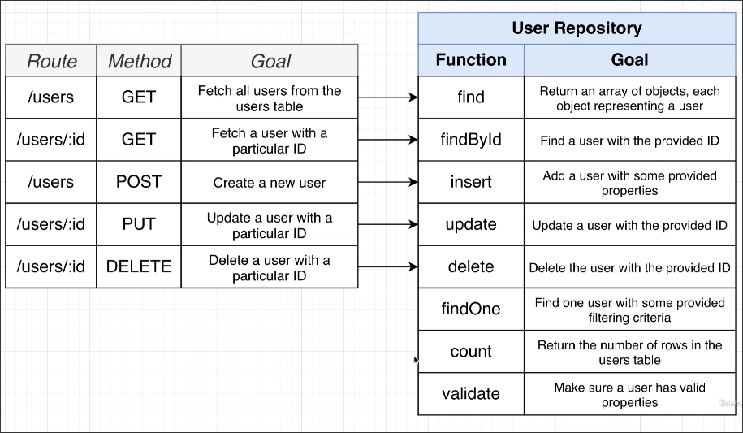

# Repository pattern

In [[2025-04-17_Two-more-functions-for-Pool,-close-and-query|Two more functions for Pool, close and query]], we added a query method to the Pool object to pass SQL queries to the database, so we can use it to implement our endpoints.

```js
// src/routes/users.js

// ...

router.get('/users', async (req, res) => {
  // Run a query to get all users

  // Send the result back to the person
  // who made the request
});

//...

```

But we do not directly use pool.query() in the "Run a query to get all users" endpoint, instead we create a repository object and use it to complete this task.

The repository pattern means creating an object to handle various operations for a specific type of resource.

In our case, we create a UserRepository object to handle all operations related to users.



It can be seen that repository functions and endpoints do not necessarily have a 1:1 relationship. We can define some helper functions in the repository to make endpoints easier to use.

There are many ways to establish a repository, such as a plain object, instance of a class, static class, etc. As long as it adheres to its core concept - **a centralized place to handle all operations related to a specific resource** - it is fine.


