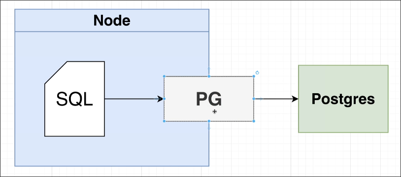
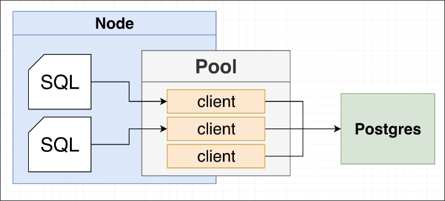

# Setup connect from server to database

In Node.js, `pg` is commonly used to connect to a PostgreSQL database.

`pg` only helps you connect to the database and send SQL to it. It doesn't do anything else. So it's popular and many other libraries are built on top of it. (for example, `node-pg-migrate` and ORM library we'll use later)



`pg` will create a pool to connect to the database instead of a single client, because a client can only be used for one SQL query at a time, which can cause issues when there are multiple requests at the same time.

A `pool` internally maintains several different clients that can be reused.



```sh
 tree
.
├── migrations
├── node_modules
├── package.json
├── package-lock.json
└── src
    ├── app.js
    ├── pool.js # create a pool to connect to the database
    └── routes
```

```js
const pg = require('pg');

const pool = new pg.Pool({
  host: 'localhost',
  port: 5432,
});

module.exports = pool
```

Above is normal way to create a pool to connect to the database and export it for use in other files.

But it'll be very challenging to test with this code because we need to connect to many different databases for the tests.

So we need to wrap the pool in a class and create a method to connect to the database as below.

```js
const pg = require('pg');

class Pool {
  _pool = null;

  connect(options) {
  //      ^^^^^^^ so we can pass different options to connect to different databases by this method
    this._pool = new pg.Pool(options);
  }
}

module.exports = new Pool();
```


