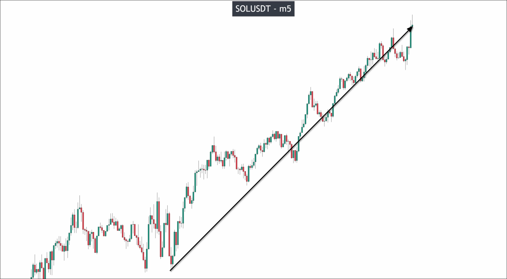
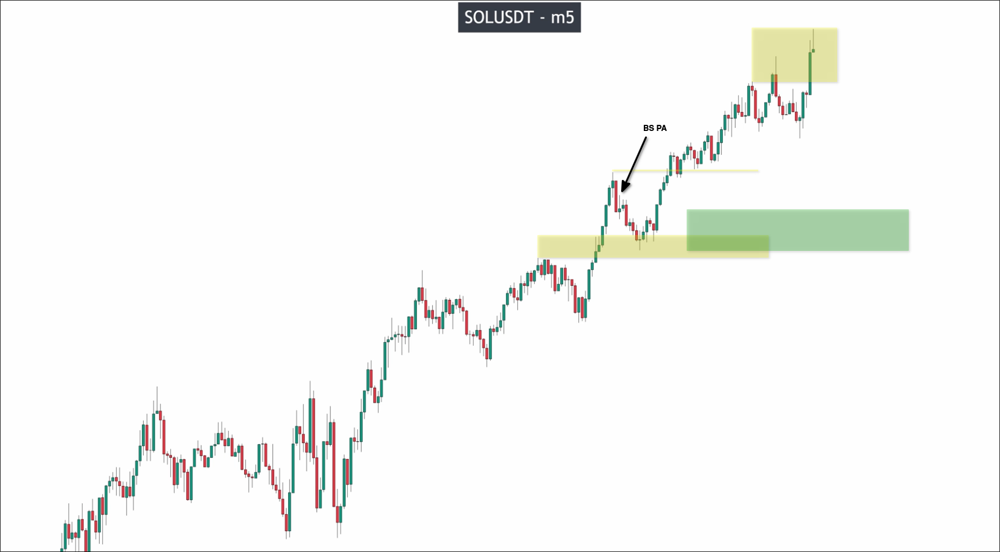
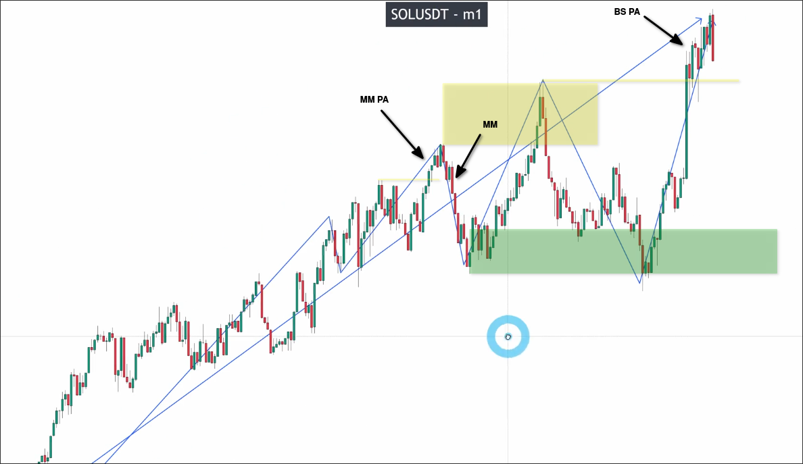
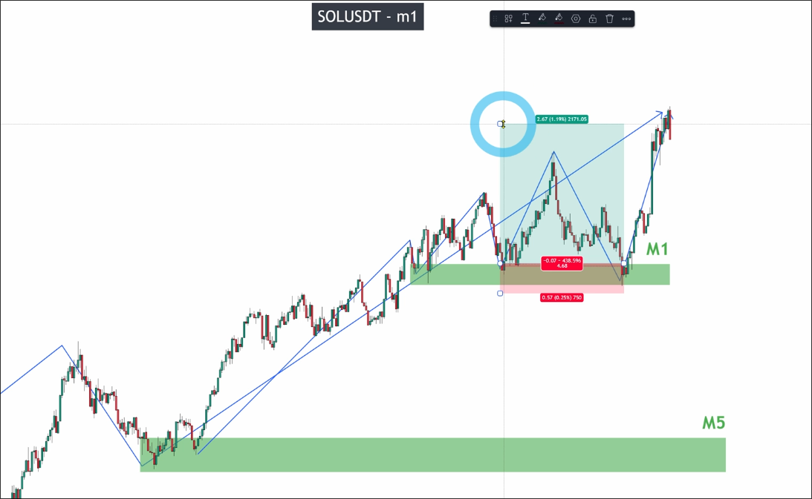
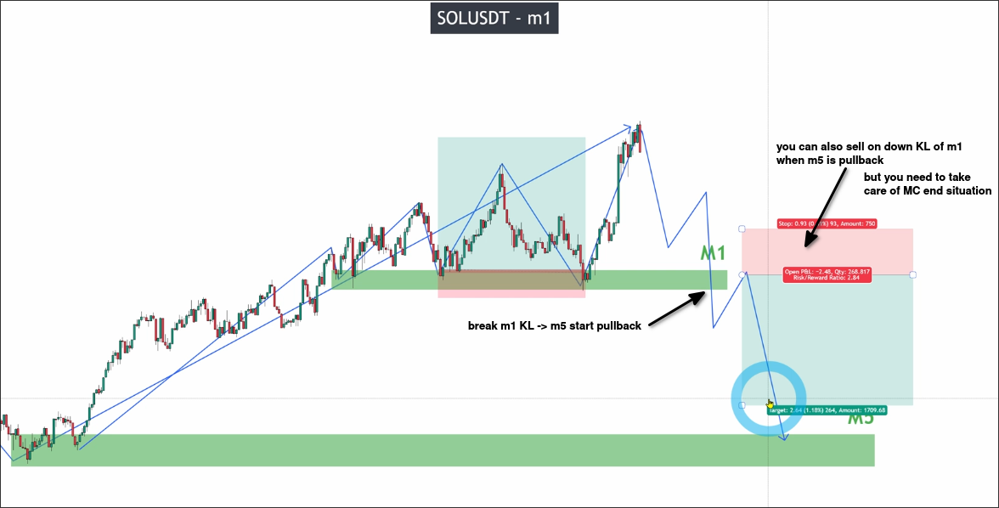
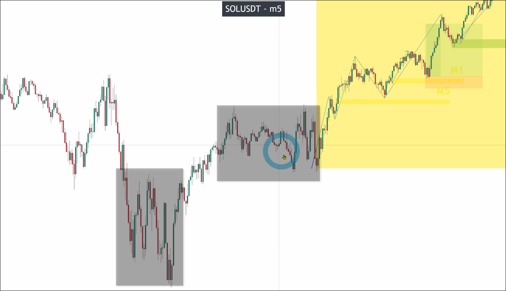

# The best market condition to TRADE on lower timeframe

As shown in the above chart, SOL m5 has a clear upward trend, which is the best market condition to trade. We can start analyzing from the recent low point.

Below is my analysis.

In the above figure, the KL of m5 has been found. Next, switch to m1 and analyze from the nearest low point in the KL of m5.

Below is my analysis.

Because the analysis of m1 is always on the pulse wave of m5, it is very safe for us to enter the market on the KL of m1.

We can even raise the TP position above the recent high because this structure is quite strong and stable.

When the KL of m1 is broken, it means that m1 has turned into a downtrend, and m5 starts a pullback wave.

At this time, we can still use the KL entry trading generated by the m1 downtrend, but we need to pay special attention to whether the market cycle has ended.

The above is the structure that beginners are most likely to do, beginners can even completely avoid analyzing areas with high noise.

In the area where there are frequent up and down movements, beginners can actually skip analyzing it directly.

Using a shorter timeframe combination (in this case, 5m and 1m), focusing only on analyzing and trading on good structures is also a very good strategy, especially for helping beginners accumulate profits and confidence.

