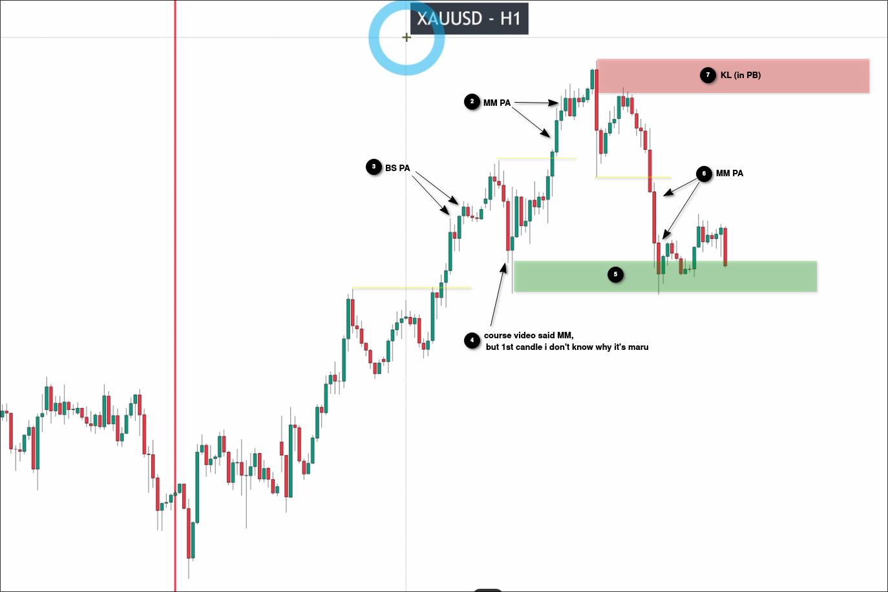
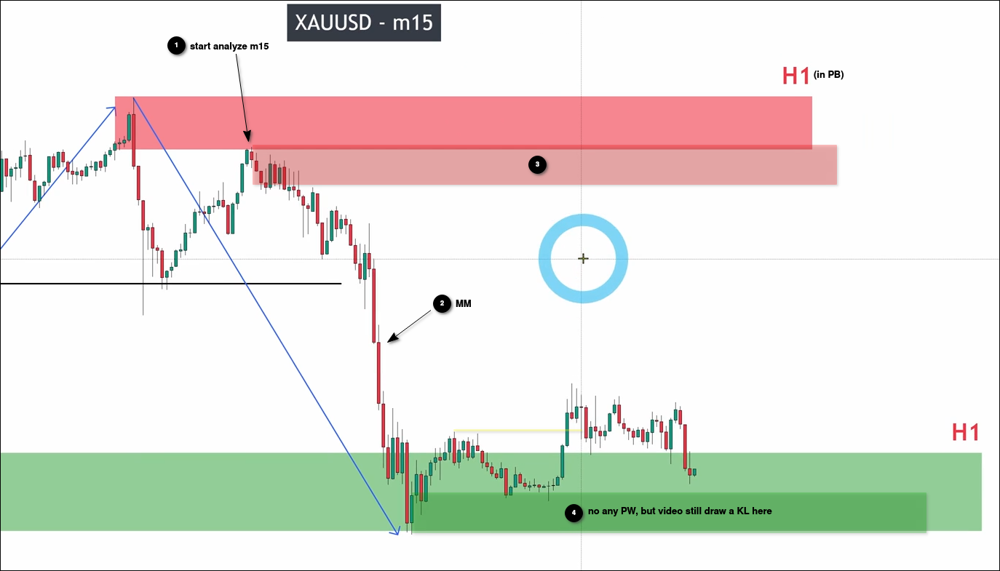
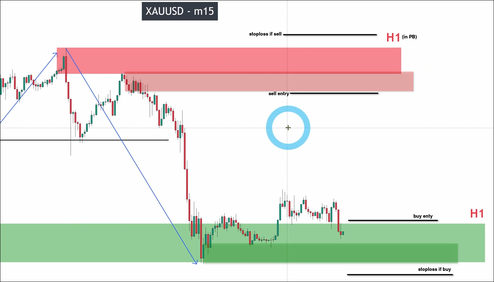
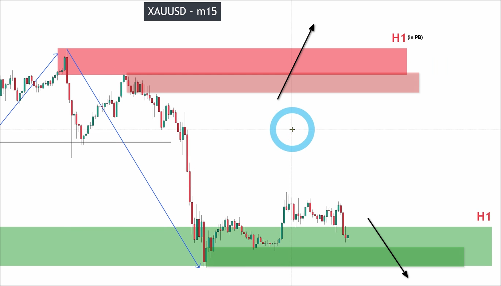

# When to STOP analyzing on Lower timeframe? XAUUSD from H1 to M1

When BTS and HTS are adjacent or even overlap as shown above, we should increase the range of stoploss.

As shown in the figure, even if we enter the market with the KL of BTS, the stop loss should be placed outside the KL of BTS and HTL, because it is easy to be caught in a fake breakout at this time.

Another point is that when you see both sides of the KL in the HTF and BTF as shown above, it means that the market is currently in a large noise. At this time, there is no need to analyze lower time frames, but rather wait for this pattern to be broken through. Only then will the market have more stable and stronger liquidity.

