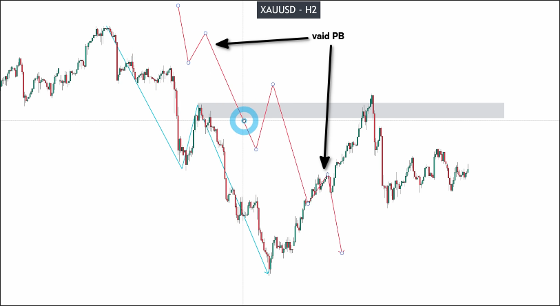

# TF divide 2 standard

## What is TF/2 standard?

If the pullback or breakout is invalid, switch to half of the current timeframe for confirmation. If it is valid, then the original timeframe is valid; otherwise, it is invalid.

## Example

As mentioned above, there are two invalid pullbacks on the H4 chart. At this time, we can switch to the H2 chart to confirm if the pullback is valid.

We can see that the pullbacks in these two places in H2 are both valid, so we can say that the pullbacks in these two places in H4 are also valid.

(We don't say that the pullbacks in H2 are valid because H2 is only supporting H4.)

## Compare with T standard

T standard is the analysis method we have always learned, which means analyzing only the chart of a single timeframe each time (even if it is a multi-timeframe analysis).

TF/2 standard having more chances and more profit but higher risk.
(TF/2: 10R month // T: 8R month)

In TF/2 standard, we need to analyze six chart if using multiframe analysis, so it's harder to master.

It's not recommended for new traders who have less than 2 years experience with NCI system.

T standard has higher consistency and less risk.

T standard is very easily to master and use.

All traders can learn and use it easily. (about six months or less)

