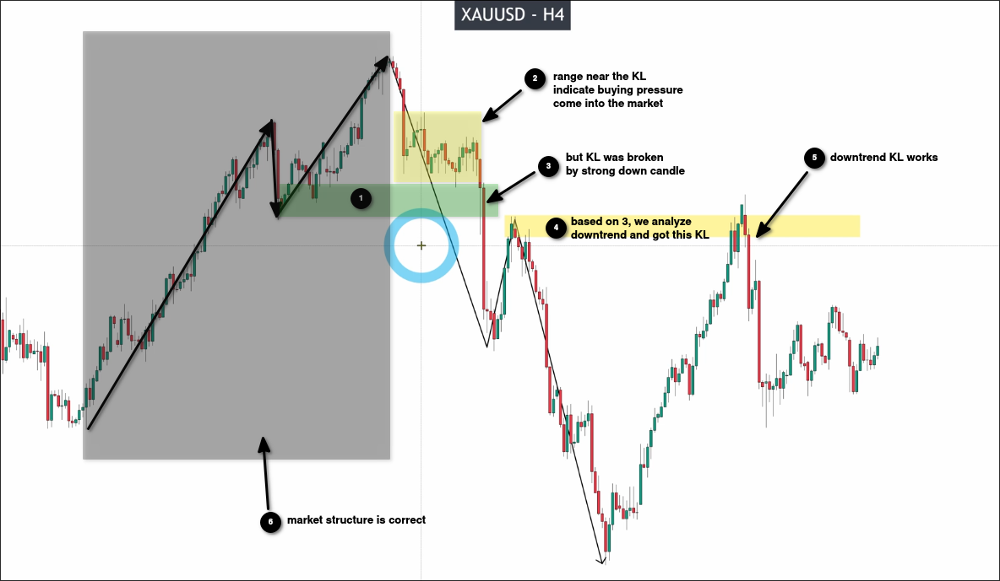

# How to know your MARKET STRUCTURE is correctly: market verification

## Market Structure is correct

We are waiting for the price to reach the KL of the market structure. If there is a price confirmation, it means that the market structure is correct.

## Doubtful Market Structure

We can see that the previous market structure obtained a range in KL when the price approached, indicating that buying pressure was added during the pullback wave, implying that this KL is effective.

However, it was then strongly broken through, so we began to doubt the correctness of this market structure. Note that we have not yet reached a conclusion at this time.

We still assume that this market structure is correct, so based on this market structure, the KL has been broken. We need to start analyzing the downtrend market structure and obtain the KL.

If the KL of the downtrend market structure is valid, it means that the market structure of the previous uptrend is correct, because the KL it produces is indeed broken, causing the trend to change to a downtrend.

> So when we have doubts about the market structure, we need to wait for further price action to confirm whether the market structure is correct. We must let the market tell us the answer instead of making subjective judgments.

