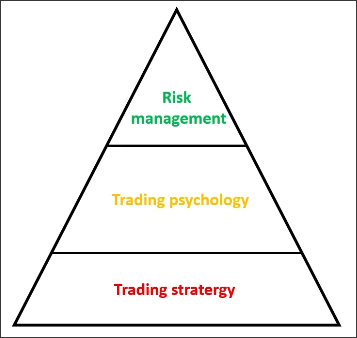

# Level 1 course was built based on trading system

## 1. Trading strategy
* Understand the big pictures
* Analyze the chart:
  * Multiple timeframe
  * Supply & Demand
  * Price pattern
  * Candle pattern
  * Set order / TP / SL / Trailing Stop / Quick exit

## 2. Psychology
* How many emotion in trading
* What you normally act for each emotion
* Solution

## 3. Risk management
* Calculate risk as % acc
* Judge your trading ability: RR, Winrate, Drawdown
* Combine with Supply and Demand strategy
* Practice & control risk
