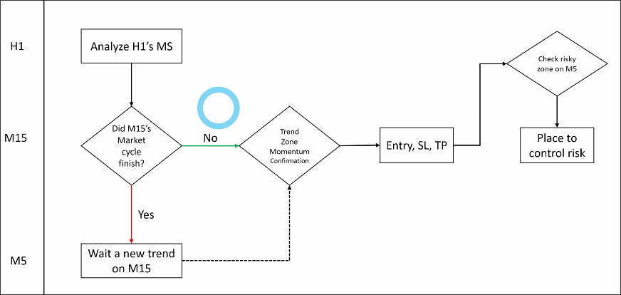
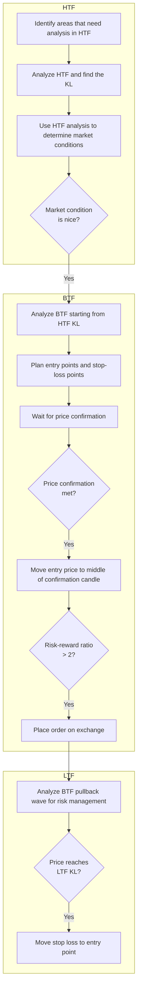
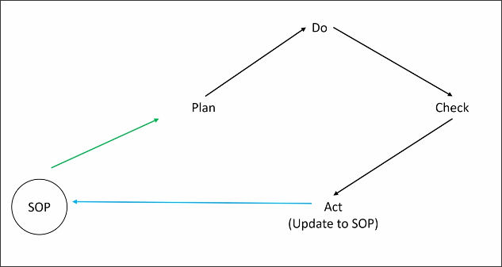

# SOP and PDCA process to practice after the course

## Diagram of SOP

Draw a diagram of the SOP you created in [[2025-04-19_SOP-assignments:-How-to-give-out-trading-plan-from-a-clean-chart|SOP assignments: How to give out trading plan from a clean chart]], below is an example diagram:

Below is my own SOP.

We can derive other SOPs from the above SOP, for example:
- SOP for identifying areas that need analysis in HTF
- SOP for determining market conditions
- SOP for determining price confirmation
...

So we will have many SOPs, each SOP focusing on a specific task, which will facilitate our future PDCA process for SOPs. In other words, we can continuously improve and optimize each SOP, making our transaction process more efficient and accurate.

## PDCA process

Based on a fixed SOP, we can continuously use PDCA to gradually optimize each step of the SOP, making the SOP become more and more streamlined, and more and more in line with our trading style.

**Plan**
It can be any plan, such as using SOP for trading plan for two hours after work every day.

**Do**
Actually use SOP to carry out the trading plan.

**Check**
Based on results of the **DO**, we can check if the KL defined by SOL is truly effective, if the price will really rebound at KL or if there will be a situation of long and short battles.

**Act**
Based on the results of the **Check**, we can adjust the SOP, such as adjusting the KL definition, or adjusting the entry point and stop-loss point.

## SOP can include anything, not only trading step

For example, we can use SOP for psychology control, we can write down some SOPs to prohibit opening certain charts in certain situations to avoid generating useless mental pressure.

## Fixed SOP is important

We must have a fixed SOP, and use PDCA to continuously optimize it for it to make sense. If the SOP is random, and each PDCA is built on a different SOP each time, then PDCA becomes meaningless. This will not allow our transactions to improve over time.

