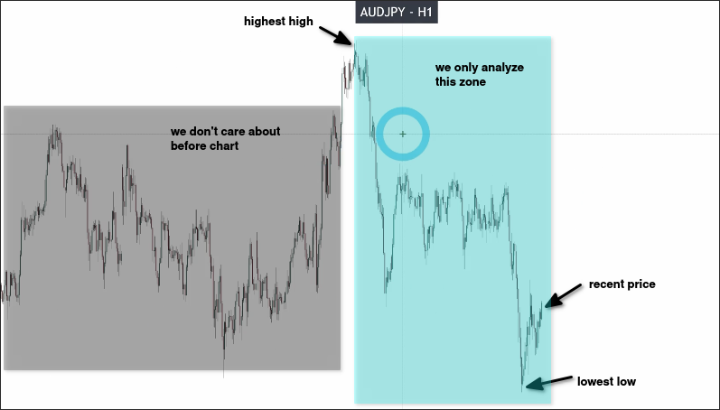
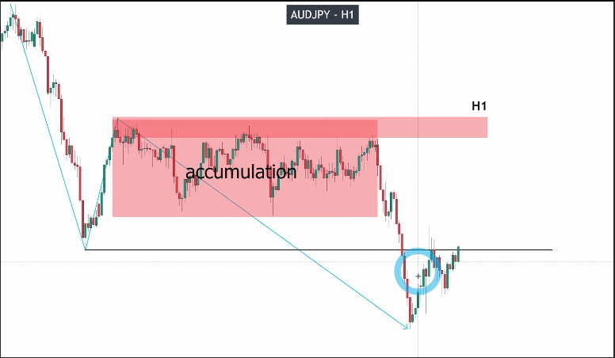
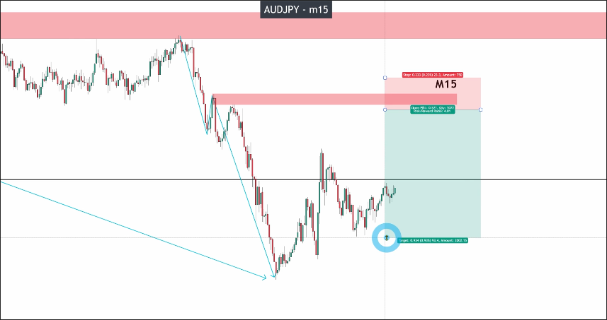
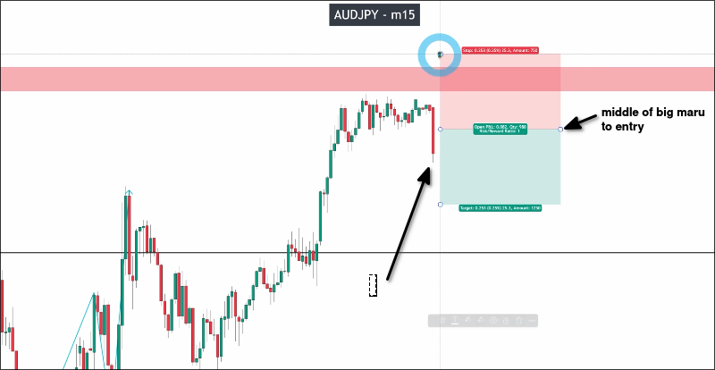
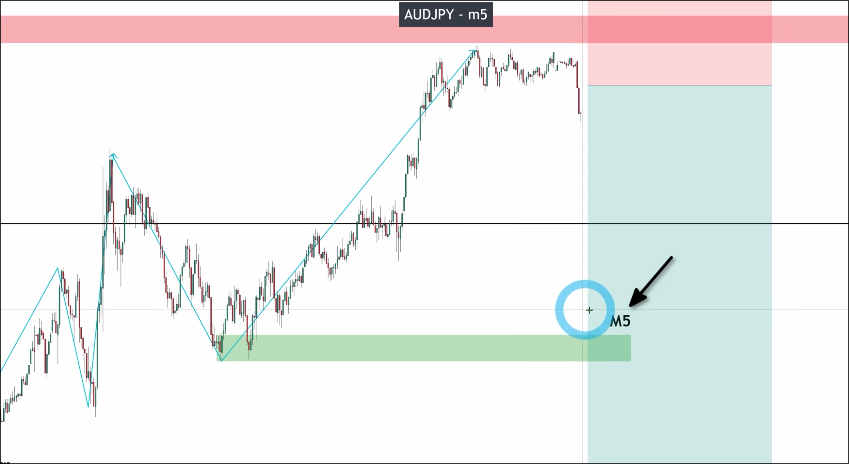
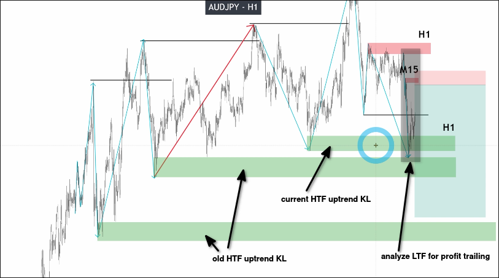

# SOP assignments: How to give out trading plan from a clean chart

The following will analyze AUDJPY and attempt to write the process in a simple SOP. SOP is "How to give out trading plan from a clean chart".

First, we need to start by identifying the parts that need to be analyzed from the HTF, always looking for the highest high, lowest low, and recent price in the chart.

You can see from the above chart that the recent price is very close to the lowest low, so we only need to analyze this section from a downtrend perspective, and we don't need to pay attention to the previous chart.

Analyzing the HTF results above, the current market condition is considered nice:
- There has not been a retest of the downtrend KL
- There is no obvious noise
- There has been no appearance of KL in the pullback section

In the case of nice market conditions, we can start analyzing BTF from the KL of the HTF downtrend. (There are many high points to touch HTF KL, we should start from the most recent one to analyze BTF.)

After analyzing BTF as above, we can plan entry points and stop-loss points after finding BTF KL and use the recent low as the profit-taking point.

Then, just waiting for the price confirmation to enter the market. It should be:
- Big marubozu candle
- Big pinbar candle with long tail up
- Two/Three tops

We wait for the confirmation of the Big Marubozu candle, then move the entry price to the middle of that candle, and measure if the risk-reward ratio is greater than 2. If it is greater, then we will truly place the order on the exchange.

After entering the market, we need to switch to LTF to analyze the BTF pullback wave for risk management.

In the above chart, we found LTF KL. When the price reaches it, we need to move the stop loss to the entry point to control the risk.

## If you want higher RR

If you want a higher RR, you can analyze the chart in front of HTF to find the uptrend KL and old KL, and use LTF to enter the market from BTF KL and start analyzing to do profit trailing.

However, this requires a lot of analysis of many parts as shown in the figure, and the price needs to break through more resistance, which makes it more difficult. Although the risk-reward ratio looks high, the extra effort may not be proportional to the return.

For beginners, it is recommended to only use recent low (or high) for taking profit, as it can make the standard operating procedure simpler.

## SOP

1. Identify the areas that need analysis in HTF.
2. Analyze HTF and find the KL.
3. Use HTF analysis results to determine market conditions.

if market condition is nice:

4. Analyze BTF starting from HTF KL.
5. Plan entry points and stop-loss points.
6. Wait for price confirmation to enter the market.

if price confirmation is met:

7. Move entry price to the middle of the confirmation candle.
8. Measure if the risk-reward ratio is greater than 2.

if yes:

9. Place the order on the exchange.
10. Switch to LTF to analyze BTF pullback wave for risk management.

if price reaches LTF KL:

11. Move stop loss to entry point.

