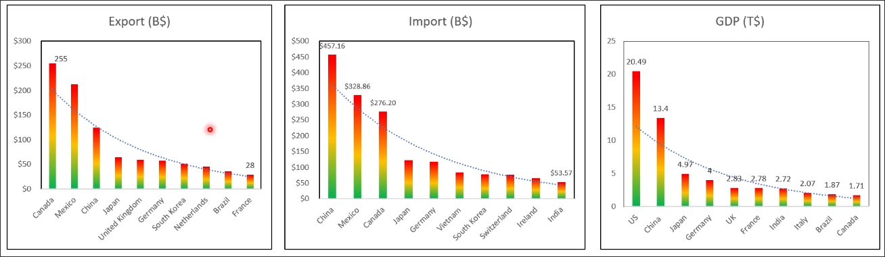

# Three types of currency pairs

## Top Countries of the World

First, you need to understand which countries have the strongest economies based on factors such as inflation rate, growth rate, policy, GDP, etc. Because the exchange currency volume is determined based on the strength of these countries' economies.

**Top countries excluding the US**
- UK (GBP)
- Australia (AUD)
- Canada (CAD)
- Switzerland (CHF)
- New Zealand (NZD)
- Japan (JPY)
- Euro zone (EUR)

## Major pairs

USD accounts for over 80% of global trading volume, so we can use USD to form major currency pairs.

We use the currencies of top countries and USD to form major pairs.
- GBPUSD
- AUDUSD
- USDCAD
- NZDUSD
- USDCHF
- USDJPY
- EURUSD

## Cross pairs

Cross pairs are formed by the currencies of top countries excluding USD.

- EURCHF
- EURGBP
- *EURAUD (recommended)*
- EURJPY
- *GBPJPY (recommended)*
- AUDJPY
- GBPAUD
- GBPNZD
- GBPCAD

Because these pairs are not included USD, which contributes to 80% of the volume, so they are less liquid than major pairs, it leads to:
- More noise in the charts
- Higher fluctuations

## Exotic pairs

This is currencies belong to the developing countries. So thier volume is very low, don't trade them.

- USDZAR (South Africa)
- USDMXN (Mexico)
- USDTHB (Thailand)
...

## Which pairs to trade?

### major pairs -> mix with cross pairs
For new traders, it is recommended to trade major pairs. Because they have more volume and liquidity, so the charts are:
- More stable, less noise
- spread is lower

When you become more experienced, then you can mix your portfolio with cross pairs.

### Select pairs based on your trading time
Choose currency pairs that are suitable for your trading time, because different currency pairs have different volumes at different times. Even main pairs may have very low volume at certain times, so it is not suitable for trading.

