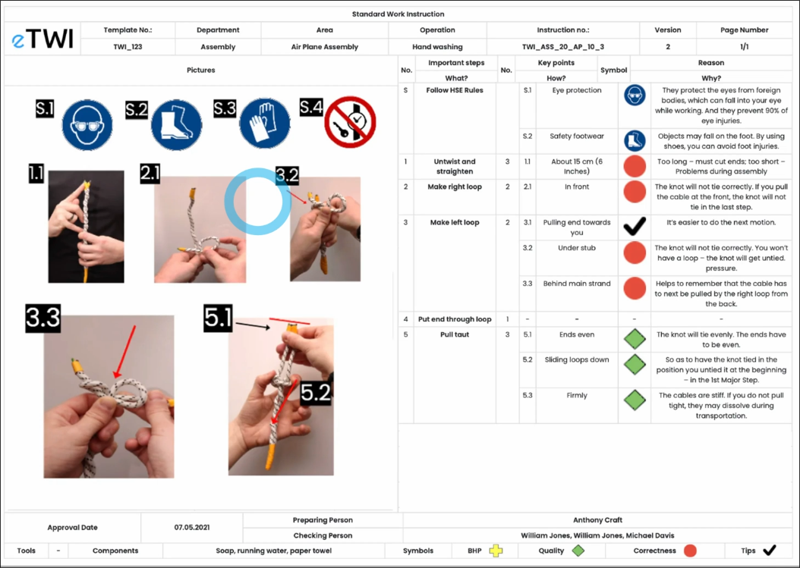

# What and Why we need SOP_PDCA process?

## What is SOP?

SOP stands for Standard Operating Procedure, which is a set of instructions that outline how to perform a routine task. SOPs are used in many industries, including healthcare, engineering, education, and manufacturing.

## Top reasons to develop SOPs

Here are six of the top reasons why businesses of all sizes should develop SOPs:

1. Maintain consistent operations
2. Streamline performance management
3. Limit the risk of knowledge loss
4. Save on training costs
5. Comply with industry standards
6. Prepare for future growth

## SOP example for a factory worker

You can see in the above SOP that there are pictures explaining each step, so even new employees can follow it well.

You need a simple and clear SOP such above to keep your trading consistent and be able to improve your abilities in psychology and risk management day by day on your own.

Even if there are teachers who can guide you for a long time, you still need to create your own SOP, because only you know your own various situations.
- Life expetation
- Working/living environment
- Family pressure

So. the system you develop by yourself is the best for your target.

## Simple is the BEST

Because the market itself is already very complex, if you also use very complicated trading strategies, you will feel totally confused when actually trading, and your actions will also be difficult to be consistent.

Therefore, you must use a very simple SOP, which is a step-by-step instructions on how to give out the TRADING PLAN from a CLEAN CHART.

Another reason why SOPs need to be simple is that when you encounter a problem, by repeatedly reviewing your SOP, you will easily identify the issue and improve your trading system.

