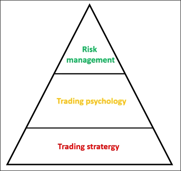

# What you will learn in Level 1

## 1. Trading system

As shown in the above figure, the trading system consists of three parts:
- Trading strategy: fundamental of the trading system
- Trading psychology: middle of the trading system
- Risk management: the top of the trading system

## 2. What you can learn in this lesson

### Basic level:

1. What is Forex, Definition(Pips, lot, leverage), calculate risk as % account.
2. Develop trading career: Freedom traders, Funds trader.
3. Trading styles in Finance & Which ones is suitable for you

### Intermediate level:

1. What is TA & FA (Technical Analysis & Fundamental Analysis)
2. Application to analyze the market (forex, crypto, stock)
3. Strongest Candle stick:
    - Story of one by one candle
    - Story of candle pattern
    - Main pattern you can use

4. Strongest Price pattern
    - Double top/bottom pattern
    - Break / Re-test
    - Some patterns to refer

### Expert level:

1. Supply & Demand
    - Understand SD
    - How to draw SD
    - Strongest SD
    - Obsolete SD

2. Multiple timeframe with SD
    - Select TF for your trading styles
    - Understand the big pictures
    - Trading with confluence
    - Trading with non-confluence

3. How to practice successfully
4. Control emotion in trading
