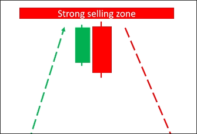

# Candle patterns

Candle patterns have two types: reversal and continuation.

## Reversal patterns

This type of candle pattern represents a trend reversal.

### Engalfing

Two marubozu candles in different directions, with the size of the latter candle being greater than or equal to 25% of the former candle size.

This pattern indicates a strong selling pressure that absorbs buying pressure and pushes prices lower, potentially leading to a trend reversal.

### Morning/Evening Star

Up marubozu -> doji -> down marubozu (morning star)

A doji indicates that buying pressure has disappeared, as there are no buyers willing to enter the market due to the high risk. Subsequently, sellers enter the market and create significant selling pressure, which may lead to a trend reversal.

### Tweezer Bottom and top

A combination of pinbar candles with tails of 2 or more, all in the same direction.

This represents intense battles between long and short positions, but one side continues to win, which may lead to a trend reversal.

### Mopping

Continuous up marubozu candles appeared, but the size gradually decreased, and finally a down marubozu candle appeared, forming an engulfing pattern.

## Continuation patterns

This type of candle pattern represents a trend continuation.

### Inside bar

An up marubozu candle appears, followed by some doji candles within it, and then an up marubozu candle breaks out of the first marubozu candle.

This pattern will form an upward market structure in smaller time frames, indicating that the trend will continue to rise.

### Three soliders

Three up marubozu candles appear in a row.

This pattern indicates that the market is in a strong uptrend.

## Why I still loss money when I trade with these patterns?

**You don't use them with the trend**

In the first chart above, a reversal pattern appeared in an uptrend PW. If you enter a short position at this time, it is very likely to be stopped out because the market trend is upward.

In the second chart, we see a reversal pattern in the uptrend PW. If we enter a long position at this time, there is a high probability of profit because we are following the trend.

So, always use these patterns and MUST follow the trend.

**You don't use them with strong buying/selling zone**

We should not rely solely on one candle for trading, similarly, we should not rely solely on candle patterns for trading, we must combine support and resistance key zones.

## Step by step in analyzation

1. Check the trend by using higher TF

2. Check the strong buying/selling zone => Support & Resistance

3. Wait for the candle pattern to appear at the strong buying/selling zone

