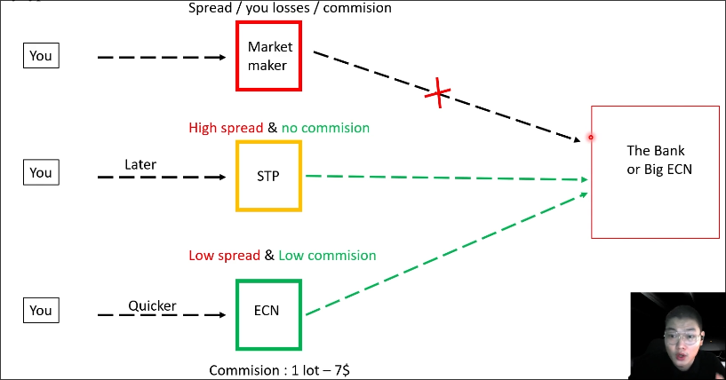

# Choosing broker

## Forex vs CFD

**Forex**
Exchanging one currency for another. Normally the object is company, funds and banks. They exchange with very big money and have no leverage.

**CFD**
Contract for difference. We are not exchanging currencies but have a contract between us and the broker. The contract has leverage, so we can use small amount of money to control a big amount of money.

Both use the same charts.

## Comparison
| Feature | Forex Broker | CFD Broker |
|---------|--------------|------------|
| Price movement | same | same |
| Market | Only BUY | BUY/SELL |
| Asset | Money | Contracts |
| Trading hours | Working times | 24/5 or 24/7 |
| Cost | Tax, commision | Commision |
| Leverage | 0 or very small | x100 ~ x1000 |
| Required funds | High (millions dollars) | Low (hundreds dollars) |

## Three types of CFD brokers

### 1. Market Maker

The profit of the Market Maker comes from the spread, your losses, and commissions, and they do not send your order to The Bank or Big ECN for processing.

So it's very dangerous to trade with them, because they can manipulate the price and make you lose money.

### 2. STP (Straight Through Processing)

The STP broker is a hybrid between the Market Maker and ECN broker. The big difference from the Market Maker is that they send your order to the bank or big ECN for processing.

The STP broker earns money from the spread only, so you don't have to worry about them manipulating the price.

### 3. ECN (Electronic Communication Network)

The ECN broker is the best type of broker. They send your order to the bank or big ECN for processing, and they earn money from the spread and commissions.

Normally, commission is very low (~ 1 lot - 7$), and the spread is very low compared to the STP broker.

And the order is processed very fast compared to the STP broker as well.

## Which type of broker to choose?

For scalpers or swing traders, the best choice is the ECN broker. They have the lowest spread and commission, and the order is processed very fast.

For long-term traders or investors, the best choice is the STP broker. They have no commission, high spread and slow order processing has almost no effect on the long-term trading.

## Which broker to choose?

### 1. Regulation
- The simplest method is to see which one has more users.
- Next is to look at the time of establishment.
- You can also search online for their reviews or to check if any issues have been reported.

### 2. Features
**Leverage**
Leverage of up to x500 is required.
**Commission & Spread**
Better to have a low commission and low spread.
**Initial deposit**
There is usually a minimum deposit requirement of $50 or $200, with $200 typically being the better option.
**Withdrawal**
The withdrawal process should be simple and fast, you can check the reviews online by google "withdrawal process of (broker name)".
**Trading currency**
Some brokers may not support trading in certain currencies, but this usually means that there are very few people trading in those currencies, so it usually won't affect you.
**Platform**
The platform should be:
- Easy to use
- No Delay

